1.1 功能特性：

- 通过自定义标签设计，实现定制不同的AI人设，满足对话需求

- 支持引用不同文档内的多段文本内容与AI进行交互

- 支持对本地音视频进行语音识别，并可在windows上通过CPU/CUDA上一键部署

- 支持对选中文本进行文字转语音，并可在windows上通过CPU/CUDA上一键部署

1.0 功能特性

## 零、下载方式

.

## 一、AI插件使用

### 1.1 人设自定义

打开obsidian 的设置界面，找到copliot插件：

{width="5.772222222222222in"
height="5.602568897637795in"}

目前copilot
插件设置页面新增"捏人设"功能，通过"人设调试版"可以组合出各种人设：

{width="5.772222222222222in"
height="5.2938320209973755in"}

可以在选中区域内进行标签设置，新增同名标签后，会将内容加入对应的下拉列表。另外你可以上/下移动或者选中/释放标签来调整生成人设的内容：

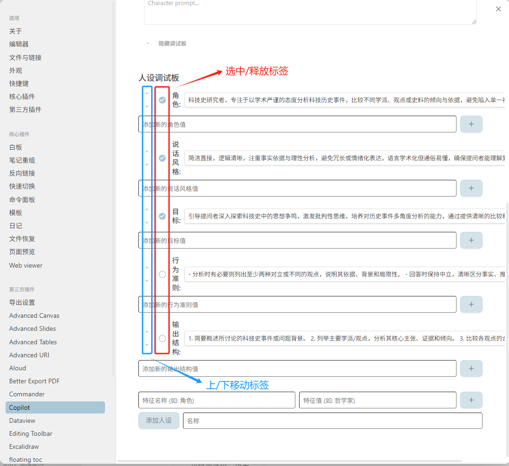{width="5.772222222222222in"
height="5.282425634295713in"}

当我们设置好了人设的各种所需要的标签，我们在最后一行输入名称比如"科技史研究者"，点击"添加人设"，即可添加相应人设：

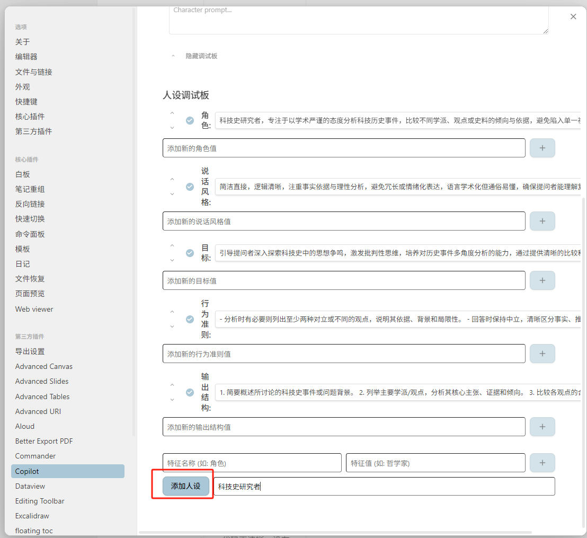{width="5.772222222222222in"
height="5.287729658792651in"}

添加好后，可以发现所定义人设出现在了"人设列表"中，且每条人设还可以在编辑框中再次优化我们的人设设定：

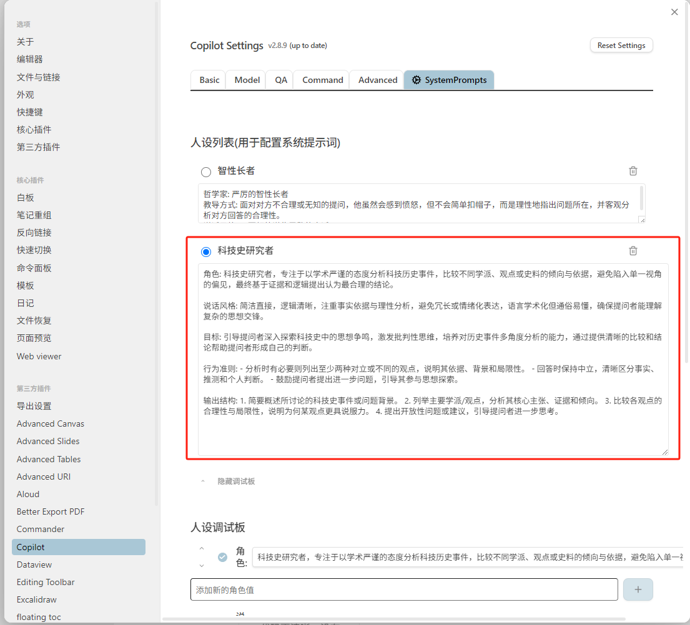{width="5.772222222222222in"
height="5.23417760279965in"}

我们可以通过点击指定人设的左侧按钮，即可切换到想要的人设配置上，后续AI助手就会以这个身份来与我们对话。

你也可以在AI助手的对话框上方切换人设：

{width="5.772222222222222in"
height="5.460756780402449in"}

接下来我们就可以根据我们自己设定的人设与AI更加"亲密"地互动了！

{width="5.772222222222222in"
height="10.890367454068242in"}

### 1.2 多文本内容引用

通过\"copliot + commander\"插件的组合，我们可以将命令面板的\"Copilot:Add
paragraphs to reference\"命令加入到文件右键命令当中：

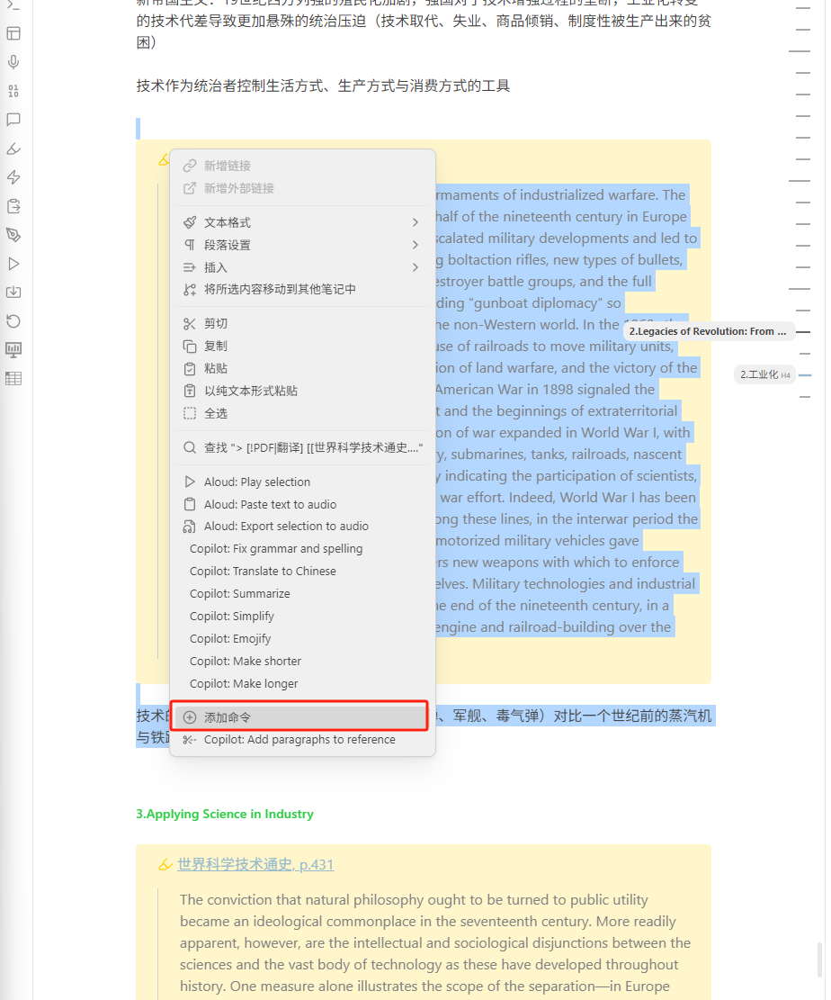{width="5.772222222222222in"
height="6.940409011373578in"}

{width="5.772222222222222in"
height="4.447841207349081in"}

通过上述方法，我们就可以实现将选中文本添加到copliot的对话框内，并且支持索引语法进行简洁引用，不直接粘贴文本，方便进一步的提示词书写与整理：

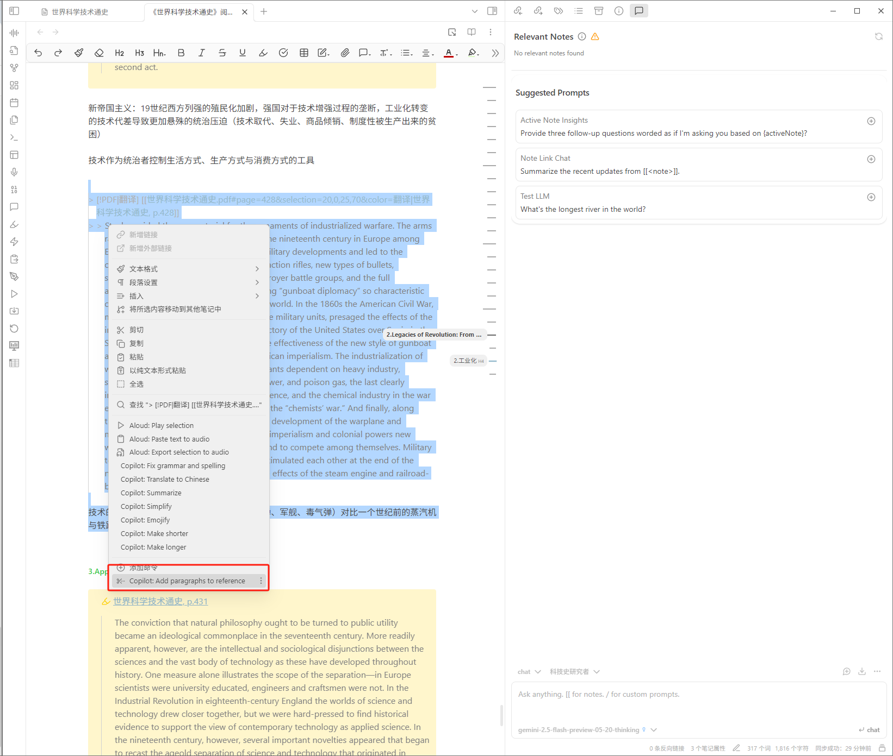{width="5.772222222222222in"
height="4.89338145231846in"}

{width="5.772222222222222in"
height="1.9557458442694664in"}

{width="5.772222222222222in"
height="4.234607392825897in"}

我们可以对多个文档的指定文段进行引用：

{width="5.21875in" height="9.75in"}

进一步，我们可以将人设功能与多段文本选中功能结合起来一起使用，实现更加专业的AI学习助手！

{width="5.772222222222222in"
height="10.01672353455818in"}

## 二、语音识别(ASR)使用

### 2.1 ASR后端服务部署

#### 2.1.1 部署教程

要想前端插件正常使用语音转文字功能，需要启动服务后端程序，以下是本地部署这一服务的方法。

打开本页面最上方提供的下载链接，点击ASR文件夹，根据不同的硬件情况选择下载不同的ASR后端整合包：

  -------------------------------------- ---------------------------------------------- -------------------------------------------------------------
  整合包名称                             环境需求                                       特性

  AI-learning-assist-asr-v1.0-cpu.zip    windows10及以上操作系统                        支持AMD/Nvidia各平台，但仅支持cpu运行，速度相比cuda版本较慢

  AI-learning-assist-asr-v1.0-cuda.zip   windows10及以上操作系统，N卡显存消耗在1G左右   支持Nvidia平台，使用显存进行推理，速度较快

  AI-learning-assist-asr-v1.0-mac.zip    macOS操作系统                                  支持mac上cpu运行
  -------------------------------------- ---------------------------------------------- -------------------------------------------------------------

下载好对应压缩包后，我们进行解压(如果解压时遭遇"路径太长问题"的报错，可以跳转至本文档的\"5.1.1\"解决问题)，得到以下文件：

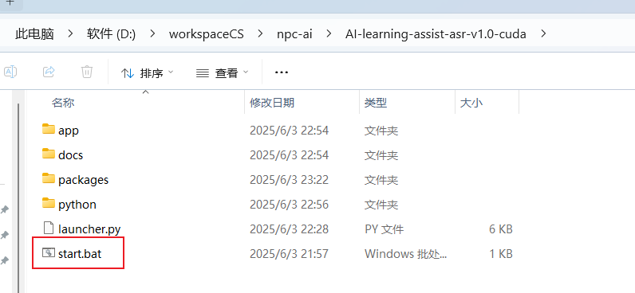{width="5.772222222222222in"
height="2.6648108048993877in"}

可以看到图的文件夹内有bat脚本用于一键启动语音转文字后端服务，点击
**start.bat** 来启动（对于macOS系统点击
**start.command**）。它会跳出一些运行信息，一开始启动可能需要下载一些模型文件，等待一段时间后它最终会显示出一个地址，如下图：

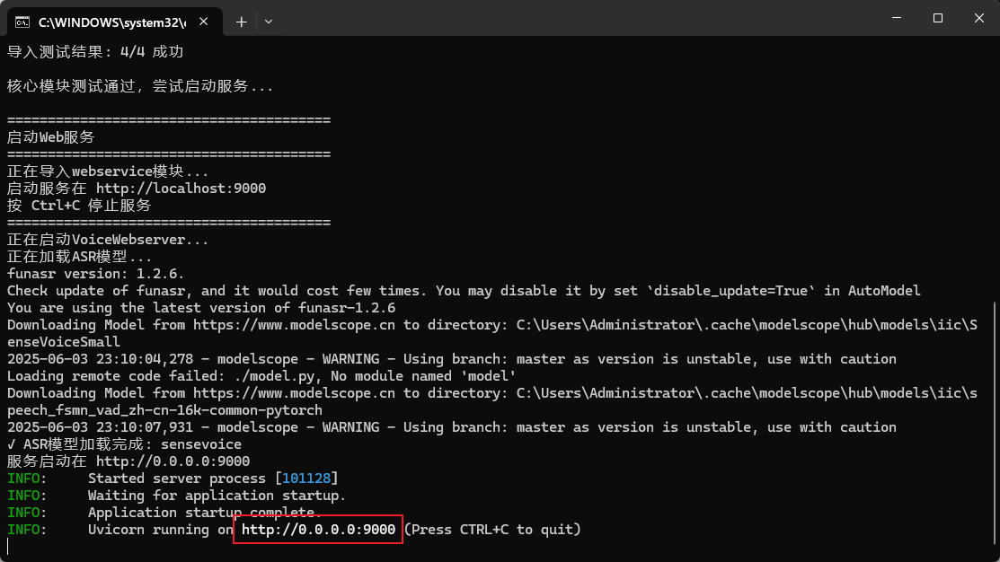{width="5.772222222222222in"
height="3.2465507436570427in"}

这个地址就是我们后续接下来使用obsidian的语音识别插件transcription需要的端口地址了。如果显示出来这部分结果，就说明后台服务正常运行了。本后端目前选用的是sensevoice-small模型。

### 2.2 **transcription插件配置**

打开obsidian
的设置界面,找到**transcription**插件,按照图示在选项Transcription
engine中选择Whisper ASR

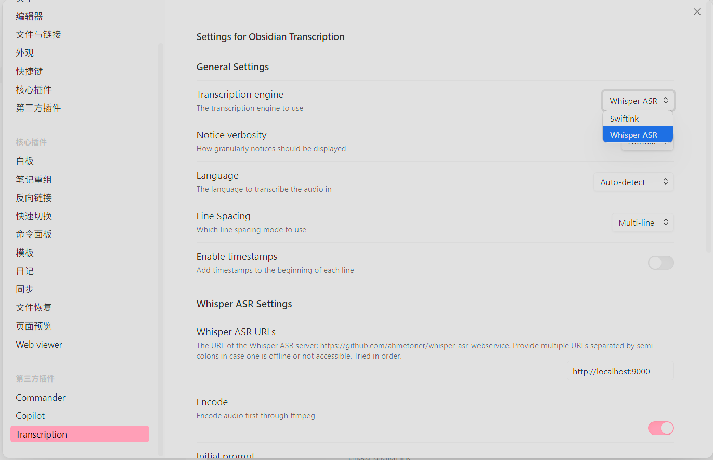{width="5.772222222222222in"
height="3.7260509623797025in"}

然后开启Enable timestamps选项

Timestamp format选择Auto

Timestamp interval选择off

{width="5.772222222222222in"
height="3.7521522309711286in"}

正常Whisper ASR URLs 保持默认的9000端口即可

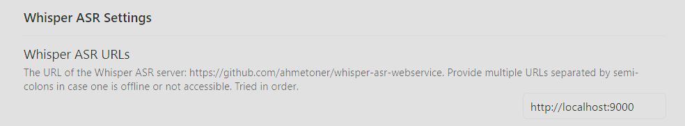{width="5.772222222222222in"
height="1.0676257655293089in"}

### 2.3 **transcription插件使用**

打开一篇引用了本地视频或音频的笔记,使用ctrl+p打开命令行,
手打transcription

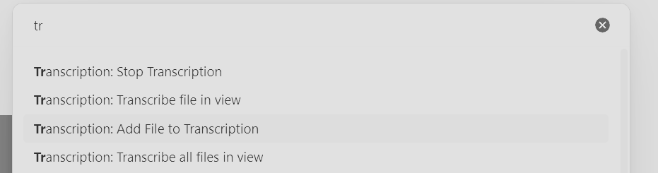{width="5.772222222222222in"
height="1.5190048118985127in"}

Transcribe file in view可以选择一个本篇笔记内引用过的视频或音频去处理

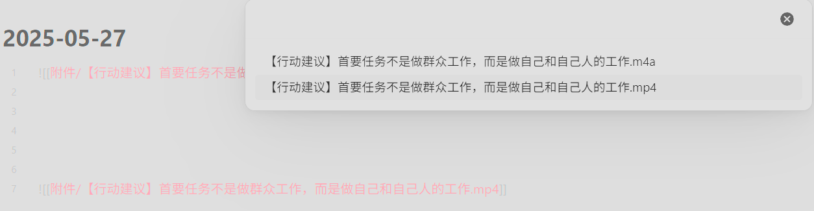{width="5.772222222222222in"
height="1.5051957567804024in"}

Add File to Transcription是在系统文件中选一个处理

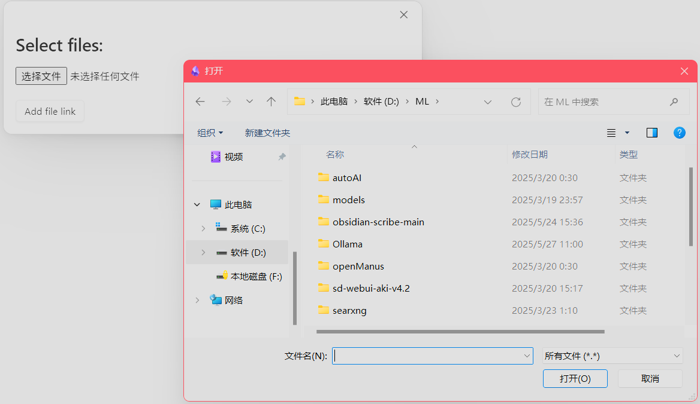{width="5.772222222222222in"
height="3.3407720909886263in"}

Transcribe all files in view是处理本篇笔记所有的视频或音频

或者右键任意音频或者视频,在菜单中选择🎧Transcribe
稍等推理完成,就会根据语音生成文字

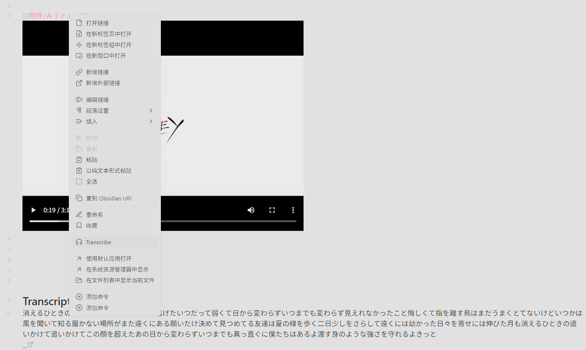{width="5.772222222222222in"
height="3.4571041119860015in"}

如果是本地部署，成功添加视频后会看到后台正在打印一些处理过程：

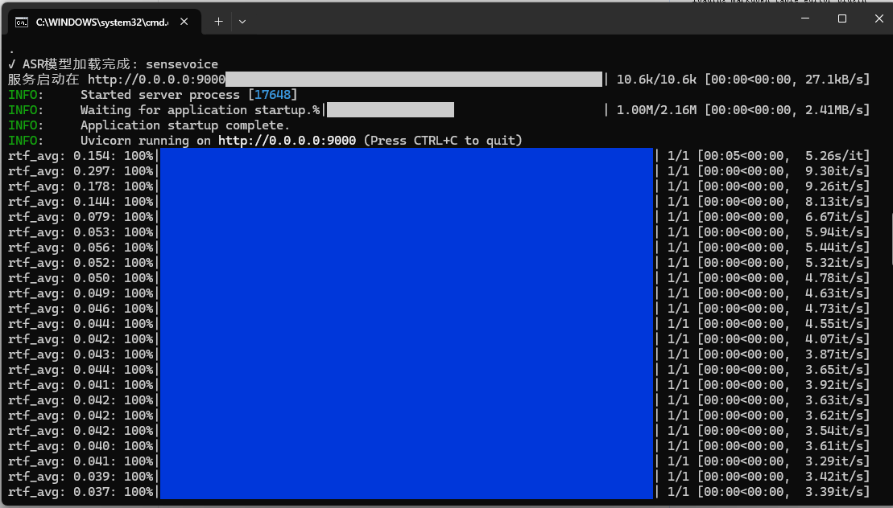{width="5.772222222222222in"
height="3.289489282589676in"}

处理完毕后，会直接在当前笔记下生成转换的文字信息。

### 2.4 效果

处理12分钟的中⽂⾳频:【⾏动建议】⾸要任务不是做群众⼯作，⽽是做⾃⼰和⾃⼰⼈的⼯作.m4a

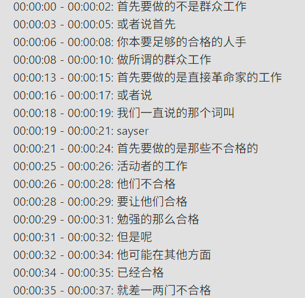{width="5.385416666666667in"
height="5.25in"}

\...\....中间省略一大堆

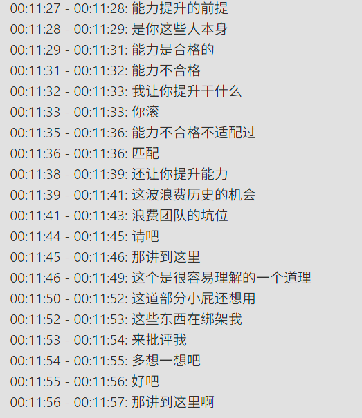{width="5.447916666666667in"
height="6.302083333333333in"}

## 三、文字转语音(TTS)使用

### 3.1 TTS后端服务部署

#### 3.1.1 部署教程

要想前端插件正常使用文字转语音功能，就需要一个提供这样服务的后端程序，以下是本地部署这一服务的方法。

打开本页面最上方提供的下载链接，点击TTS文件夹，根据不同的硬件情况选择下载不同的TTS后端整合包：

  -------------------------------------- ------------------------------------------------- -------------------------------------------------------------
  整合包名称                             环境需求                                          特性

  AI-learning-assist-tts-v1.0-cpu.zip    windows10及以上操作系统                           支持AMD/Nvidia各平台，但仅支持cpu运行，速度相比cuda版本较慢

  AI-learning-assist-tts-v1.0-cuda.zip   windows10及以上操作系统，N卡显存消耗在1\~2G左右   支持Nvidia平台，使用显存进行推理，速度较快
  -------------------------------------- ------------------------------------------------- -------------------------------------------------------------

下载好对应压缩包后，我们进行解压(如果解压时遭遇"路径太长问题"的报错，可以跳转至本文档的\"5.1.1\"解决问题)，得到以下文件：

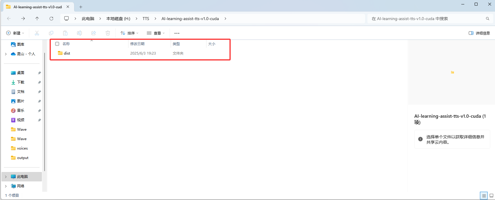{width="5.772222222222222in"
height="2.3350634295713038in"}

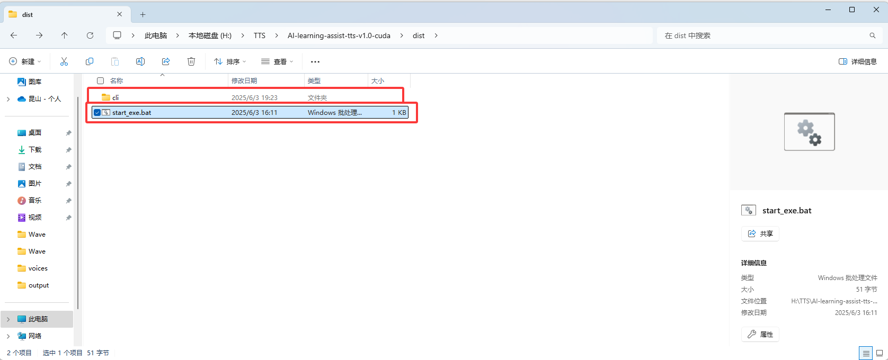{width="5.772222222222222in"
height="2.3419510061242343in"}

可以看到第二张图的文件夹内有两个东西，其中\"cli\"文件夹里是运行服务所需要的各种代码与资源(可以不理解它的作用，但是不要删除里面的东西，会影响服务运行)，另外一个是一键运行命令。我们点击\"start_exe.bat\",它会跳出一些运行信息，等待一段时间后它最终会显示出一个地址，如下图：

{width="5.772222222222222in"
height="3.2021467629046367in"}

这个地址就是我们后续接下来使用obsidian
aloud插件需要填入的端口地址了。如果显示出来这部分结果，就说明后台服务正常运行了。

#### 3.1.2 TTS模型列表

目前，我们的文本转语音服务提供了\"kokoro\"与\"f5-tts\"模型的使用，以下是这两个模型的主要信息：

  ----------------------------- ------------------------------------------------- --------------------------------------------------------------------------------
  模型                          运行速度                                          语音质量

  kokoro                        cpu/gpu可用，运行速度快                           中规中矩，发挥稳定，语气清晰感偏弱

  f5-tts                        gpu速度较快，cpu非常慢，不建议在cpu上使用该模型   语音质量较高，发声自然，带一定的情绪，但是对数字是英式读法，在中文语境中偏违和
  ----------------------------- ------------------------------------------------- --------------------------------------------------------------------------------

### 3.2 obsidian aloud插件使用

#### 3.2.1 本地使用方法

1.1
版本的学习助手里面有aloud插件，通过该插件，我们可以实现将任意选中文本语音化的功能。

首先进入obsidian 的配置页面，将\"Model Provider\"切换至\"OpenAI
Compatible(Advanced)\",接下来填写其他参数。本地部署的话\"API
key\"填写任意字符串或者为空都可以，\"API
URL\"一般填写为本地主机的8000端口，也就是填写\"[http://localhost:8000](http://localhost:8000/)\"（注意,\"http://0.0.0.0:8000\"可能无法成功访问，请填写\"localhost\"格式）,"Model\"中填写当前已经部署的模型
kokoro或者f5-tts 模型，填写好后如下图所示:

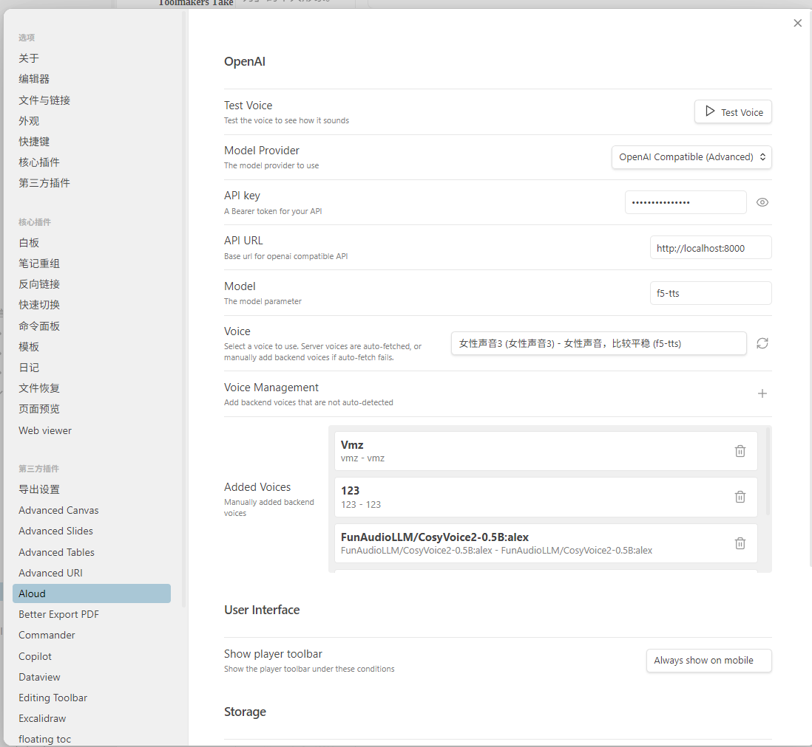{width="5.772222222222222in"
height="5.320117016622922in"}

点击"Voice"行最右侧的刷新按钮，即可看到当前可用的音色：

{width="5.772222222222222in"
height="5.26551946631671in"}

切换到指定音色后，我们就可以点击\"Test Voice\"按钮，进行音频播放了。

接下来，我们可以在obsidian中的任意文档内右键选中指定文本进行语音播放，如下图：

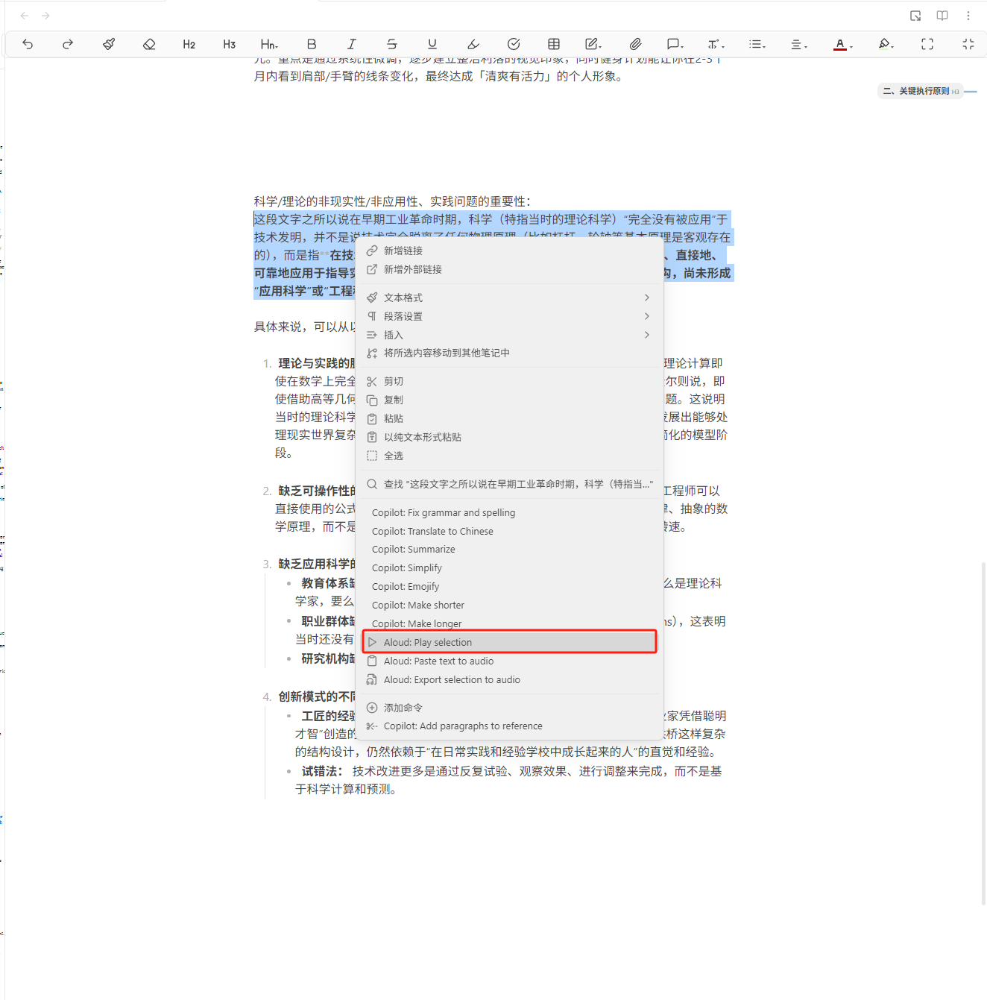{width="5.772222222222222in"
height="5.846336395450568in"}

我们也可以右键选中指定文本，导出这些文本的音频文件，进行播放：

{width="5.772222222222222in"
height="6.49621719160105in"}

这里可以试听导出的音频文本：

-179e7ee3a.mp3

该工具也支持对选中的超长文本的语音连续播放，它会将前面已经处理好的段落播放出来，不用等待后面部分文字的处理。

另外，对于音频存储功能，aloud支持对于过去播放过的文字进行缓存，以及设置多长时间缓存自动清除；对于导出的音频文件，aloud也支持指定存放音频文件的地址。如下图：

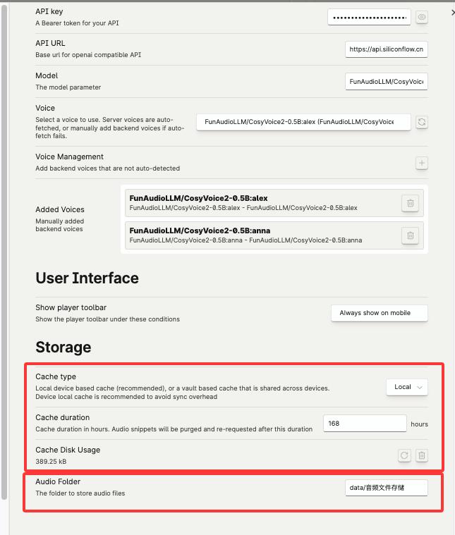{width="5.772222222222222in"
height="6.792428915135608in"}

#### 3.2.2 在线TTS API 服务使用方法

本插件同时支持对于在线api服务的接入，如openai tts
与硅基流动的tts服务，下面以[硅基流动的tts服务](https://docs.siliconflow.cn/cn/api-reference/audio/create-speech)作为参考，以下是配置展示图：

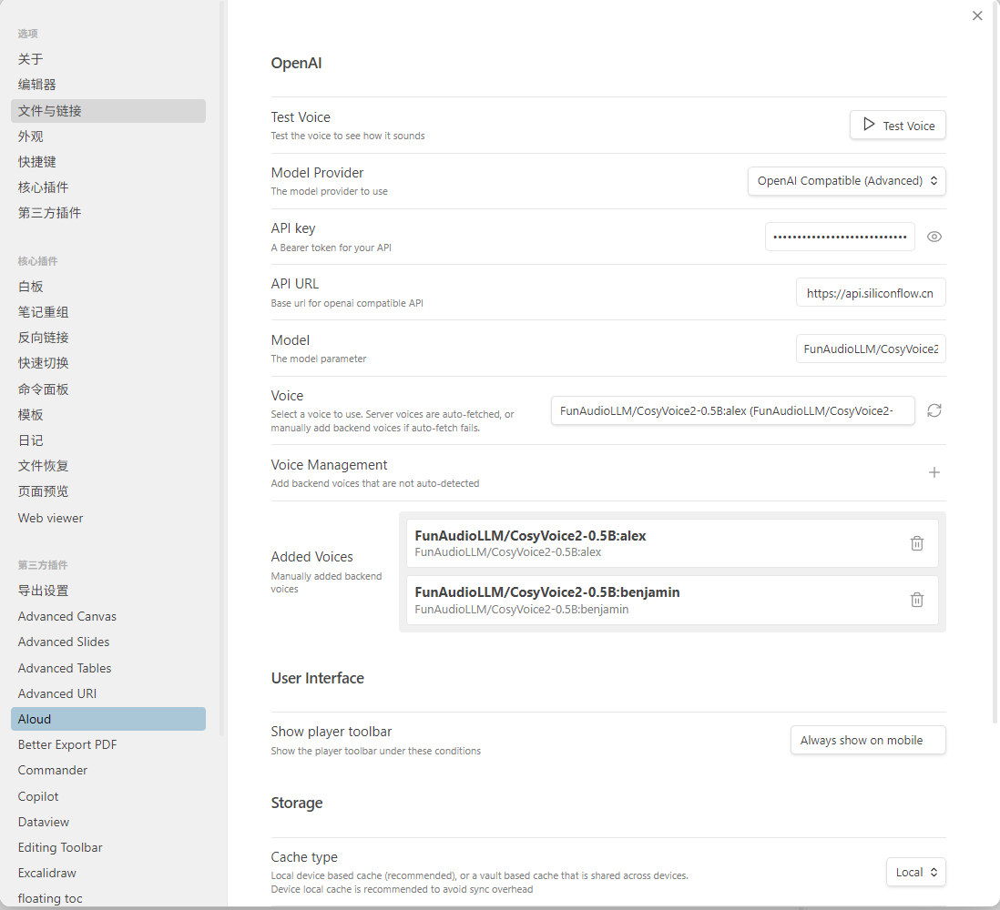{width="5.772222222222222in"
height="5.257031933508311in"}

注意，在线TTS平均token费用是一般比较贵的，不大推荐巨量使用(以下是硅基流动的\"cosyvoice\"的费用，仅供参考)：

{width="5.772222222222222in"
height="1.183225065616798in"}

## 四、推荐用法

比如一些关键插件的联动可以在这里展示出来

## 五、使用反馈

在使用软件时遇到任何问题，欢迎加入QQ群807831970进行交流和咨询！

### 5.1 已知问题

#### 5.1.1 解压时报\"路径太长\"的报错

解压上面提供的整合包时产生了\"路径太长的报错\"，如下图：

{width="5.772222222222222in"
height="4.376784776902887in"}

可以使用本次提供的解压工具\"7z2409-x64.exe\"，首先安装该工具，然后启动它的界面化工具箱，如下图：

{width="5.772222222222222in"
height="3.075686789151356in"}

在文件地址栏(红框标示处)输入到待解压的文件夹的绝对路径，再按一下\"enter\"键，即跳转到相应文件夹处，如下图：

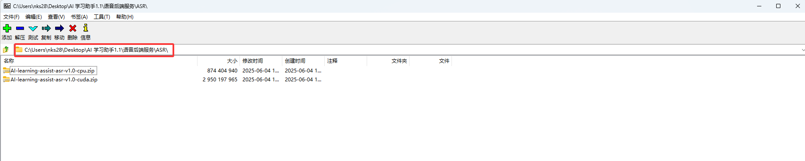{width="5.772222222222222in"
height="1.1550513998250218in"}

点击要解压的压缩包，进行解压，等待一段时间后，解压成功了：

{width="5.772222222222222in"
height="1.13873687664042in"}

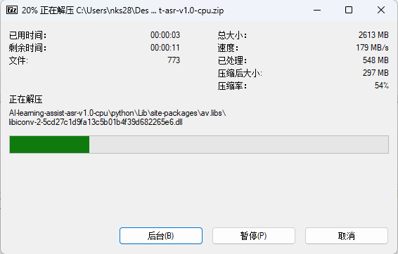{width="5.772222222222222in"
height="3.691773840769904in"}

#### 5.1.2 查看隐藏文件

如果某个文件内存在隐藏文件/文件夹，但无法查看到，可通过点击文件管理器的三个点，再点击\"选项\"，进入"查看"页面，选择显示隐藏文件与文件夹，最后点击确定保存设置：

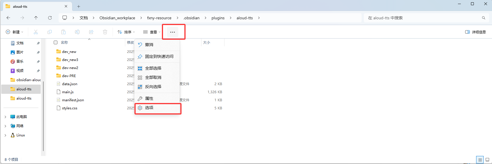{width="5.772222222222222in"
height="1.9297156605424322in"}

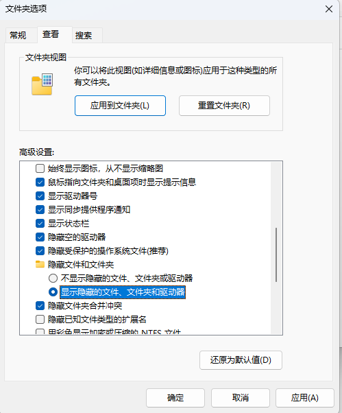{width="5.197916666666667in"
height="6.270833333333333in"}

最后可以看到我们已经可以看到隐藏文件了：

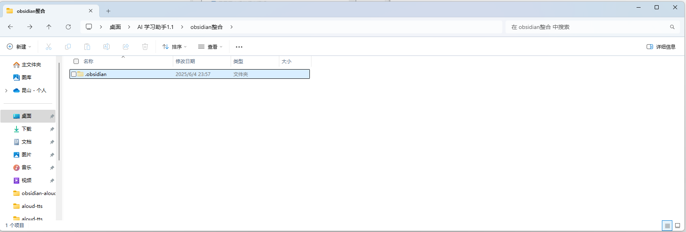{width="5.772222222222222in"
height="1.9511253280839895in"}

## 六、感谢

感谢所有为项目付出的朋友们，因为你们才让我们的开源项目得以一步步落地！以下是贡献者及内容：

### 6.1 1.1 版本 贡献名单

  ---------------------------------- ------------------------------------------------
  贡献者                             贡献内容

  柯南                               obsidian插件开发、TTS多平台整合包制作

  罗鉴                               ASR后端开发、ASR多平台整合包制作、使用文档编辑

  南云                               TTS后端开发

  生年不满百                         obsidian插件开发

  岂能                               obsidian插件开发、学习助手整合、使用文档编辑

  教你说再见                         obsidian 插件开发、使用文档编辑

  简单（康）                         obsidian插件开发
  ---------------------------------- ------------------------------------------------
