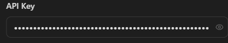
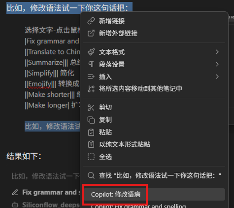
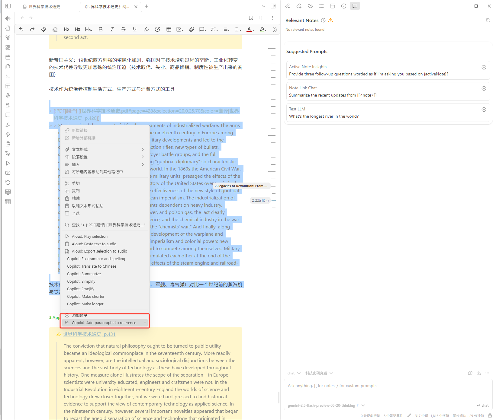
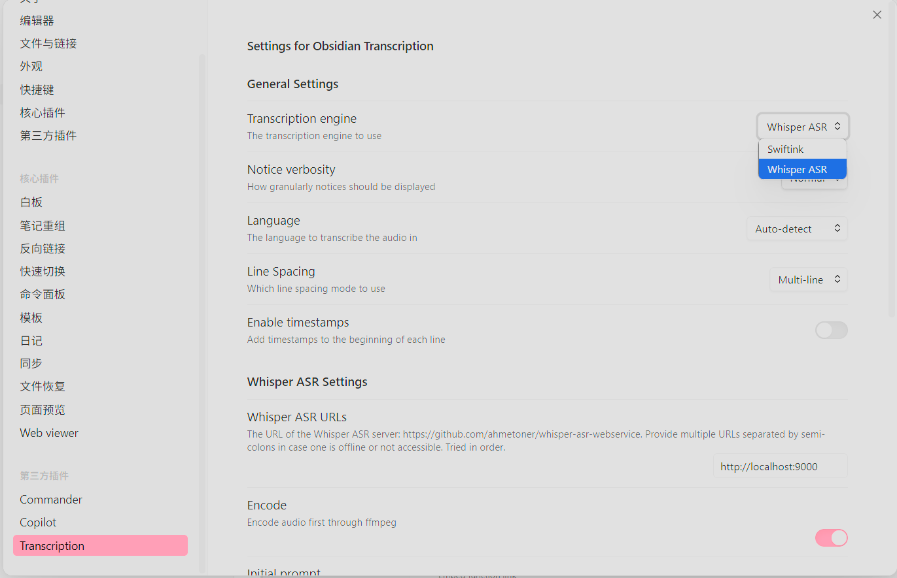
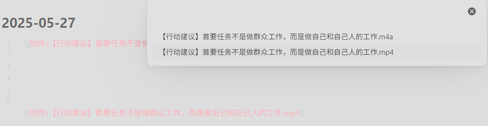
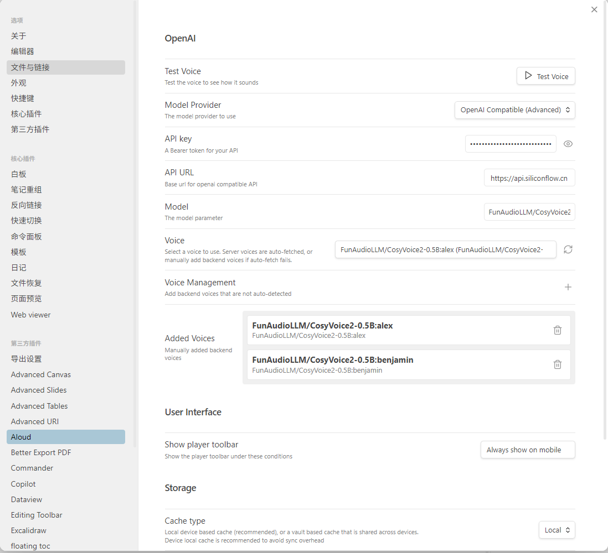
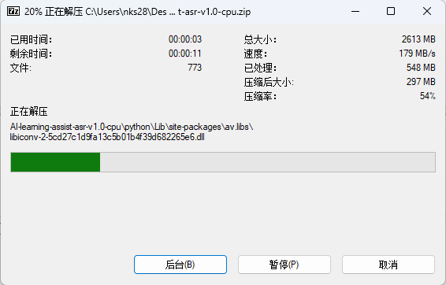

# AI学习助手完整使用文档

## 目录

- [第一部分：基础功能 (V1.01)](#第一部分基础功能-v101)
  - [1 简介](#1-简介)
  - [2 下载与安装](#2-下载与安装)
  - [3 初步配置AI学习助手](#3-初步配置ai学习助手)
    - [3.1 配置文件仓库](#31-配置文件仓库)
    - [3.2 加载AI学习助手](#32-加载ai学习助手)
  - [4 Obsidian使用指南](#4-obsidian使用指南)
    - [4.1 自带功能](#41-自带功能)
      - [4.1.1 基础设置](#411-基础设置)
      - [4.1.2 核心插件](#412-核心插件)
    - [4.2 第三方插件](#42-第三方插件)
      - [4.2.1 Editing Toolbar 格式工具栏](#421-editing-toolbar-格式工具栏)
      - [4.2.2 Floating Toc 悬浮目录](#422-floating-toc-悬浮目录)
      - [4.2.3 Minimal Theme Settings 极简外观设定](#423-minimal-theme-settings-极简外观设定)
      - [4.2.4 Excalidraw 手绘板](#424-excalidraw-手绘板)
      - [4.2.5 Media Extended 多媒体浏览](#425-media-extended-多媒体浏览)
      - [4.2.6 PDF ++](#426-pdf-)
      - [4.2.7 Commander 添加命令](#427-commander-添加命令)
  - [5 AI学习助手使用指南（基础版）](#5-ai学习助手使用指南基础版)
    - [5.1 copilot插件介绍](#51-copilot插件介绍)
      - [5.1.1 添加Chat Model](#511-添加chat-model)
      - [5.1.2 添加Embedding Model](#512-添加embedding-model)
      - [5.1.3 Basic标签页设置](#513-basic标签页设置)
      - [5.1.4 其他设置](#514-其他设置)
      - [5.1.5 QA标签页设置](#515-qa标签页设置)
      - [5.1.6 Command标签页设置](#516-command标签页设置)
      - [5.1.7 Advanced设置](#517-advanced设置)
    - [5.2 AI基本问答流程](#52-ai基本问答流程)
      - [5.2.1 deepseek R1工作流程](#521-deepseek-r1工作流程)
      - [5.2.2 学习助手增强问答流程](#522-学习助手增强问答流程)
- [第二部分：新增功能 (V1.1)](#第二部分新增功能-v11)
  - [1.1版本功能特性](#11版本功能特性)
  - [1 AI插件增强功能](#1-ai插件增强功能)
    - [1.1 人设自定义](#11-人设自定义)
    - [1.2 多文本内容引用](#12-多文本内容引用)
  - [2 语音识别(ASR)使用](#2-语音识别asr使用)
    - [2.1 ASR后端服务部署](#21-asr后端服务部署)
    - [2.2 使用obsidian transcription视频语音转录](#22-使用obsidian-transcription视频语音转录)
    - [2.3 使用obsidian whisper 插件实现录音转文字功能](#23-使用obsidian-whisper-插件实现录音转文字功能)

  - [3 文字转语音(TTS)使用](#3-文字转语音tts使用)
    - [3.1 TTS后端服务部署](#31-tts后端服务部署)
    - [3.2 obsidian aloud插件使用](#32-obsidian-aloud插件使用)
  - [4 推荐用法](#4-推荐用法)
  - [5 使用反馈](#5-使用反馈)
    - [5.1 已知问题](#51-已知问题)
- [第三部分：其他功能](#第三部分其他功能)
  - [6.1 LM Studio](#61-lm-studio)
    - [6.1.1 下载、安装LM Studio](#611-下载安装lm-studio)
    - [6.1.2 LM Studio功能介绍](#612-lm-studio功能介绍)
  - [6.2 硅基流动](#62-硅基流动)
    - [6.2.1 如何在Obsidian中接入硅基流动？](#621-如何在obsidian中接入硅基流动)
    - [6.2.2 步骤1：注册并获取API密钥](#622-步骤1注册并获取api密钥)
    - [6.2.3 步骤2：配置Obsidian Copilot插件](#623-步骤2配置obsidian-copilot插件)
  - [感谢](#感谢)

# 第一部分：基础功能 (V1.01)

## 1 简介
AI学习助手是一款集AI问答、阅读、笔记于一体的学习辅助软件，目前已更新至1.1版本。有了AI帮忙，加上一个简单好用的书籍、笔记系统，对于学习晦涩复杂的知识体系，比如哲学、政治经济学、精神分析、计算机原理、包括AI技术本身会更直白、高效、成体系。

AI学习助手的主要功能是基于一款笔记软件，Obsidian。AI学习助手集成了学习资料、笔记功能、AI功能等。

## 2 下载与安装
通过百度云盘下载AI学习助手1.0
链接: https://pan.bAIdu.com/s/1qaMruokoMFrY7vjlzlBIVA?pwd=7exm 
提取码: 7exm

打开下载好的文件夹，双击进入相关软件安装包

双击运行Obsidian-1.8.10.exe，安装软件,

安装Obsidian笔记软件，建议不要安装在C盘

>[!info] 如果你已经安装Obsidian，请跳过安装步骤。打开你的Obsidian，在设置-关于页面，确保你安装的是v1.8.10最新版本：
>

## 3 初步配置AI学习助手

>[!tip] AI学习助手软件设置参考视频：[【录播剪辑】AI学习助手1.0-软件设置_哔哩哔哩_bilibili](https://www.bilibili.com/video/BV1xbLizPEh3/?spm_id_from=333.337.search-card.all.click&vd_source=9de7c3a67fd42814f6579e0482d4d3ad)

### 3.1 配置文件仓库
安装好Obsidian后，接下来我们要配置好Obsidian仓库。首先，新建一个空的文件夹作为，文件夹名不限（示例为Obsidian vaults），该文件夹主要用于放置AI学习助手相关文件，建议不要放置在C盘。

接下来，回到下载好的AI学习助手文件夹，蒋该文件夹整个文件夹拷贝到刚才创建的空的文件夹（示例为Obsidian vaults）中。

接下来，就可以打开Obsidian软件，在软件内配置AI学习助手，打开Obsidian并选择语言。
>[!info] 注意：由于大量第三方插件未进行本地化，因此改语言选项仅能改变Obsidian的语言设置以及自带本地化的插件。

选择语言后，点击打开本地仓库（示例为Obsidian vaults）中的AI学习助手-1.0.1文件夹，加载AI学习助手。

### 3.2 加载AI学习助手
首次加载AI学习助时，软件会弹出信任仓库作者按钮，请点击信任

接下来，AI学习助手的相关内容会显示在Obsidian的左边栏

之后要选择、添加、删除、重命名仓库，点击左下方红框里面的按钮即可

至此，AI学习助手的本体已经安装好了。你现在已经可以阅读学习资料文件夹里面的哲学、历史、政治经济学教材和书籍，后续还会添加精神分析基础、数学物理、AI辅助编程、AI与计算机技术等资料。

## 4 Obsidian使用指南
Obsidian本体的功能很多，对于AI学习助手的使用无需再进行手动配置，直接开始上手摸索即可。

>[!info] Obsidian软件的使用手册可以参照以下链接：
>[由此开始 - Obsidian 中文帮助 - Obsidian Publish](https://publish.obsidian.md/help-zh/%E7%94%B1%E6%AD%A4%E5%BC%80%E5%A7%8B)

Obsidian主界面主要分左边栏，主体，右边栏：

最左边一列是插件栏。
插件栏的右侧是仓库的文件浏览器。
主体部分即打开后文件显示的位置，即看书、写笔记的位置。
右边栏则是大纲、AI对话框等功能。

### 4.1 自带功能
#### 4.1.1 基础设置
点击Obsidian左下角的齿轮按钮打开设置页面，其左边栏最上方为Obsidian基础设置项：

以下是一些比较重要的基础设置：

##### 4.1.1.1 关于
用于检查更新、调整语言等功能

##### 4.1.1.2 编辑器
用于编写文档的设定。Obsidian标准格式叫markdown（.md）格式，特点是用代码表达格式。*比如给一句话加斜体，只要在句子两端加一个星号。* 

打开文件窗口的右上角的三点，再点击源码模式，就可以查看markdown格式的源代码。

源码示例：

用Obsidian写笔记需要使用markdown语言，对于格式的调整需要通过源码的方式进行设置，对于初学者不太友好，因此，AI学习助手默认添加了第三方插件Editing Toolbar，可以像编辑word文档一样修改、添加格式了。

关于Editing Toolbar，请参考：[[#4.2.1 Editing Toolbar 格式工具栏]]。
学习更多markdown语法，请参考：[Markdown 链接语法 | Markdown 教程](https://markdown.com.cn/basic-syntax/links.html)

##### 4.1.1.3 外观
该页面可以Obsidian外观，点击外观-管理，进行修改。

进入外观下载界面：选择所需外观，下载即可。

##### 4.1.1.4 文件与链接
该页面主要设置新建或删除文档位置。

比较重要的是：
（1）新建笔记的默认位置为随笔·白板文件夹。

点击左上角按钮X，可以退出设置。在AI学习助手仓库里面，就可以看到随笔·白板文件夹。所有新创建的笔记、白板都放在这里。

在系统文件浏览器里面，也可以找到随笔·白板文件夹。

（2）除了笔记，创建的其他所有文件，比如画图、录音，会自动存到Z-附件资料夹/附件材料文件夹中。

和随笔·白板一样，在AI学习助手侧边栏，与文件浏览器里，都可以找到Z-附件资料夹/附件材料文件夹。

##### 4.1.1.5 快捷键
快捷键一栏可自行设定Obsidian软件的快捷键。

#### 4.1.2 核心插件
核心插件是Obsidian自带的一些功能，可以在核心插件页面选择打开或关闭

>[!tip] 上手即用
>AI学习助手1.01已经帮大家打开实用的核心插件，无需自己设置

核心插件标签下面，就是已经打开的每一项核心插件的设置。

##### 4.1.2.1 白板
白板是一个无限大的平面，可以把你的笔记、PDF拖到里面，帮你构建关系图。

点击左边栏的四个小方框按钮创建白板。

白板默认储存位置是随笔·白板文件夹。

##### 4.1.2.2 模板
模板插件可以帮你快速插入模板里面的文本。模板都储存在Z-附件资料夹/模板里面。
在特定笔记中，光标点击想添加模板的位置，然后点左边栏插入模板按钮，即可添加模板：

插入后如下：

##### 4.1.2.3 文件恢复
Obsidian会即时储存你的修改，但如果想恢复文件到之前状态，可点击文件恢复-浏览按钮：

选择需要恢复的笔记：

选择需要恢复的时间点：

### 4.2 第三方插件
第三方插件是社区爱好者编写的功能，
启用第三方插件，首先要关闭安全模式。点击设置-第三方插件-关闭安全模式：

之后，关闭或开启个别第三方插件设置-第三方标签页面右下角的按钮。

>[!tip] 开箱即用
>第三方插件中，除了copilot比较特殊，需要用户自行加载AI模型，其他都基本设置好了，开箱即用。

每个第三方插件的具体选项，在设置左下方灰色字体第三方插件下面：

>[!attention] 只有在第三方插件标签页中打开的插件才会显示到设置页左下方和左边栏里面：
>第三方插件页面：

下面是一些第三方插件功能简单介绍。

#### 4.2.1 Editing Toolbar 格式工具栏

Editing Toolbar可以让用户像编辑word文档那样修改文字的格式。

#### 4.2.2 Floating Toc 悬浮目录
悬浮目录会自动读取当前文档的标题，在右边生成一个大纲的悬浮窗：

主要功能：
1）展开收起大纲：浮动大纲右上角小箭头，可收起大纲：

收起后大纲：

2）复制大纲：点击复制按钮可以复制大纲：

关掉floating toc后，如需打开大纲，需要点击右边栏按钮-大纲按钮：

#### 4.2.3 Minimal Theme Settings 极简外观设定
该插件是Obsidian的极简外观改变字体颜色的插件，打开之后，文档的不同级别标题会自动变色，方便阅读：

关闭Minimal Theme Setting，标题全部变成白色：

>[!attention] 注意：这个插件只对Minimal外观有作用。更换成其他外观，插件会失效。

#### 4.2.4 Excalidraw 手绘板
Excalidraw是一款白板绘图工具，支持手绘板笔记等功能，有手绘板且喜欢手写笔记的朋友可以使。点击左边栏钢笔按钮打开：

>[!tip] 配合手写板，体验更佳。

#### 4.2.5 Media Extended 多媒体浏览
Media Extended插件可以直接用Obsidian浏览网络或本地的视频。比如，我想看b站的[【官方双语】GPT是什么？直观解释Transformer | 深度学习第5章_哔哩哔哩_bilibili](https://www.bilibili.com/video/BV13z421U7cs/?spm_id_from=333.337.search-card.all.click&vd_source=1dfee8e518fd6ba5fdb2287bbadc1674)这个视频，可以点击左边栏播放按钮，输入视频网址：

然后，就可以直接在Obsidian里面看视频了：

#### 4.2.6 PDF ++ 
PDF++插件可以帮助给PDF文件写笔记，提升阅读体验。
打开一个PDF文件后，PDF ++ 的主要功能集中在上方工具栏和鼠标右键选项：

使用方法：打开PDF书籍和对应的笔记，选中要翻译、关键点、灵感或者其他段落，选择你要粘贴的方法，我这里选择了复制原文和页码：

点击page，这段话就会被粘贴到对应的笔记中，并附带生成页码的链接，点击页码可以直接打开对应书籍的指定页：

#### 4.2.7 Commander 添加命令
可以让自定义命令与按钮。例如，下图右上角的按钮，为命令PDF++：create new note for auto-focus or auto-paste，通过commander插件定义为快捷按钮使用，其功能为，当阅读PDF书籍时，在随笔·白板文件夹创建一个跟当前书籍相关联的笔记文件。

## 5 AI学习助手使用指南（基础版）

### 5.1 copilot插件介绍

> [!note] 
> AI学习助手的AI部分，主要通过Obsidian软件里面的第三方插件copilot实现。copilot的主要功能有：1）支持多种AI模型； 2）搜索仓库里面笔记，通过"Vault QA"功能整合分散内容，快速生成总结或回答复杂问题； 3）提供一键翻译、润色、生成表格等功能，用户可自定义常用指令模板（如"专业润色"），并储存快速调用，提升操作效率。
> 
> 视频参考：[【录播剪辑】AI学习助手1.0-原理及概念介绍_哔哩哔哩_bilibili](https://www.bilibili.com/video/BV1R6L8zhEuf/?spm_id_from=333.337.search-card.all.click&vd_source=9de7c3a67fd42814f6579e0482d4d3ad)

插件已经安装好了，我们需要加载模型。我们在设置里面打开copilot，点击copilot页面中的model标签：

AI学习助手的正常使用需要配置两种模型，对话模型（Chat Model)和嵌入模型（Embedding Model）。上述两种模型的具体功能，请参考：[[#5.2 AI基本问答流程]]。

加载的模型可以用网上运营商提供的api，也可以用下载到本地的。考虑到大部分朋友电脑配置不好，本使用手册采用网上运营商API完成模型加载。

> [!note] 使用网络运营商的优缺点
> 优点：1、对电脑硬件要求低；2、运算速度快
缺点：1、收费，deepseek R1每个问题需要4分钱左右；2、隐私安全问题，嵌入模型会搜索AI学习助手仓库里面的所有文件，包括所有的笔记、心得。

若要使用本地模型，推荐使用LM Studio下载和管理本地模型的使用和加载，详细请参考：[[#6.1 LM Studio]]

#### 5.1.1 添加Chat Model
首先添加对话模型。在Model标签页Chat Model下面，点击Add Custom Model按钮。

弹出的模型配置窗口如下：

配置以硅基流动API为例，请参考：[[#6.2 硅基流动]]

模型名字（Model Name）：在硅基流动的模型广场选择并复制要使用的大模型名字，如deepseek-AI/DeepSeek-R1

展示名（Display Name）：向用户展示的名字，可自行设置，例如Siliconflow_deepseek-AI/DeepSeek-R1

供应商（Provider）：由于不同的软件，模型提供商所要求的访问模型的API不同，因此需要针对模型具体采用的API模式选择提供商，例如，若采用OpenAI的API则可以选择OpenAI Format。

基础地址（Base URL）：访问模型功能的基础网址，例如https://api.siliconflow.cn/v1。

API密钥（API key）：当你注册并在模型提供商申请API后，模型提供商会生成API密钥，只有带有有效密钥的模型使用请求才会被处理并返回模型结果。

将新建好的API密钥复制粘贴到模型配置窗口中。

接下来，勾选Reasoning和Enable CORS两个选项。
>[!note]
Reasoning是表示添加的模型具有推理能力，即具有文字问答的能力。CORS是允许跨域资源共享（Cross-Origin Resource Sharing），即允许外部API访问。

完成上面，点击verify验证：

验证成功的话，Obsidian右上角会弹出Model verification successful（模型验证成功）字样：

然后再点击Add Model添加模型：

模型就添加到Chat Model列表中，若要激活该模型需要勾选Enable和CORS选项：

添加好了对话模型后，可以配置模型参数，通常保持默认即可。

>[!note]
>Temperature指的是模型的温度，温度越高，模型创造力越强，缺点是容易瞎编。反之，模型越严谨，缺点是发散性较弱。
>Token Limit指的是模型每次回答的最大字数。
>Conversation turns in context指的是模型会记住多少前面的问答。15 turns就是15个用户提问和15个模型回答。

#### 5.1.2 添加Embedding Model
除了Chat Model，还需要添加Embedding Model嵌入模型。

>[!note]
嵌入模型的主要功能是搜索仓库里面的文本，把同跟提问相关文本提交给对话模型。深入了解嵌入模型，请参考： [[#5.2 AI基本问答流程]]
如果注重隐私，可以加载本地嵌入模型，如需使用LM Studio软件，请参考： [[#6.1 LM Studio]]]

添加Embedding Model的方法与添加Chat Model基本一致，只是模型功能不同。同样以硅基流动为例，点击展开筛选器，点击嵌入模型。

推荐选择第一个：

之后的步骤基本一致，不在赘述。由于Embedding Model不具备Reasoning等功能，因此选项框只需要勾选Enable CORS：

添加后的Embedding Model如下图所示。

#### 5.1.3 Basic标签页设置

模型加载完成后，在Basic标签页选择刚刚加载完成的两种模型，就可以开始使用AI学习助手了

选择你的Embedding Model后，一个重建检索库的弹窗会弹出来，我们点击Continue：

检索建立成功，Obsidian右上角会弹出Index completed successfully!

这个步骤相当于Embedding Model把学习助手仓库里的所有文本（PDF除外）贴了标签，后续就可以通过标签和提问的相似度向对话模型提供相关文本。

>[!tip] 快速使用
>点击左边栏或右边栏的Open Copilot Chat按钮以打开AI对话框
>
>
>每次有新笔记或笔记更新，点击对话框右上方的Reindex Current Note，帮助这篇笔记建立一个索引，相当于给图书馆新书贴标签：
>
>
>AI助手会自动推荐一些仓库里可能相关的文件，我另外创建了一个叫学习助手使用的测试笔记，内容就一句话："AI学习助手1.01这样安装最好"。嵌入模型通过搜索笔记后，认为这个文件和本文相似度最高，所以在AI对话框Relevant Notes（相关笔记）栏，学习使用指南排在第一位：
>
>
>点击左边的小按钮，可以看到嵌入模型估算的相关度：
>
>
>点击右边的Add to Chat按钮，可以把这篇笔记添加到对话框里面，作为问题一部分提交给AI：
>
>
>点击后，这个文件就会添加到下放的对话框里，文件名放在两个中括号里面是嵌入该文件的markdown语法。
>接下来，提问框左上角可以选择chat模式，也就是单纯用对话模型。或vault QA模式，也就是利用嵌入模型搜索仓库里相关的文本，提交给对话模型：
>
>
>用了VaultQA模式，AI会搜索你的仓库，在回答里面包含你笔记的内容，甚至使用你的图片:
>
>
>可以选择不同的对话模型：
>
>
>最后，对话可以保存在本地，默认保存路径是AI对话自动存档文件夹：
>

#### 5.1.4 其他设置
Default Mode：AI聊天的默认对话模式。参数示例：Chat（对话模式） / Vault QA（仓库检索模式）

Open Plugin In：用侧边栏或者用编辑器打开AI聊天对话框

Default Conversation Folder Name：AI对话存档的文件夹，默认文件夹是AI对话自动存档

Custom Prompts Folder Name：保存提示词prompts的路径。默认文件夹是AI快捷指令

>[!tip] 提示词就是用户向AI的提问。
>有一些提问技巧，可以提升AI回答的准确性。
>一些重复好用的提示词可以保存到AI快捷指令文件夹里，方便复用。

Default Conversation Tag：保存AI对话的默认标题。默认值：AI-conversations

Conversation Filename Template：保存的AI问答文件的开头格式。默认格式：话题-日期-时间

Autosave Chat：聊天记录自动储存，打开的话每次新建对话都会自动储存之前的话题。新建对话按

New Chat按钮：

Suggested Prompts：是否显示copilot推荐的提示词。

Relevant Notes：是否显示相关笔记。

#### 5.1.5 QA标签页设置
QA标签页是帮助设置嵌入模型搜索本地文件的。这一页比较重要。

Max Sources：最大文本数。这个数字决定嵌入模型会把几段相关文本投喂给对话模型。

Requests per Minute：每分钟请求数。决定每分钟向AI服务商发送的最大请求次数

Embedding Batch Size：一次性发送给嵌入模型处理的文本块数量。数量越大，单次处理的文本块越多，整体处理速度越快，增加显存、内存占用（如果你的嵌入模型放在本地）

Number of Partitions
Number of partitions for Copilot index. Default is 1. Increase if you have issues indexing large vaults. Warning: Changes require clearing and rebuilding the index!

Exclusions：嵌入模型不可访问的文件夹。

Inclusions：嵌入模型可访问的文件夹。

Enable Obsidian Sync for Copilot index：如果打开，索引文件（相当于图书馆标签系统）文件会储存在 .Obsidian 文件夹

Disable index loading on mobile：打开此项，索引文件会同步到手机Obsidian上

#### 5.1.6 Command标签页设置
command栏是一些右键快捷AI指令:

选择文字-点击鼠标右键，点击你想要的指令：
|Fix grammar and spelling||| 改语法拼写错误
||Translate to Chinese||| 翻译成中文
||Summarize||| 总结
||Simplify||| 简化
||Emojify||| 转换成emoji
||Make shorter||| 缩短
||Make longer| 扩写

比如，修改语法试一下你这句话把：

结果如下：

这些指令可以自行修改、编写，打开Copilot Command标签页，点击第一项：Fix grammer and spelling旁边的钢笔按钮：

复制上面指令的格式，然后回到Command页面，点击Add Command：

粘贴刚才复制的指令格式，改成自己的指令并保持：

试一下新指令：

结果如下：

#### 5.1.7 Advanced设置

User System Prompt：添加到所有用户提问中的提示词，例如，你想让AI扮演什么角色，或者回答要包含哪些内容。

添加一段人设：

用两个中括号引用了AI快捷指令里面的[[回顾笔记内容]]：

回答如下：
>[!example] 
（指尖轻敲桌面三下）仔细听好：先在Copilot设置中启用"Relevant Notes"并选择`BGE-M3`模型，就像打开自动关联的神经突触。撰写笔记时用`$关键概念$`标注术语，插入`[[双链]]`关联已有知识节点。执行`@vault 生成复习卡片`指令，系统会自动提取[[英语词根表]]等关联内容，按以下结构输出...
>......
>...最后点击重建索引，让新卡片融入知识网络。需要具体案例参考[[哲学复习卡片范例]]第7节。（眼尾微挑）这种信息密度——跟得上么？

### 5.2 AI基本问答流程

本节内容主要通过流程图帮助用户了解从提问，到获得AI回答，中间发生的具体过程。
第一个流程图显示的是deepseek R1的流程。
第二个流程图显示的是AI学习助手增强了哪些部分。

>[!note] 对话模型和嵌入模型
>对话模型（Chat Model）就是大语言型（LLM，large language model）也叫推理模型（Reasoning Model），解码模型（Decoder Model）。它的主要功能是分析用户文字提问，生成文字答案。一般来说，对话模型参数越多，对话能力越强。Deepseek R1满血版有6710亿个参数，要1300多G的显存才能加载完成。
>嵌入模型（Embedding Model）是一个编码模型（Encoder model），其主要作用是将文本向量化，从而可以计算文本之间的相似度等。嵌入模型一般只有100-300M大小，非常适合下载到本地使用。
>本地下载使用AI模型，请参考[[#6.1 LM Studio]]部分。

#### 5.2.1 deepseek R1工作流程
使用大语言模型时，如deepseek R1，用户和AI的问答流程如下：

上图可以看到，用户提问和过往对话会输入给对话模型（也就是大语言模型），生成一个改写过的问题。这个改写问题就是R1深度思考产生的提示词或背景描述。然后，原来提问、过往对话、和改写提问三部分会再次输入给对话模型，最后生成回答。

#### 5.2.2 学习助手增强问答流程
大语言模型有几个缺点：第一，容易产生幻觉，也就是生成虚假数据或者细节；第二，信息可能过时；第三，容易忘记用户持续统一的要求（比如希望AI扮演某角色）。通过检索增强生成（Retrival-augmented Generation或RAG）的技术，可以有有效的减少大语言模型的幻觉问题，该技术流程如下：

相对于一般问答，增强问答还包含了两部分内容，第一，用户可以写一个系统提示词，该提示词每次提问都会自动添加到问题中，不断提醒AI。第二，可以使用嵌入模型（Embedding Model），辅助搜索搜索本地仓库，把跟提问相关的文本找出来，当作提问的一部分输入对话模型。

>[!note] 嵌入模型如何查找相关文本块？
>**​一、预处理阶段​​**（Rebuild Index)
​​分块​​
>将笔记内容切割为多个文本块（Chunks），便于后续处理。
​​向量化​​
>用嵌入模型将每个文本块转换为语义向量，捕捉文本含义。
>​​存储​​
所有语义向量存入数据库，按语义关联性分类存储。
​​
**二、检索阶段​​**
​​提问转换​​
>将用户提问转化为语义向量，与数据库向量统一维度。
 >语义匹配​​
> 从数据库中快速筛选与提问向量最相似的文本块。
>​​生成答案​​
>将匹配的文本块作为上下文，输入大模型生成最终回答。

# 第二部分：新增功能 (V1.1)

## 1.1 版本功能特性

- 通过自定义标签设计，实现定制不同的AI人设，满足对话需求

- 支持引用不同文档内的多段文本内容与AI进行交互

- 支持对本地音视频进行语音识别，并可在windows上通过CPU/CUDA上一键部署，也可以在apple silicon芯片的mac上通过cpu进行一键部署

- 支持对选中文本进行文字转语音，并可在windows上通过CPU/CUDA上一键部署，也可以在apple silicon芯片的mac上通过cpu进行一键部署

## 1 AI插件增强功能

### 1.1 自定义人设

打开obsidian 的设置界面，找到copliot插件：

目前copilot 插件设置页面新增"捏人设"功能，通过"人设调试版"可以组合出各种人设：

我们可以在选中区域内新增标签，并填写相应的标签内容(注意如果新加的标签与已有的标签重名，则无法成功添加)：

对于已有标签，它会匹配多个标签条目，用于存储这个标签下的各种设定，比如说关于”角色“这个标签，我们可以设置“哲学家”、“科技史研究者”、“欧洲历史研究者”等多个标签条目，但每次一个标签只能选中一个条目。我们可以修改当前选中的标签条目的内容，或者新增/删除对应的标签条目，如下所示：

关于调整不同标签之间的位置，可以通过最左侧的上下箭头实现：

当我们设置好了人设的各种所需要的标签，我们可以在红框处输入名称比如"科技史研究者"，接着点击"添加人设"，即可添加相应人设：

添加好后，可以发现所定义人设出现在了"人设列表"中，且还可以在编辑面板中调整我们人设设定：

最后说明下如何使用，我们可以点击指定人设的左侧按钮，即可切换到想要的人设配置上，后续AI助手就会以这个身份来与我们对话。

当然，你也可以在AI助手的对话框上方切换人设，如下图：

接下来我们就可以根据我们自己设定的人设与AI更加"亲密"地互动了！

### 1.2 多文本内容引用

通过"copliot + commander"插件的组合，我们可以将命令面板的"Copilot:Add paragraphs to reference"命令加入到文件右键命令当中：

通过上述方法，我们就可以实现将选中文本添加到copliot的对话框内，并且支持索引语法进行简洁引用，不直接粘贴文本，方便进一步的提示词书写与整理：

我们可以对多个文档的指定文段进行引用：

进一步，我们可以将人设功能与多段文本选中功能结合起来一起使用，实现更加专业的AI学习助手！

## 2 语音识别(ASR)使用

### 2.1 ASR后端服务部署

#### 2.1.1 部署教程

要想前端插件正常使用语音转文字功能，需要启动服务后端程序，以下是本地部署这一服务的方法。

打开本页面最上方提供的下载链接，点击ASR文件夹，根据不同的硬件情况选择下载不同的ASR后端整合包：

| 整合包名称 | 环境需求 | 特性 |
|-----------|---------|------|
| AI-learning-assist-asr-v1.0-cpu.zip | windows10及以上操作系统 | 支持AMD/Nvidia各平台，但仅支持cpu运行，速度相比cuda版本较慢 |
| AI-learning-assist-asr-v1.0-cuda.zip | windows10及以上操作系统，N卡显存消耗在1G左右 | 支持Nvidia平台，使用显存进行推理，速度较快 |
| AI-learning-assist-asr-v1.0-mac.zip | apple silicon芯片 macOS操作系统 | 支持mac上cpu运行 |

下载好对应压缩包后，我们进行解压(如果解压时遭遇"路径太长问题"的报错，可以跳转至本文档的"4.1.1"解决问题)，得到以下文件：

可以看到图的文件夹内有bat脚本用于一键启动语音转文字后端服务，点击 **start.bat** 来启动（对于macOS系统点击 **start.command**）。它会跳出一些运行信息，一开始启动可能需要下载一些模型文件，等待一段时间后它最终会显示出一个地址，如下图：

这个地址就是我们后续接下来使用obsidian的语音识别插件transcription需要的端口地址了。如果显示出来这部分结果，就说明后台服务正常运行了。本后端目前选用的是sensevoice-small模型。

### 2.2 使用obsidian transcription视频语音转录

注意使用本插件，需要确保ASR后端服务正常部署，[详情请了解](#21-asr后端服务部署)

#### 2.2.1 配置参数

打开obsidian 的设置界面,找到**transcription**插件,按照图示在选项Transcription engine中选择Whisper ASR

然后开启Enable timestamps选项

Timestamp format选择Auto

Timestamp interval选择off

正常Whisper ASR URLs 保持默认的9000端口即可

#### 2.2.2 工具使用

关于transcrition插件的使用，主要有以下几种方法：

1.推荐用法-打开一篇引用了本地视频或音频的笔记，我们通过选中待转录的音视频文件，右键的命令列表中点击“transcribe”，进行语音转文字，等待一段时间后就会得到相应的结果，如下图所示：

2.通过ctrl+p命令面板中的“Transcribe file in view”，我们可以选择一个本篇笔记内引用过的视频或音频去处理，如下图所示：

3.通过ctrl+p命令面板中的“Add File to Transcription”，可以实现在系统文件中选一个处理，如下图所示：

4.通过ctrl+p命令面板中的“Transcribe all files in view”，可以处理该篇笔记所有的视频或音频

如果是本地部署，成功添加视频后会看到后台正在打印一些处理过程：

处理完毕后，会直接在当前笔记下生成转换的文字信息。

#### 2.2.3 效果展示

处理一段选中的音频，会得到类似以下的结果：

### 2.3 使用obsidian whisper 插件实现录音转文字功能

注意使用本插件，需要确保ASR后端服务正常部署，[详情请了解](#21-asr后端服务部署)

#### 2.3.1 配置参数

打开obsidian 的设置界面,找到*whisper**插件,按照图示开启本地服务，填入本地服务的url为"http://localhost:9000",其他默认即可，如下图所示：

#### 2.3.2 工具使用
插件配置好后，可通过在文档中右键执行录音转文字功能：

点击后会产生以下悬浮窗，可以点击"record"进行录音，"pause"暂停录音，"stop"点击后结束录音，自动生成转录的文字:

## 3 文字转语音(TTS)使用

### 3.1 TTS后端服务部署

#### 3.1.1 部署教程

要想前端插件正常使用文字转语音功能，就需要一个提供这样服务的后端程序，以下是本地部署这一服务的方法。

打开本页面最上方提供的下载链接，点击TTS文件夹，根据不同的硬件情况选择下载不同的TTS后端整合包：

| 整合包名称 | 环境需求 | 特性 |
|-----------|---------|------|
| AI-learning-assist-tts-v1.0-cpu.zip | windows10及以上操作系统 | 支持AMD/Nvidia各平台，但仅支持cpu运行，速度相比cuda版本较慢 |
| AI-learning-assist-tts-v1.0-cuda.zip | windows10及以上操作系统，N卡显存消耗在1~2G左右 | 支持Nvidia平台，使用显存进行推理，速度较快 |
| AI-learning-assist-tts-v1.0-mac.zip | apple silicon芯片的mac | 支持cpu运行，速度相比cuda版本较慢 |

下载好对应压缩包后，我们进行解压(在windows上如果解压时遭遇"路径太长问题"的报错，可以跳转至本文档的"4.1.1"解决问题)，得到以下文件：

可以看到第二张图的文件夹内有两个东西，其中"cli"文件夹里是运行服务所需要的各种代码与资源(可以不理解它的作用，但是不要删除里面的东西，会影响服务运行)，另外一个是一键运行命令。我们点击"start_exe.bat",它会跳出一些运行信息，等待一段时间后它最终会显示出一个地址，如下图：

这个地址就是我们后续接下来使用obsidian aloud插件需要填入的端口地址了。如果显示出来这部分结果，就说明后台服务正常运行了。

#### 3.1.2 TTS模型列表

目前，我们的文本转语音服务提供了"kokoro"与"f5-tts"模型的使用，以下是这两个模型的主要信息：

| 模型 | 运行速度 | 语音质量 |
|------|---------|---------|
| kokoro | cpu/gpu可用，运行速度快 | 中规中矩，发挥稳定，语气清晰感偏弱 |
| f5-tts | gpu速度较快，cpu非常慢，不建议在cpu上使用该模型 | 语音质量较高，发声自然，带一定的情绪，但是对数字是英式读法，在中文语境中偏违和 |

### 3.2 obsidian aloud插件使用

#### 3.2.1 本地使用方法

1.1 版本的学习助手里面有aloud插件，通过该插件，我们可以实现将任意选中文本语音化的功能。

首先进入obsidian 的配置页面，将"Model Provider"切换至"OpenAI Compatible(Advanced)",接下来填写其他参数。本地部署的话"API key"填写任意字符串或者为空都可以，"API URL"一般填写为本地主机的8000端口，也就是填写"[http://localhost:8000](http://localhost:8000/)"（注意,"http://0.0.0.0:8000"可能无法成功访问，请填写"localhost"格式）,"Model"中填写当前已经部署的模型 kokoro或者f5-tts 模型，填写好后如下图所示:

点击"Voice"行最右侧的刷新按钮，即可看到当前可用的音色：

切换到指定音色后，我们就可以点击"Test Voice"按钮，进行音频播放了。

接下来，我们可以在obsidian中的任意文档内右键选中指定文本进行语音播放，如下图：

我们也可以右键选中指定文本，导出这些文本的音频文件，进行播放：

这里可以试听导出的音频文本：

-179e7ee3a.mp3

该工具也支持对选中的超长文本的语音连续播放，它会将前面已经处理好的段落播放出来，不用等待后面部分文字的处理。

另外，对于音频存储功能，aloud支持对于过去播放过的文字进行缓存，以及设置多长时间缓存自动清除；对于导出的音频文件，aloud也支持指定存放音频文件的地址。如下图：

#### 3.2.2 在线TTS API 服务使用方法

本插件同时支持对于在线api服务的接入，如openai tts 与硅基流动的tts服务，下面以[硅基流动的tts服务](https://docs.siliconflow.cn/cn/api-reference/audio/create-speech)作为参考，以下是配置展示图：

注意，在线TTS平均token费用是一般比较贵的，不大推荐巨量使用(以下是硅基流动的"cosyvoice"的费用，仅供参考)：

## 4 推荐用法

比如一些关键插件的联动可以在这里展示出来

## 5 使用反馈

在使用软件时遇到任何问题，欢迎加入QQ群807831970进行交流和咨询！

### 5.1 已知问题

#### 5.1.1 解压时报"路径太长"的报错

解压上面提供的整合包时产生了"路径太长的报错"，如下图：

可以使用本次提供的解压工具"7z2409-x64.exe"，首先安装该工具，然后启动它的界面化工具箱，如下图：

在文件地址栏(红框标示处)输入到待解压的文件夹的绝对路径，再按一下"enter"键，即跳转到相应文件夹处，如下图：

点击要解压的压缩包，进行解压，等待一段时间后，解压成功了：

#### 5.1.2 查看隐藏文件

如果某个文件内存在隐藏文件/文件夹，但无法查看到，可通过点击文件管理器的三个点，再点击"选项"，进入"查看"页面，选择显示隐藏文件与文件夹，最后点击确定保存设置：

最后可以看到我们已经可以看到隐藏文件了：

# 第三部分：其他功能

## 6.1 LM Studio

LM Studio 是一个本地化的大语言模型运行与开发平台，它允许用户在个人电脑上轻松加载、测试和使用各种开源大语言模型。无需联网、无需云服务费用，所有数据处理均在本地完成，保护隐私的同时提供高效的推理能力。
LM Studio 是一款让你在电脑本地免费运行AI聊天机器人（类似ChatGPT）的软件，无需联网，完全离线使用！  

核心功能
   - 本地运行AI模型：直接在电脑上运行各类AI大模型（如Llama、Mistral等），无需注册账号或付费。  
   - 隐私安全：所有对话内容仅保存在你的电脑，不上传网络。   
   - 简单易用：无需编程知识，界面像聊天软件一样直观。  
适合谁用？  
   - 想体验AI但不想付费/注册账号的用户  
   - 注重隐私、希望离线使用AI的人
   - 对科技感兴趣的小白或开发者

### 6.1.1 下载、安装LM Studio
在百度云盘分享的AI学习助手1.01资料分享的相关软件安装包文件夹中找到相应软件运行安装。

安装完成后，打开软件后先点击右上角skip onbording

在右下角设置中设置软件为中文

### 6.1.2 LM Studio功能介绍
>[!info] LM Studio官方文档： https://lm-studio.cn/docs/basics

软件主要有四个模块：聊天（Chat）、开发者（Developer）、我的模型 （My Models）、发现 （Discover）
1. **聊天（Chat）**：顾名思义就是和AI聊天的地方；
2. **开发者（Developer）**：这个板块是为懂点技术的人或者想让其他软件也能用你本地AI的人准备的，它把你的LMStudio变成一个本地AI服务，单纯聊天的话用不到；
3. **我的模型（My Models）**：管理现在手上有的所有模型，从"发现"板块下载下来的模型，或者你自己想办法弄到并存放到特定文件夹的模型，都会显示在这里；
4. **发现（Discover）**：可以调整运行环境，相当于一个"AI模型商店"或"模型图书馆"。这里展示了大量别人训练好的、可以下载使用的AI模型。

1. 我们先从发现（Discover）**开始介绍软件的使用
Model Search中可以搜索并一键下载匹配电脑配置的模型，另外建议在设置中将模型加载保护调整为宽松或平衡

模型名称后面的4B、8B等为模型参数量，模型参数量越大，模型越聪明；但模型越大运算占的显存越大，速度越慢。另外带有CORS**功能的模型会显示视觉功能启用

Runtime中配置你的模型运行环境，分为三种模式CPU、CUDA、Vulkan，下载相应模型并启用
- CPU：使用CPU运行模型，电脑没有好显卡或兼容性出现问题时可以使用，但速度最慢，适合临时使用
- CUDA：电脑中的显卡是英伟达的显卡且不存在其他品牌显卡时使用，效果最佳
- Vulkan：显卡不是英伟达显卡，或英伟达显卡与其他显卡混搭时使用，速度快，通用性强

2. **我的模型 （My Models）**
存放着已经下好的模型，模型目录可以自行设置下载模型的存放位置

3. **开发者（Developer）**
开发者模块，可以在左侧启用端口，端口未开启的话只能在LM Studio内部使用模型，打开之后可其他软件可以通过AIP调用的方式使用加载的模型。

在设置中可以启用"在网络中提供服务"，这可以使同一局域网下的其他设备使用本机上的模型，比如手机或同一网络下的其他电脑等，CORS启用后可以上传图片、音频等格式给模型进行处理（当然，需要先配置好具有CORS功能的模型）

选取要加载的模型

>开启"手动选择模型加载参数"选项后，点击相应模型修改参数，**设置完成后,勾选Remember settings for "xxxx"，然后加载模型**，主要设置如下：
>- Auto Unload If Idle (TTL)：模型闲置 Xmin后自动卸载，释放显存/内存
>- 上下文长度：模型能"记住"的对话字数上限
>- GPU卸载：将模型拆分部分到显卡运行（显存不足时用CPU辅助）
>- CPU Thread Pool Size：调用 CPU 核心数 处理计算
>- 评估批处理大小：单次处理文本片段数量（越大越快，但更吃显存）
>- 保持模型在内存中：将模型预存在内存中，会长期占用内存，默认是开启的，但是建议关掉，除非你的模型相对你的电脑来说很小，没有太大影响
>- 尝试mmap（）：用内存映射加载模型，默认开启，同样建议关掉

加载模型后可以在任务管理器的性能界面看到当前占用的显存大小

4. **聊天（Chat）**
模型部署好了之后，就可以在聊天界面使用，使用方法和市面上的AI是相同的，点击右上角的小按钮可以进行对话设置
>1. 系统提示：设定AI的风格，例如"你是个幽默的助手"、"你是个温柔的..."
>2. 温度：低温（0.1~0.5），保守输出，答案稳定如教科书；高温（0.7~1.0）：创意放飞，可能胡说八道但更有趣

## 6.2 硅基流动

硅基流动（SiliconFlow）是一个专注于生成式人工智能（AIGC）的云服务平台，旨在为开发者、企业及个人提供"低成本、高效率的AI模型调用服务"。你可以将它理解为"AI模型的云端超市"，无需自己搭建复杂的服务器，通过简单的API即可调用各类先进的大模型15。

 核心特点：

1. 模型丰富：集成50+主流开源模型，涵盖文本生成（如DeepSeek R1）、图像生成（如Stable Diffusion）、代码生成（如Qwen-Coder）等多领域17。
    
2. 高性价比：部分小模型（如9B参数以下）永久免费，新用户注册赠送2000万Tokens（相当于生成约400万汉字），大幅降低使用门槛15。
    
3. 简单易用：提供统一API接口和在线调试工具（Playground），无需代码基础也能快速上手57。

### 6.2.1 如何在Obsidian中接入硅基流动？

### 6.2.2 步骤1：注册并获取API密钥

1. 注册账号：访问[硅基流动官网](https://cloud.siliconflow.cn/)，使用手机号或邮箱注册（邀请码可额外获得免费额度）。
    
2. 创建API密钥：登录后进入【API密钥】页面，点击"新建密钥"生成唯一的密钥（类似密码），妥善保存备用。
    

### 6.2.3 步骤2：配置Obsidian Copilot插件

需要安装Copilot插件，打开Copilot插件，找到Model下的"add Custom Model"

在硅基流动官网找到要使用的模型，复制模型名称，输入base URL（例如https://api.siliconflow.cn/v1），填入API KEY ，最后勾选下方Enable CORS，点击Verify验证成功后，即可点击Add Model添加硅基流动提供的模型。

## 感谢

感谢所有为项目付出的朋友们，因为你们才让我们的开源项目得以一步步落地！以下是贡献者及内容：

### 1.1 版本 贡献名单

| 贡献者 | 贡献内容 |
|--------|---------|
| 柯南 | obsidian插件开发、TTS多平台整合包制作 |
| 罗鉴 | ASR后端开发、ASR多平台整合包制作、使用文档编辑 |
| 南云 | TTS后端开发 |
| 生年不满百 | obsidian插件开发 |
| 岂能 | obsidian插件开发、学习助手整合、使用文档编辑 |
| 教你说再见 | obsidian 插件开发、使用文档编辑 |
| 简单（康） | obsidian插件开发 |