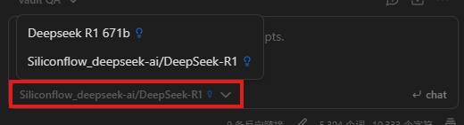
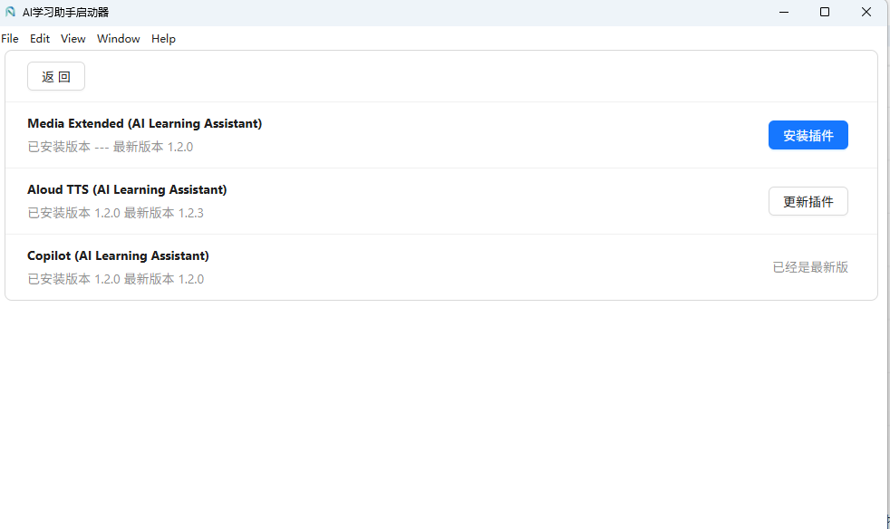
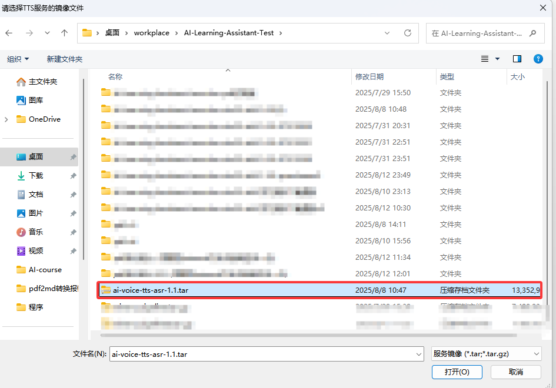
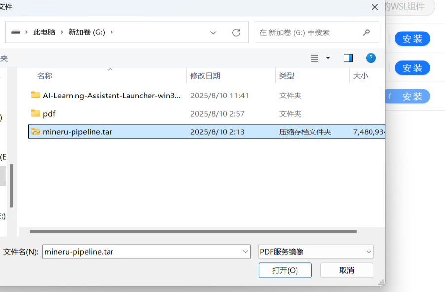
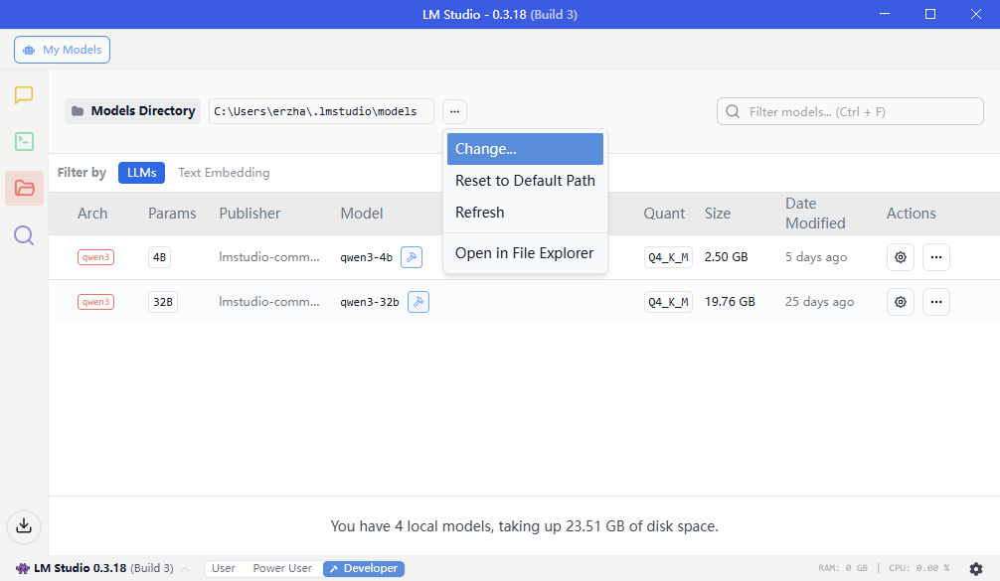
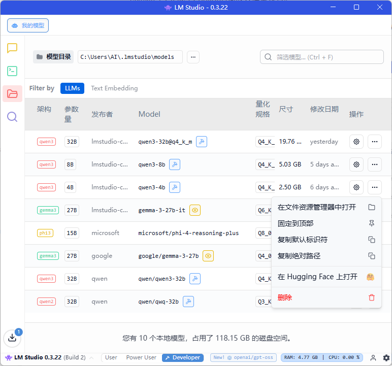
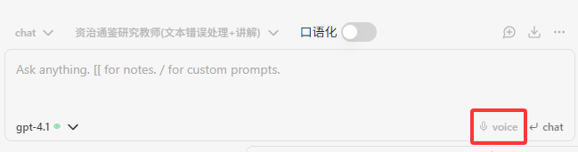
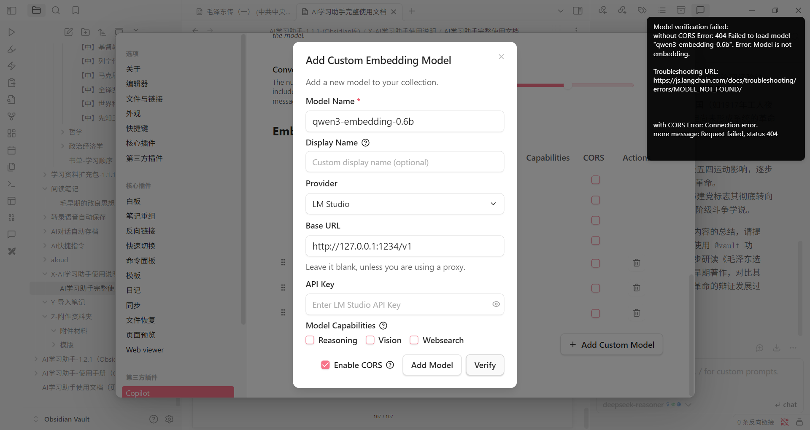

```table-of-contents
```

# 第一部分：基础功能 (V1.01)

## 1 简介
AI学习助手是一款集AI问答、阅读、笔记于一体的学习辅助软件，目前已更新至1.1版本。有了AI帮忙，加上一个简单好用的书籍、笔记系统，对于学习晦涩复杂的知识体系，比如哲学、政治经济学、精神分析、计算机原理、包括AI技术本身会更直白、高效、成体系。

AI学习助手的主要功能是基于一款笔记软件，Obsidian。AI学习助手集成了学习资料、笔记功能、AI功能等。

## 2 下载与安装
通过百度云盘下载AI学习助手1.0
链接: https://pan.bAIdu.com/s/1qaMruokoMFrY7vjlzlBIVA?pwd=7exm 
提取码: 7exm


打开下载好的文件夹，双击进入相关软件安装包


双击运行Obsidian-1.8.10.exe，安装软件,


安装Obsidian笔记软件，建议不要安装在C盘


>[!info] 如果你已经安装Obsidian，请跳过安装步骤。打开你的Obsidian，在<font color="#92d050">设置-关于</font>页面，确保你安装的是v1.8.10最新版本：
>

## 3 初步配置AI学习助手

>[!tip] AI学习助手软件设置参考视频：[【录播剪辑】AI学习助手1.0-软件设置_哔哩哔哩_bilibili](https://www.bilibili.com/video/BV1xbLizPEh3/?spm_id_from=333.337.search-card.all.click&vd_source=9de7c3a67fd42814f6579e0482d4d3ad)

### 3.1 配置文件仓库
安装好Obsidian后，接下来我们要配置好Obsidian仓库。首先，新建一个空的文件夹作为，文件夹名不限（示例为Obsidian vaults），该文件夹主要用于放置AI学习助手相关文件，建议不要放置在C盘。


接下来，回到下载好的AI学习助手文件夹，蒋该文件夹整个文件夹拷贝到刚才创建的空的文件夹（示例为Obsidian vaults）中。


接下来，就可以打开Obsidian软件，在软件内配置AI学习助手，打开Obsidian并选择语言。
>[!info] 注意：由于大量第三方插件未进行本地化，因此改语言选项仅能改变Obsidian的语言设置以及自带本地化的插件。


选择语言后，点击打开本地仓库（示例为Obsidian vaults）中的AI学习助手-1.0.1文件夹，加载AI学习助手。


### 3.2 加载AI学习助手
首次加载AI学习助时，软件会弹出信任仓库作者按钮，请点击信任


接下来，AI学习助手的相关内容会显示在Obsidian的左边栏


之后要选择、添加、删除、重命名仓库，点击左下方红框里面的按钮即可


至此，AI学习助手的本体已经安装好了。你现在已经可以阅读学习资料文件夹里面的哲学、历史、政治经济学教材和书籍，后续还会添加精神分析基础、数学物理、AI辅助编程、AI与计算机技术等资料。

## 4 Obsidian使用指南
Obsidian本体的功能很多，对于AI学习助手的使用无需再进行手动配置，直接开始上手摸索即可。

>[!info] Obsidian软件的使用手册可以参照以下链接：
>[由此开始 - Obsidian 中文帮助 - Obsidian Publish](https://publish.obsidian.md/help-zh/%E7%94%B1%E6%AD%A4%E5%BC%80%E5%A7%8B)

Obsidian主界面主要分左边栏，主体，右边栏：

最左边一列是插件栏。
插件栏的右侧是仓库的文件浏览器。
主体部分即打开后文件显示的位置，即看书、写笔记的位置。
右边栏则是大纲、AI对话框等功能。

### 4.1 自带功能
#### 4.1.1 基础设置
点击Obsidian左下角的<font color="#92d050">齿轮按钮</font>打开设置页面，其左边栏最上方为Obsidian基础设置项：


以下是一些比较重要的基础设置：

##### 4.1.1.1 关于
用于检查更新、调整语言等功能

##### 4.1.1.2 编辑器
用于编写文档的设定。Obsidian标准格式叫markdown（.md）格式，特点是用代码表达格式。*比如给一句话加斜体，只要在句子两端加一个星号。* 

打开文件窗口的右上角的三点，再点击源码模式，就可以查看markdown格式的源代码。


源码示例：


用Obsidian写笔记需要使用markdown语言，对于格式的调整需要通过源码的方式进行设置，对于初学者不太友好，因此，AI学习助手默认添加了第三方插件Editing Toolbar，可以像编辑word文档一样修改、添加格式了。

关于Editing Toolbar，请参考：[[#4.2.1 Editing Toolbar 格式工具栏]]。
学习更多markdown语法，请参考：[Markdown 链接语法 | Markdown 教程](https://markdown.com.cn/basic-syntax/links.html)

##### 4.1.1.3 外观
该页面可以Obsidian外观，点击外观-管理，进行修改。


进入外观下载界面：选择所需外观，下载即可。


##### 4.1.1.4 文件与链接
该页面主要设置新建或删除文档位置。

比较重要的是：
（1）新建笔记的默认位置为<font color="#92d050">随笔·白板</font>文件夹。


点击左上角按钮X，可以退出设置。在AI学习助手仓库里面，就可以看到<font color="#92d050">随笔·白板</font>文件夹。所有新创建的笔记、白板都放在这里。


在系统文件浏览器里面，也可以找到<font color="#92d050">随笔·白板</font>文件夹。


（2）除了笔记，创建的其他所有文件，比如画图、录音，会自动存到<font color="#92d050">Z-附件资料夹/附件材料</font>文件夹中。

和<font color="#92d050">随笔·白板</font>一样，在AI学习助手侧边栏，与文件浏览器里，都可以找到<font color="#92d050">Z-附件资料夹/附件材料</font>文件夹。

##### 4.1.1.5 快捷键
快捷键一栏可自行设定Obsidian软件的快捷键。

#### 4.1.2 核心插件
核心插件是Obsidian自带的一些功能，可以在核心插件页面选择打开或关闭


>[!tip] 上手即用
>AI学习助手1.01已经帮大家打开实用的核心插件，无需自己设置

核心插件标签下面，就是已经打开的每一项核心插件的设置。


##### 4.1.2.1 白板
白板是一个无限大的平面，可以把你的笔记、PDF拖到里面，帮你构建关系图。


点击左边栏的四个小方框按钮创建白板。

白板默认储存位置是<font color="#92d050">随笔·白板</font>文件夹。

##### 4.1.2.2 模板
模板插件可以帮你快速插入模板里面的文本。模板都储存在<font color="#92d050">Z-附件资料夹/模板</font>里面。
在特定笔记中，光标点击想添加模板的位置，然后点左边栏<font color="#92d050">插入模板</font>按钮，即可添加模板：

插入后如下：

##### 4.1.2.3 文件恢复
Obsidian会即时储存你的修改，但如果想恢复文件到之前状态，可点击<font color="#92d050">文件恢复-浏览</font>按钮：


选择需要恢复的笔记：


选择需要恢复的时间点：


### 4.2 第三方插件
第三方插件是社区爱好者编写的功能，
启用第三方插件，首先要<font color="#92d050">关闭安全模式</font>。点击<font color="#92d050">设置-第三方插件-关闭安全模式</font>：


之后，关闭或开启个别第三方插件设置-第三方标签页面右下角的按钮。


>[!tip] 开箱即用
>第三方插件中，除了copilot比较特殊，需要用户自行加载AI模型，其他都基本设置好了，开箱即用。

每个第三方插件的具体选项，在设置左下方灰色字体<font color="#646a73">第三方插件</font>下面：


>[!attention] 只有在<font color="#92d050">第三方插件</font>标签页中打开的插件才会显示到<font color="#92d050">设置页左下方</font>和<font color="#92d050">左边栏</font>里面：
><font color="#92d050">第三方插件</font>页面：

下面是一些第三方插件功能简单介绍。

#### 4.2.1 Editing Toolbar 格式工具栏

<font color="#92d050">Editing Toolbar</font>可以让用户像编辑word文档那样修改文字的格式。


#### 4.2.2 Floating Toc 悬浮目录
悬浮目录会自动读取当前文档的标题，在右边生成一个<font color="#92d050">大纲</font>的悬浮窗：


主要功能：
1）<font color="#92d050">展开收起大纲</font>：浮动大纲右上角小箭头，可收起大纲：


收起后大纲：


2）<font color="#92d050">复制大纲</font>：点击复制按钮可以复制大纲：


关掉floating toc后，如需打开大纲，需要点击<font color="#92d050">右边栏</font>按钮-<font color="#92d050">大纲</font>按钮：


#### 4.2.3 Minimal Theme Settings 极简外观设定
该插件是Obsidian的极简外观<font color="#92d050">改变字体颜色</font>的插件，打开之后，文档的<font color="#92d050">不同级别标题会自动变色</font>，方便阅读：


关闭Minimal Theme Setting，标题全部变成白色：


>[!attention] 注意：这个插件只对Minimal外观有作用。更换成其他外观，插件会失效。

#### 4.2.4 Excalidraw 手绘板
Excalidraw是一款<font color="#92d050">白板绘图工具</font>，支持手绘板笔记等功能，有手绘板且喜欢手写笔记的朋友可以使。点击左边栏<font color="#92d050">钢笔</font>按钮打开：


>[!tip] 配合手写板，体验更佳。

#### 4.2.5 Media Extended 多媒体浏览
Media Extended插件可以直接<font color="#92d050">用Obsidian</font><font color="#92d050">浏览</font>网络或本地的<font color="#92d050">视频</font>。比如，我想看b站的[【官方双语】GPT是什么？直观解释Transformer | 深度学习第5章_哔哩哔哩_bilibili](https://www.bilibili.com/video/BV13z421U7cs/?spm_id_from=333.337.search-card.all.click&vd_source=1dfee8e518fd6ba5fdb2287bbadc1674)这个视频，可以点击左边栏播放按钮，输入视频网址：


然后，就可以直接在Obsidian里面看视频了：


#### 4.2.6 PDF ++ 
PDF++插件可以帮助给PDF文件写笔记，提升阅读体验。
打开一个PDF文件后，PDF ++ 的主要功能集中在上方<font color="#92d050">工具栏</font>和<font color="#92d050">鼠标右键</font>选项：


使用方法：打开PDF书籍和对应的笔记，选中要翻译、关键点、灵感或者其他段落，选择你要粘贴的方法，我这里选择了复制原文和页码：


点击page，这段话就会被粘贴到对应的笔记中，并附带生成页码的链接，点击页码可以直接打开对应书籍的指定页：


#### 4.2.7 Commander 添加命令
可以让自定义命令与按钮。例如，下图右上角的按钮，为命令<font color="#92d050">PDF++：create new note for auto-focus or auto-paste</font>，通过commander插件定义为快捷按钮使用，其功能为，当阅读PDF书籍时，在<font color="#92d050">随笔·白板</font>文件夹创建一个跟当前书籍相关联的笔记文件。


## 5 AI学习助手使用指南（基础版）

### 5.1 copilot插件介绍

> [!note] 
> AI学习助手的AI部分，主要通过Obsidian软件里面的第三方插件<font color="#92d050">copilot</font>实现。copilot的主要功能有：1）支持多种AI模型； 2）搜索仓库里面笔记，通过"Vault QA"功能整合分散内容，快速生成总结或回答复杂问题； 3）提供一键翻译、润色、生成表格等功能，用户可自定义常用指令模板（如"专业润色"），并储存快速调用，提升操作效率。
> 
> 视频参考：[【录播剪辑】AI学习助手1.0-原理及概念介绍_哔哩哔哩_bilibili](https://www.bilibili.com/video/BV1R6L8zhEuf/?spm_id_from=333.337.search-card.all.click&vd_source=9de7c3a67fd42814f6579e0482d4d3ad)

插件已经安装好了，我们需要加载模型。我们在设置里面打开<font color="#92d050">copilot</font>，点击copilot页面中的<font color="#92d050">model</font>标签：


AI学习助手的正常使用需要配置两种模型，<font color="#92d050">对话模型（Chat Model)</font>和<font color="#92d050">嵌入模型（Embedding Model）</font>。上述两种模型的具体功能，请参考：[[#5.2 AI基本问答流程]]。

加载的模型可以用网上运营商提供的api，也可以用下载到本地的。考虑到大部分朋友电脑配置不好，<font color="#92d050">本使用手册采用网上运营商API完成模型加载</font>。

> [!note] 使用网络运营商的优缺点
> 优点：1、对电脑硬件要求低；2、运算速度快
缺点：1、收费，deepseek R1每个问题需要4分钱左右；2、隐私安全问题，嵌入模型会搜索AI学习助手仓库里面的所有文件，包括所有的笔记、心得。

若要使用本地模型，推荐使用LM Studio下载和管理本地模型的使用和加载，详细请参考：[[#6.1 LM Studio]]

#### 5.1.1 添加Chat Model
首先添加对话模型。在Model标签页Chat Model下面，点击Add Custom Model按钮。


弹出的模型配置窗口如下：


配置以硅基流动API为例，请参考：[[#6.2 硅基流动]]

模型名字（<font color="#92d050">Model Name</font>）：在硅基流动的模型广场选择并复制要使用的大模型名字，如deepseek-AI/DeepSeek-R1


展示名（<font color="#92d050">Display Name</font>）：向用户展示的名字，可自行设置，例如Siliconflow_deepseek-AI/DeepSeek-R1

供应商（<font color="#92d050">Provider</font>）：由于不同的软件，模型提供商所要求的访问模型的API不同，因此需要针对模型具体采用的API模式选择提供商，例如，若采用OpenAI的API则可以选择OpenAI Format。


基础地址（<font color="#92d050">Base URL</font>）：访问模型功能的基础网址，例如https://api.siliconflow.cn/v1。


API密钥（<font color="#92d050">API key</font>）：当你注册并在模型提供商申请API后，模型提供商会生成API密钥，只有带有有效密钥的模型使用请求才会被处理并返回模型结果。


将新建好的API密钥复制粘贴到模型配置窗口中。


接下来，勾选<font color="#92d050">Reasoning</font>和<font color="#92d050">Enable CORS</font>两个选项。
>[!note]
Reasoning是表示添加的模型具有推理能力，即具有文字问答的能力。CORS是允许跨域资源共享（Cross-Origin Resource Sharing），即允许外部API访问。


完成上面，点击verify验证：


验证成功的话，Obsidian右上角会弹出Model verification successful（模型验证成功）字样：


然后再点击Add Model添加模型：


模型就添加到Chat Model列表中，若要激活该模型需要勾选Enable和CORS选项：


添加好了对话模型后，可以配置模型参数，通常保持默认即可。


>[!note]
><font color="#92d050">Temperature</font>指的是模型的温度，温度越高，模型创造力越强，缺点是容易瞎编。反之，模型越严谨，缺点是发散性较弱。
><font color="#92d050">Token Limit</font>指的是模型每次回答的最大字数。
><font color="#92d050">Conversation turns in context</font>指的是模型会记住多少前面的问答。15 turns就是15个用户提问和15个模型回答。

#### 5.1.2 添加Embedding Model
除了Chat Model，还需要添加Embedding Model嵌入模型。

>[!note]
嵌入模型的主要功能是搜索仓库里面的文本，把同跟提问相关文本提交给对话模型。深入了解嵌入模型，请参考： [[#5.2 AI基本问答流程]]
如果注重隐私，可以加载本地嵌入模型，如需使用LM Studio软件，请参考： [[#6.1 LM Studio]]]

添加Embedding Model的方法与添加Chat Model基本一致，只是模型功能不同。同样以硅基流动为例，点击展开筛选器，点击嵌入模型。


推荐选择第一个：


之后的步骤基本一致，不在赘述。由于Embedding Model不具备Reasoning等功能，因此选项框只需要勾选<font color="#92d050">Enable CORS</font>：


添加后的Embedding Model如下图所示。


#### 5.1.3 Basic标签页设置

模型加载完成后，在Basic标签页选择刚刚加载完成的两种模型，就可以开始使用AI学习助手了


选择你的Embedding Model后，一个重建检索库的弹窗会弹出来，我们点击<font color="#92d050">Continue</font>：


检索建立成功，Obsidian右上角会弹出Index completed successfully!


<font color="#92d050">这个步骤相当于Embedding Model把学习助手仓库里的所有文本（PDF除外）贴了标签，后续就可以通过标签和提问的相似度向对话模型提供相关文本。</font>

>[!tip] 快速使用
>点击左边栏或右边栏的<font color="#92d050">Open Copilot Chat</font>按钮以打开AI对话框
>
>
>每次有新笔记或笔记更新，点击对话框右上方的<font color="#92d050">Reindex Current Note</font>，帮助这篇笔记建立一个索引，相当于给图书馆新书贴标签：
>
>
>AI助手会自动推荐一些仓库里可能相关的文件，我另外创建了一个叫<font color="#92d050">学习助手使用</font>的测试笔记，内容就一句话："AI学习助手1.01这样安装最好"。嵌入模型通过搜索笔记后，认为这个文件和本文相似度最高，所以在AI对话框<font color="#92d050">Relevant Notes</font>（相关笔记）栏，<font color="#92d050">学习使用指南</font>排在第一位：
>
>
>点击左边的小按钮，可以看到嵌入模型估算的相关度：
>
>
>点击右边的<font color="#92d050">Add to Chat</font>按钮，可以把这篇笔记添加到对话框里面，作为问题一部分提交给AI：
>
>
>点击后，这个文件就会添加到下放的对话框里，文件名放在两个中括号里面是嵌入该文件的markdown语法。
>接下来，提问框左上角可以选择<font color="#92d050">chat</font>模式，也就是单纯用对话模型。或v<font color="#92d050">ault QA</font>模式，也就是利用嵌入模型搜索仓库里相关的文本，提交给对话模型：
>
>
>用了VaultQA模式，AI会搜索你的仓库，在回答里面包含你笔记的内容，甚至使用你的图片:
>
>
>可以选择不同的对话模型：
>
>
>最后，对话可以保存在本地，默认保存路径是<font color="#92d050">AI对话自动存档</font>文件夹：
>

#### 5.1.4 其他设置
<font color="#92d050">Default Mode</font>：AI聊天的默认对话模式。参数示例：Chat（对话模式） / Vault QA（仓库检索模式）

<font color="#92d050">Open Plugin In</font>：用侧边栏或者用编辑器打开AI聊天对话框

<font color="#92d050">Default Conversation Folder Name</font>：AI对话存档的文件夹，默认文件夹是<font color="#92d050">AI对话自动存档</font>

<font color="#92d050">Custom Prompts Folder Name</font>：保存提示词prompts的路径。默认文件夹是<font color="#92d050">AI快捷指令</font>

>[!tip] 提示词就是用户向AI的提问。
>有一些提问技巧，可以提升AI回答的准确性。
>一些重复好用的提示词可以保存到<font color="#92d050">AI快捷指令</font>文件夹里，方便复用。

<font color="#92d050">Default Conversation Tag</font>：保存AI对话的默认标题。默认值：AI-conversations

<font color="#92d050">Conversation Filename Template</font>：保存的AI问答文件的开头格式。默认格式：话题-日期-时间

<font color="#92d050">Autosave Chat</font>：聊天记录自动储存，打开的话每次新建对话都会自动储存之前的话题。新建对话按

<font color="#92d050">New Chat</font>按钮：


<font color="#92d050">Suggested Prompts</font>：是否显示copilot推荐的提示词。

<font color="#92d050">Relevant Notes</font>：是否显示相关笔记。

#### 5.1.5 QA标签页设置
QA标签页是帮助设置嵌入模型搜索本地文件的。这一页比较重要。

<font color="#92d050">Max Sources</font>：最大文本数。这个数字决定嵌入模型会把几段相关文本投喂给对话模型。

<font color="#92d050">Requests per Minute</font>：每分钟请求数。决定每分钟向AI服务商发送的最大请求次数

<font color="#92d050">Embedding Batch Size</font>：一次性发送给嵌入模型处理的文本块数量。数量越大，单次处理的文本块越多，整体处理速度越快，增加显存、内存占用（如果你的嵌入模型放在本地）

<font color="#92d050">Number of Partitions</font>
Number of partitions for Copilot index. Default is 1. Increase if you have issues indexing large vaults. Warning: Changes require clearing and rebuilding the index!

<font color="#92d050">Exclusions</font>：嵌入模型不可访问的文件夹。

<font color="#92d050">Inclusions</font>：嵌入模型可访问的文件夹。

<font color="#92d050">Enable Obsidian Sync for Copilot index</font>：如果打开，索引文件（相当于图书馆标签系统）文件会储存在 .Obsidian 文件夹


<font color="#92d050">Disable index loading on mobile</font>：打开此项，索引文件会同步到手机Obsidian上

#### 5.1.6 Command标签页设置
command栏是一些右键快捷AI指令:


选择文字-点击鼠标右键，点击你想要的指令：
|Fix grammar and spelling||| 改语法拼写错误
||Translate to Chinese||| 翻译成中文
||Summarize||| 总结
||Simplify||| 简化
||Emojify||| 转换成emoji
||Make shorter||| 缩短
||Make longer| 扩写

比如，修改语法试一下你这句话把：


结果如下：


这些指令可以自行修改、编写，打开Copilot <font color="#92d050">Command</font>标签页，点击第一项：<font color="#92d050">Fix grammer and spelling</font>旁边的钢笔按钮：


复制上面指令的格式，然后回到<font color="#92d050">Command</font>页面，点击<font color="#92d050">Add Command</font>：


粘贴刚才复制的指令格式，改成自己的指令并保持：


试一下新指令：


结果如下：


#### 5.1.7 Advanced设置

<font color="#92d050">User System Prompt</font>：添加到所有用户提问中的提示词，例如，你想让AI扮演什么角色，或者回答要包含哪些内容。

添加一段人设：


用两个中括号引用了AI快捷指令里面的[[回顾笔记内容]]：


回答如下：
>[!example] 
（指尖轻敲桌面三下）仔细听好：先在Copilot设置中启用"Relevant Notes"并选择`BGE-M3`模型，就像打开自动关联的神经突触。撰写笔记时用`$关键概念$`标注术语，插入`[[双链]]`关联已有知识节点。执行`@vault 生成复习卡片`指令，系统会自动提取[[英语词根表]]等关联内容，按以下结构输出...
>......
>...最后点击重建索引，让新卡片融入知识网络。需要具体案例参考[[哲学复习卡片范例]]第7节。（眼尾微挑）这种信息密度——跟得上么？

### 5.2 AI基本问答流程

本节内容主要通过流程图帮助用户了解从提问，到获得AI回答，中间发生的具体过程。
第一个流程图显示的是deepseek R1的流程。
第二个流程图显示的是AI学习助手增强了哪些部分。

>[!note] 对话模型和嵌入模型
><font color="#92d050">对话模型</font>（Chat Model）就是大语言型（LLM，large language model）也叫推理模型（Reasoning Model），解码模型（Decoder Model）。它的主要功能是分析<font color="#92d050">用户文字提问，生成文字答案。</font>一般来说，对话模型参数越多，对话能力越强。Deepseek R1满血版有6710亿个参数，要1300多G的显存才能加载完成。
><font color="#92d050">嵌入模型</font>（Embedding Model）是一个编码模型（Encoder model），其主要作用是将文本向量化，从而可以计算文本之间的相似度等。嵌入模型一般只有100-300M大小，非常适合下载到本地使用。
>本地下载使用AI模型，请参考[[#6.1 LM Studio]]部分。

#### 5.2.1 deepseek R1工作流程
使用大语言模型时，如deepseek R1，用户和AI的问答流程如下：

上图可以看到，用户提问和过往对话会输入给对话模型（也就是大语言模型），生成一个改写过的问题。这个改写问题就是R1<font color="#92d050">深度思考</font>产生的提示词或背景描述。然后，<font color="#92d050">原来提问、过往对话、和改写提问三部分</font>会再次输入给对话模型，最后生成回答。

#### 5.2.2 学习助手增强问答流程
大语言模型有几个缺点：第一，容易产生幻觉，也就是生成虚假数据或者细节；第二，信息可能过时；第三，容易忘记用户持续统一的要求（比如希望AI扮演某角色）。通过检索增强生成（Retrival-augmented Generation或RAG）的技术，可以有有效的减少大语言模型的幻觉问题，该技术流程如下：

相对于一般问答，增强问答还包含了两部分内容，第一，用户可以写一个<font color="#92d050">系统提示词</font>，该提示词每次提问都会自动添加到问题中，不断提醒AI。第二，可以使用<font color="#92d050">嵌入模型</font>（Embedding Model），辅助搜索<font color="#92d050">搜索本地仓库</font>，把跟提问<font color="#92d050">相关的文本</font>找出来，当作提问的一部分输入对话模型。

>[!note] 嵌入模型如何查找相关文本块？
>**​一、预处理阶段​​**（Rebuild Index)
​​<font color="#92d050">分块​​</font>
>将笔记内容切割为多个文本块（Chunks），便于后续处理。
​​<font color="#92d050">向量化​​</font>
>用嵌入模型将每个文本块转换为语义向量，捕捉文本含义。
><font color="#92d050">​​存储​​</font>
所有语义向量存入数据库，按语义关联性分类存储。
​​
**二、检索阶段​​**
​​<font color="#92d050">提问转换</font>​​
>将用户提问转化为语义向量，与数据库向量统一维度。
 ><font color="#92d050">语义匹配​​</font>
> 从数据库中快速筛选与提问向量最相似的文本块。
><font color="#92d050">​​生成答案​​</font>
>将匹配的文本块作为上下文，输入大模型生成最终回答。

# 第二部分：新增功能(V1.3)

## 零、版本情况

### 1.3 版本功能特性

- **一键部署AI模型**：支持LLM与Embedding模型，简化部署流程，助力小白用户快速上手热门模型。

- **新增工作区功能**：支持创建定制化人设与RAG检索，增强知识检索能力，搭配学习助手社区提供的学习资源，实现一键下载并开展学习。

- **媒体资源下载**：新增Media Download功能，支持视频与字幕资源下载，丰富学习素材获取方式。

- **Copilot体验优化**：优化历史对话加载、RAG检索链路及索引建立流程，提升交互流畅度和效率。

- **PDF转Markdown工具**：提供一键将PDF转换为Markdown功能，结合工作区功能，方便用户制作个性化学习资料。

- **学习助手启动器优化**：新增容器存储位置迁移功能和大模型存储位置变更功能，提升启动器灵活性与用户体验。

- **长文本实时播放优化**：优化index-tts推理，支持长文本实时播放（在V100上测试效果显著），语音输出更流畅自然。

**Bug修复**：

- 修复启动器阅读器多开Obsidian仓库时打开错误的问题。

- 解决启动器工具箱语音功能安装时Podman初始化失败的bug。

- 修复aloud插件将表情文字等特殊符号误读为"fei"的问题，确保语音输出内容准确无误。

### 1.2 版本功能特性

- **AI学习助手界面** -
  提供直观的操作界面，一键管理Obsidian软件和语音功能。

- **Obsidian插件语音功能** - 在Obsidian Copilot插件中新增语音功能，包括录音转文字、音视频转文字，以及文字转语音，支持自动播放和更自然的对话方式，模拟真实交流。

- **更多AI学习角色** -
  提供多样化的AI学习助手角色，并支持问题延伸功能，AI会主动提出相关学习问题，帮助用户深入学习。

- **语音功能优化** -
  为CUDA用户升级至更高品质的TTS模型，生成音色更生动自然，支持音色克隆功能。语音服务可根据用户设备性能自动适配最优模型，确保流畅体验。

### 1.1 版本功能特性

- 通过自定义标签设计，实现定制不同的AI人设，满足对话需求

- 支持引用不同文档内的多段文本内容与AI进行交互

- 支持对本地音视频进行语音识别，并可在windows上通过CPU/CUDA上一键部署

- 支持对选中文本进行文字转语音，并可在windows上通过CPU/CUDA上一键部署

## 一、启动器使用

### 1.1 启动器解压与启动

首先，下载学习助手软件包"AI-Learning-Assistant-Launcher-win32-x64-1.3.0.zip"，并解压到指定文件夹(解压路径尽量选择英文路径)，点击其中的学习助手图标的程序启动，如下图：


点击后会启动学习助手界面，目前主要有两块内容，分别是：

1.  学习助手阅读器：用于对obsidian阅读器进行管理，支持多仓库管理、学习助手插件一键更新、工作区创建与学习资料下载

2.  学习助手工具箱：用于集成管理与使用各种AI工具，目前支持文字转语音(TTS)、语音转文字(ASR)、PDF2MarkDown一键部署，后续版本会在其中逐步支持AI跑团、AI绘图等工具(暂未支持，敬请期待\~)

3.  AI大模型：用于使用lm
    studio本地部署相关AI模型服务，提供推荐模型(qwen3、gemma3等)的一键下载与运行，包括大语言模型、Embedding等

### 1.2 学习助手阅读器使用说明

#### 1.2.1 安装与定位obsidian阅读器

在学习助手阅读器界面，如果未安装obsidian软件，请点击"安装阅读器"按钮进行安装，会跳出obsidian软件安装程序，请按照指示完成安装。


安装好obsidian软件后，则需要点击"定位阅读器"，点击后会跳出一个选择文件框，用于选择obsidian软件运行程序。


我们可以通过已下方法得知obsidian软件运行程序的具体地址，通过windows搜索栏按照序号顺序输入与点击内容，最后复制此软件的绝对路径，粘贴至定位阅读器的选择框中，最后点击"打开"确认：


#### 1.2.2 插件下载与更新

确定好obsidian位置后，点击需要使用的obsidian仓库的"插件情况"进行插件更新，目前支持对二次开发插件进行更新：



安装好指定插件后，请在obsidian的插件管理页面启动这两个插件：


若你先前安装了原版的aloud/copilot/media extended插件，由于插件兼容冲突的原因，需要首先关闭原先插件，再启动新版插件，才能正常使用。

相关新版obsidian插件新功能的使用说明请跳转至"第二部分"进行查看。

#### 1.2.3 工作区的管理与说明(v1.3新功能)

##### 1.2.3.1 工作区的功能介绍

工作区主要以文件夹作为单位进行区分，如果在文件夹下，存在**data.md配置文件**，软件就会识别成工作区。配置文件中存在版本、人设、RAG排除路径等配置参数，用于提供给Copilot插件读取，从而实现在Copilot插件中使用文件夹下自定义的人设等参数，而不需在Copilot插件中进行配置，方便后续更新共享。

##### 1.2.3.2 工作区的管理

工作区主要包括创建工作区、删除工作区、修改配置的功能。

- 查看仓库下的工作区列表，点击"工作区管理"按钮进入仓库中查看。


- 创建工作区

创建工作区，相当于在文件夹下新建data.md配置文件，使用默认配置。


在弹出的选择文件夹窗口中可以新建文件夹、也可以选择仓库下已有的文件夹作为工作区。工作区的文件夹选择只能选择当前仓库下的文件夹。


创建工作区后，可在obsidian中看到创建了data.md配置文件。


- 删除工作区

删除工作区，相当于删除文件夹下的data.md配置文件，点击"配置工作区"按钮，再点击"删除配置"按钮即可。


- 修改配置

点击"配置工作区"按钮，可修改人设名称、人设描述、添加人设、删除人设，修改版本、添加排除RAG搜索路径（用于vault QA模式），修改完后，点击"保存配置"按钮即可。


##### 1.2.3.3 Copilot关联工作区人设

在obsidian的Copilot插件中选择vault QA模式，选择对应的工作区，再选择工作区下配置好的人设。在对话的时候，就会使用对应的人设作为提示词发给大模型。


##### 1.2.3.4 Copilot 工作区的Rag建立索引

使用中，若发现工作区内的部分学习资料未成功建立Rag索引，或文件修改后需重新建立索引，可以使用先切换到\"chat\"模式，再切换到\"vault QA\"模式(使用vault QA模式建立Rag索引需要配置嵌入模型,请确定是否已经成功配置embedding模型)并切换至相应工作区进行建立索引的操作。


配置重建索引模式，在QA设置界面，选择ON WORKSPACE SWITCH模式后，就会在工作区切换时判断该工作区下的文件是否需要进行索引重建。


若以上操作仍然无法实现建立索引，可进行以下操作强制建立索引的操作。

点击左侧对话框按钮，打开AI对话框，如下图：


根据上图指示点击对话框上面一行右侧的三个点，点击弹出菜单的Force Reindex Vault按钮来进行重建索引，这一步骤是为了保证与AI对话时AI能准确回答我们的答案，阅读器会弹出一个提示。如下图：


点击Continue，然后会需要大约3分钟来重建索引，右上角黑色消息框会显示重建进度。如下图：


请你耐心等待，不要进行其他任何操作，右上角有黑色消息框，显示Indexing completed successfully!，说明重建完成。如下图：


#### 1.2.4 学习资料导入(v1.3新功能)

为了方便用户快速获取与学习各门类知识，因此本次版本更新特别提供了学习资料导入功能。尤其是远程导入功能，它支持下载**AI学习助手编写组**提供的学习资料包进行学习。

##### 1.2.4.1 学习资料导入说明

首先说明下学习资料有两种导入方式：

1.  本地导入：将本地计算机已有的学习资料包(主要是markdown文本)进行导入

2.  远程导入：拉取远程学习资料仓库的学习资料进行导入

而导入的学习资料内容有两种形式：

1.  若一级目录下存在data.md文件，则视为**工作区(工作区的相关功能说明请参考"1.2.3"，它主要是提供了版本号、人设、rag检索条件等信息)**

2.  若一级目录下存在data.md文件，则视为**纯学习资料**

系统会**自动判断**选择的导入资料的类型。若导入的学习资料为工作区，会直接导入到当前仓库中；若导入的内容为纯学习资料，则将要求用户选择已有工作区进行导入。

**特别注意！！！在本地导入工作区时，一定要选择data.md对应的上一级文件夹，否则系统不会将其识别为工作区**

##### 1.2.4.2 学习资料导入步骤

我们可以对收集得到的学习资料进行本地导入或远程导入。

打开工作区管理


点击"导入工作区"


以下是导入的两种情况：

**1.本地导入：**

点击本地导入，若导入的是非工作区的学习资料，它将会要求选择当前已有的工作区进行导入：


点击本地导入，若导入的是为工作区格式的学习资料，它会直接作为一个工作区导入到当前的obsidian仓库中

**2.远程导入：**

点击远程导入：


远程仓库地址保持默认即可，点击"获取学习包"后，出现以下可选学习包：


选中并下载标识了"独立工作区"的学习资料，会直接导入将其导入到obsidian的根目录中；

若勾选的下载项中包含非工作区的学习资料，需要进一步选中当前仓库的已有工作区：


选择完成后点击下载选中项，即可开始下载。

出现以下信息则表示下载成功：


### 1.3 学习助手工具箱使用说明

工具箱主要提供各种AI增强服务功能，当前版本支持语音转文字、文字转语音功能，后续功能会逐步添加其他功能。

#### 1.3.1 服务初始化

首先使用工具箱相关功能，需要在Windows上启动WSL功能,请点击按钮进行启动：


启动后需要安装一些程序，安装好后会提示需要重新启动电脑：


重新启动好后，接下来开始正常开始使用相关功能了。

#### 1.3.2 设置安装位置(v1.3新功能)

C盘空间不足的朋友，可以通过这个操作减少对你C盘空间的占用。

首先打开AI学习助手启动器然后打开工具箱功能，如下图：


点击修改安装位置，后看到提示框，如下图：


点击提示框的修改按钮后弹出系统文件夹选择框，请选中未来安装工具箱的文件夹，如下图：


点击选择文件夹，然后等待启动器在你选择的文件夹中创建虚拟机磁盘，创建成功后如下图：


在你选择的文件中会新增一个名为ext4.vhdx的文件，如下图，它是用来存储你的所有工具箱程序的容器，请不要删除它，手动删除它会软件出问题，你可以点击下图中的删除所有服务和缓存来删除它。不要在这个文件夹中存放任何其他文件，因为当你点击工具箱的"删除所有数据和缓存时\"按钮式，这个文件夹会被整个删掉，会导致你存放在这个文件夹的其他文件也被删掉。


#### 1.3.3 语音服务使用

对于TTS/ASR功能，我们提供了\"ai-voice-tts-asr-1.1.tar\"安装包，其点击其中一个功能的安装按钮，选中指定tar包进行导入与安装，初始安装可能需要耗费比较长的时间(10分钟左右)，请耐心等待：





##### 1.3.3.1 语音转文字

**基础使用：**

安装完毕后，请点击"启动"，可以在设置页面查看启动情况，当看到最终提示9000端口的相关信息时，可知服务启动成功。接着，我们可在"2.5
Copilot
语音识别功能使用"部分配置obsidian插件相关参数(注意，请使用本地地址的
URL进行配置，例如
\'[http://127.0.0.1:9000](http://127.0.0.1:9000/)\'。如果使用全局地址
\'[http://0.0.0.0:9000](http://0.0.0.0:9000/)\'，由于相关网络参数未正确配置，可能无法正常使用服务。)来使用ASR服务。


**注意：请在不需要使用时即时关闭相关服务，以免内存/显存占用**

##### 1.3.3.2 文字转语音

**基础使用：**

安装完毕后，请点击"启动"，可以在设置页面查看启动情况，当看到最终提示8000端口的相关信息时，可知服务启动成功。接着，我们可在"2.4 copilot 语音播放服务接入"部分配置obsidian插件相关参数(注意，请使用本地地址的URL进行配置，例如
\'[http://127.0.0.1:8000](http://127.0.0.1:9000/)\'。如果使用全局地址
\'[http://0.0.0.0:8000](http://0.0.0.0:9000/)\'，由于相关网络参数未正确配置，可能无法正常使用服务。)来使用TTS服务。


另外要注意的是，在设置中我们可以强制指定N卡或cpu的运行条件，这样的区别是强制N卡使用index-tts模型，而强制cpu使用kokoro模型。而在默认不强制情况下，程序会根据当前设备的硬件状况运行指定模型(若无N卡以及cuda驱动，则运行kokoro模型；若有则默认运行index-tts模型)


这里展示下当前可用的文本转语音模型总体情况：

| 模型                   | 运行速度                                      | 语音质量                                             |
|------------------------|---------------------------------------------|----------------------------------------------------|
| kokoro (A卡或CPU默认运行) | CPU/GPU可用，运行速度快                       | 中规中矩，发挥稳定，语气清晰感偏弱                   |
| index-tts (N卡默认运行)   | GPU速度较快，CPU非常慢，不建议在只有CPU上使用该模型 | 语音质量较高，发声自然，带一定的情绪，且支持音色克隆 |

**音色克隆：**

以下介绍音色克隆的方法：点击"添加语音"，选择一段比较干净无噪声的说话人音频文件(7s\~20s即可)，确认后会在语音配置管理界面出现一个新增卡片：


接下来我们需要编辑新增音色的相关配置，尤其是"语音对应文本"即需要填写上传音频对应的文本内容，当各种参数配置好后，我们点击\"保存语音配置\"：


配置好后，若文本转语音服务正在运行，则需要停止服务重新启动，新增音色才能正常使用。

注意：

1.  本团队提供此项功能主要是**为了方便学习的目的，请不要滥用或不正当使用他人音色**

2.  请在不需要使用时即时关闭相关服务，以免显存占用

#### 1.3.4 PDF转Markdown(v1.3新功能)

**安装：**



与语音转文字的安装过程类似，点击安装按钮，选择mineru-pipeline.tar进行安装，等待一段时间后安装成功。

**使用：**

安装完成后，页面将转化为如下状态：


点击【启动】按钮，会在WSL中加载该服务。在处理完PDF后，如果你暂时没有处理PDF任务的需求，建议点击【停止】按钮来停止该服务的加载，该服务可能在后台占用极大的内存。


点击【转换PDF】按钮，将进入下一级子页面，在其中可以进行PDF转换：


该页面的下方是WSL内部服务的日志输出，你可以通过观察该日志判断单一PDF的转换进度。点击【选择PDF文件】，可以在文件浏览器中选择自己希望添加的PDF文件，按住ctrl点击可以多选：


选择后该页面将转化成如下状态。如果有误选，可以点击【删除】按钮进行删除；如有漏选，可以继续点击【选择PDF文件】进行补选。


点击开始转换，当前页面将转化为如下状态，此时不能操作任务列表，但可以退出该页面（注意，不能退出启动器！），让任务后台执行，同时也可以观测下方日志来判断单一文件执行进度：


某一文件执行完成后会从任务列表中移除：


所有任务均完成后，该页面将转化为如下状态，此时可以进行下一轮操作：


当成功转化一个PDF文件后，可以在该文件的同级目录下找到同名文件夹，其中存放了产物：


产物的格式如下：

**配置：**

默认情况下，你无需点击【设置】按钮进行配置。并且，该按钮中的配置也只在一次程序运行时生效，下一次打开启动器会恢复到默认设置，需要重新进行配置。


你可以在该页面设置如下内容，注意，该配置内容将对任务列表中的所有任务均生效：


**已知问题：**

1.  该能力可能在面对某些特殊PDF时，在初始化阶段卡住很久，但是往往后续还可以继续执行，可以观察如下截图的时间戳：


1.  转换得到的markdown格式可能无法一比一还原PDF的阅读体验。若追求高质量的markdown格式排版，可以手工进行校对，可以参考人工校对文档：

<https://docs.qq.com/aio/p/scg8z0wezvdo563?p=Hn5BrWOMvIh2j8NoBAZqHn>

1.  如果某些pdf转换失败，通常会显示\"socket hang
    up\"，这可能是由于PDF转换依赖的mineru在处理超多页数的影印版PDF时的策略过于激进，导致电脑性能消耗过大。此时如果希望继续转换该pdf，可以尝试使用切分pdf的能力，如下所示：


该能力会自动合并所有的md文件和images文件夹

### 1.4 大模型一键部署(v1.3新功能)

#### 1.4.1 安装LM Studio

首先打开AI学习助手启动器，打开后如下图所示：


点击AI大模型，看到如下画面：


点击"开启本地大模型前请点击我安装LMStudio"来安装LMStudio，点击后再稍等几秒会弹出LM
Studio的安装界面，如下图：


在上图界面点击下一步，点击后如下图：


在上图界面点击安装后，会有安装进度显示，安装完成后如下图：


在上图中确保红框中的勾勾被勾选，然后点击完成，然后会看到下面这张图：


切换到AI学习助手启动器，会看到AI学习助手右上角显示已安装LMStudio，如下图：


到这里，你已经完成了安装LM Studio。

#### 1.4.2 选择模型存储位置

这个功能是给C盘空间不足的用户使用的，如果你的C盘有50GB以上空间，可以跳过这一节。

点击修改模型存储位置，点击后如下图：


按照弹窗中的截图在LM Studio软件上进行操作，我们先切换到LM
Studio软件，如下图：


点击上图红色箭头所指图标，点击后如下图所示：


点击上图红圈圈出的三个点的按钮，点击后如下图：



点击弹出的菜单中的Change按钮，点击后会弹出文件位置选择框，如下图：


选择一个有50GB以上空间的文件位置，然后点击选择文件夹，点击后如下图：


到这里你已经完成了修改模型存储位置的操作。

#### 1.4.3 安装语言模型

让我们先安装一个小模型开始，其他模型的安装过程是一样的。

切换到AI学习助手启动器的AI大模型页面，如下图：


点击qwen/qwen3-4b那一行后面的安装按钮，点击后如下图：


上图这个画面中下方会实时显示下载的速度和进度，显示的含义如下：

图形进度条 下载百分比 \| 已下载大小 / 总大小 \| 下载速度 \|
预估剩余下载时间

AI大语言模型都很大，请耐心等待。下载完成后如下图所示：


点击上图画面的加载按钮可以把模型加载到内存或显存中，如果模型比较大，加载会需要大概1分钟时间。当加载完成后如下图所示：


到这里你已经完成了语言模型的下载和加载，如果你下载了多个模型，已经加载了一个语言模型，但是想要加载其他模型，请先点击已经加载的模型的后面的停止按钮按钮来停止模型，然后点击你想要加载的模型后面的加载按钮。这样能保证AI模型以最快的速度运行。

#### 1.4.4 设置Obsidian的Copilot插件

先切换到AI学习助手启动器的AI大模型功能，加载一个语言模型和一个词嵌入模型，如下图：


上图中划红线的部分是接下来要填写到Copilot中的参数，左边的的是模型名称（Model Names），右边的是地址（Base URL），记住他们，在下一个步骤中要使用，切换到Obsidian的Copilot的设置页的Model页签，点击Chat Models 栏目下的Add Custom Model按钮，在弹出的对话框中，将Provider选项选择LM Studio，填写Model Names和Base URL，如下图：


这些参数需要根据你的AI学习助手上显示的内容填写，可能和我的不一样。点击Verify后，看到右上角的黑色信息框显示Model verification successful!，说明参数填写正确，如下图：


点击Add Model，点击后如下图


到这里你已经完成了Copilot调用本地大模型的设置。记得要在下图这个红色圈圈位置选择你刚刚设置的大模型：


#### 1.4.5 设置词嵌入模型（Embedding Models）

如果你想让Copilot的RAG功能使用本地模型，那么你可以在Obsidian的模型设置里添加本地模型，你需要点击Embedding Models栏目下的Add Custom Model按钮，弹出Add Custom Embedding Model窗口，在窗口里填写词嵌入模型的参数，然后点击Add Model如下图：


还需要在Copilot设置页面的Basic页签的Embedding Model中选中上一步添加的模型。如下图：


到此你已经完成了Copilot的词嵌入模型设置。

#### 1.4.6 删除本地大模型

如果你的磁盘空间已经不够了，可以按照下面的步骤删除你用不到的本地大模型，腾出磁盘空间。

首先切换到LM Studio软件的下图页面：


Model列找到你要删除的模型，点击上图右侧红圈标出的按钮，点击后如下图所示：



点击刚才弹出的菜单中的删除按钮，点击后如下图：


点击删除，点击后如下图：


当上图页面列表中找不到你删除的模型后，说明模型已经删除成功。

## 二、obsidian阅读器使用

本部分主要介绍1.1版本以来围绕新增功能的教程说明，更详细与基础的obsidian使用说明请参考其他教程视频与学习手册。

### 2.1 copilot 第三方AI服务快速接入(以硅基流动服务为例)

#### 2.1.1 创建API密钥

要使用copilot
AI功能，我们首先需要自行配置好相关AI模型，这里提供硅基流动模型接入方式作为参考。打开这个链接<https://account.siliconflow.cn/zh/login>，如下图所示：


根据这个界面的引导注册你的账号，注册完成后登录。登录后如下图所示：


点击左侧API密钥按钮。点击后如下图所示：


点击新建API密钥按钮。点击后如下图所示：


在弹窗中填写AI学习助手，然后点击新建密钥按钮。点击后如图所示：


点击sk-m类似字样的密钥。点击后如下图所示：


当你看到如上图所示的已复制字样后，你就成功的复制AI密钥到剪贴板中。在后续步骤会用到这个AI密钥。

#### 2.1.2 将AI密钥填写到学习助手阅读器中

打开阅读器，找到红箭头所指的小齿轮按钮。如下图所示：


点击小齿轮按钮，进入到设置页面，设置页左侧向下找到并点击Copilot（AI Learning Assistant）选项，就可以进入到Copilot插件设置界面。如下图所示：


点击顶部Model选项卡，右侧会显示Chat Models界面。如下图所示：


点击下方Add Custom Model按钮，会弹出Add Custom Chart Model窗口，在窗口中把Reasoning前方的方框勾选上，再按照下方表格给出的参数填写：

  -------------------------------- --------------------------------------
  输入框名称                       填写内容

  Provider                         Open AI Format

  API Key                          在硅基流动网页上复制的sk开头的AI密钥

  Model Name                       Qwen/Qwen3-235B-A22B-Instruct-2507

  Display Name                     Qwen3-235B

  Base URL                         <https://api.siliconflow.cn/v1>
  -------------------------------- --------------------------------------

填写后如下图所示：

{width="5.772222222222222in"
height="4.295977690288714in"}

点击Verify按钮验证我们填写的密钥是否正确，如果正确，右上角会弹出黑色消息框，会有一个消息框内写着Model
verification successful!。如下图所示：

{width="5.772222222222222in"
height="4.295977690288714in"}

点击Add
Model按钮，然后把Qwen3-235B右边的两个方框中左边的框勾选上，右边的框不要勾选。完成后如图所示：

{width="5.772222222222222in"
height="4.295977690288714in"}

在右侧界面继续向下滚动，找到Embedding Models设置。如下图所示：

{width="5.772222222222222in"
height="4.509548337707787in"}

点击Add Custom Model按钮，会弹出Add Custom Embedding
Model窗口，按照下方表格给出的参数填写：

| 输入框名称   | 填写内容                                   |
|--------------|------------------------------------------|
| Provider     | Open AI Format                           |
| API Key      | 在硅基流动网页上复制的sk开头的AI密钥       |
| Model Name   | BAAI/bge-m3                              |
| Base URL     | [https://api.siliconflow.cn/v1](https://api.siliconflow.cn/v1) |

填写完成后点击Verify按钮验证我们填写的密钥是否正确，如果正确，右上角会弹出黑色消息框，会有一个消息框内写着Model verification successful!。如下图所示：


点击Add Model按钮。看到BAAI/bge-m3显示在界面上。操作完成后如下图所示：


将右侧区域滚动到显示顶部内容，在顶部选择Basic选项卡，在Basic选项卡中，把Default
Chat Model右侧的选项改为Qwen3-235B。如下图所示：


把Embedding Model右侧的选项改为BAAI/bge-m3，会弹出Rebuild Index
提示窗口，如下图所示：


点击Continue按钮后，界面右上角会弹出黑色消息框显示Local Copilot index
Cleared successfully.。


点击Copilot Settings窗口右上角的叉，关闭Copilot
Settings窗口，关闭后如图所示：


然后点击上图箭头所指对话框图标，就能看到右侧变为一个对话框界面：


点击上图箭头所指的选项，选择Qwen3-235B。到此阅读器的设置工作就完成了。

**此外，你可以以同样的方式接入其他AI模型，也可以在其他的网站(例如，AI模型聚合服务网站\"**<https://www.dmxapi.com/>**\",该网站提供更加丰富的模型)接入，无需完全参考本教程提供的模型，请自行进行探索。**

### 2.2 copilot 基础AI交互体验功能介绍

接下来介绍如何在obsidian中使用**copilot**插件进行AI交互。

#### 2.2.1 使用copilot与AI进行交互

配置AI模型后，我们可以在右边的窗口与AI进行对话：


接下来介绍AI对话窗口的各个按钮的功能(序号的文字说明对应相关按钮序号)：


1.  复制：将所在对话的文字复制到剪切板中，可在其他位置粘贴

2.  插入/替换笔记内容：将AI回复插入到当前选中的笔记当中。若当前存在选中文本，则会将该文本替换成AI回复的文本

3.  编辑文本：编辑先前与AI问答的文本，编辑好后按enter确定。若文本编辑后存在修改，则会重新让AI生成相应的回复

4.  重新生成回复：点击后重新根据提问回答信息

5.  删除：点击后会删除选中对话框

6.  语音播放（可选）：点击后会调用aloud插件进行语音播放。前提是aloud插件已安装且已正确配置与部署语音转文本服务。本次教程非必要使用该功能

接下来介绍下方对话窗口的相关功能按钮(序号的文字说明对应相关按钮序号)：


1.  新建会话：新开一个干净的对话窗口用于与AI进行交互。注意若未在copilot配置界面启动自动保存会话，点击后原有AI会话信息会被清除

2.  保存当前会话为笔记：点击后，会将当前与AI对话的内容保存到笔记当中，默认位置在"copilot-conversations"文件夹中。可通过copilot配置进行修改

3.  载入历史对话：点击后，可以选中先前保存的AI对话笔记，将其重新载入copilot的AI对话窗口当中

4.  回复口语化（可选）：开启后，AI回复会根据人设设定(关于人设，将会在2.2中讲到)进行相应风格的口语化。本功能在本次培训中非必要使用。

其他更加详细的copilot 配置请参考其他提供的obsidian教程。

#### 2.2.2 多文本内容引用

通过\"copliot + commander\"插件的组合，我们可以将命令面板的\"Copilot:Add paragraphs to reference\"命令加入到文件右键命令当中：


通过上述方法，我们就可以实现将选中文本添加到copliot的对话框内，并且支持索引语法进行简洁引用，不直接粘贴文本，方便进一步的提示词书写与整理：


我们可以对多个文档的指定文段进行引用：


#### 2.2.3 人设自定义

打开obsidian 的设置界面，找到copliot插件：


目前copilot
插件设置页面新增\"捏人设\"功能，通过\"人设调试版\"可以组合出各种人设：


我们可以在选中区域内新增标签，并填写相应的标签内容(注意如果新加的标签与已有的标签重名，则无法成功添加)：


对于已有标签，它会匹配多个标签条目，用于存储这个标签下的各种设定，比如说关于"角色"这个标签，我们可以设置"哲学家"、"科技史研究者"、"欧洲历史研究者"等多个标签条目，但每次一个标签只能选中一个条目。我们可以修改当前选中的标签条目的内容，或者新增/删除对应的标签条目，如下所示：


关于调整不同标签之间的位置，可以通过最左侧的上下箭头实现：


当我们设置好了人设的各种所需要的标签，我们可以在红框处输入名称比如\"科技史研究者\"，接着点击\"添加人设\"，即可添加相应人设：


添加好后，可以发现所定义人设出现在了\"人设列表\"中，且还可以在编辑面板中调整我们人设设定：


最后说明下如何使用，我们可以点击指定人设的左侧按钮，即可切换到想要的人设配置上，后续AI助手就会以这个身份来与我们对话。

当然，你也可以在AI助手的对话框上方切换人设，如下图：


接下来我们就可以根据我们自己设定的人设与AI更加\"亲密\"地互动了！


#### 2.2.4 自动衍生问题

copilot的1.2版本主要新增自动衍生问题、自动语音播放两个功能，下面主要说明自动衍生问题的原理和使用方法，自动语音播放功能说明请看2.3章节。

##### 2.2.4.1 自动衍生问题原理说明

自动衍生问题主要采取提示词控制大模型输出特定格式的方式实现，也就是说使用特定提示词，使得大模型按照提示词的要求进行输出。如目前插件中默认的提示词，截图如下：


在对话界面中启动自动衍生问题开关后，向大模型提问\"你有什么功能\"，返回的内容最后就会带上衍生的问题。


大模型回复截图如下：


当我们继续向大模型提问\"请回答问题2"，copilot本身会将对话的上下文一起发送给大模型，那么就会回答之前衍生出来的问题，从而实现自动问题的衍生与答复。


##### 2.2.4.2 自动衍生问题提示词与系统提示词关系的详细说明(可跳过)

开启自动衍生问题开关后，就会将相应的提示词拼接到系统提示词上，如果有选择人设或开启口语化功能，会按照\"默认系统提示词\" +
\"人设提示词\" + \"自动衍生问题提示词\" +
\"口语化提示词\"的顺序拼接文本，形成系统提示词。如果某项功能没有开启或没有设置，则忽略不进行拼接。

自动衍生问题提示词可以在设置界面中进行修改，如果修改成其它提示词的要求，也是没有可以的。目前的功能本质上只是**将相应的文本拼接起来作为系统提示词发送给大模型**，前端的开关按钮只是用于控制是否将相应的文本拼接在一起。所以自动衍生问题的提示词，包括2.2章节的口语化提示词功能，都是可以修改成自己需要的提示词，同样也可以把相应的提示词写到人设提示词中，只要确保自己配置的提示词会发送给大模型即可。目前自动衍生问题、口语化等功能的提示词是针对特定场景而进行配置的。

可以在设置界面中查看copilot默认系统提示词，并可通过开关进行控制。截图如下：


### 2.3 copilot 工作区使用(以"使用手册"工作区为例)

接下来介绍如何使用新版copilot的工作区功能，我们可以使用它进行人设切换以及Rag检索，关于工作区的管理(包括创建、删除等操作)相关说明请参考"1.2.3
工作区的管理与说明"。

首先我们点击右下角的对话模式，切换为"vault"模式，即工作区模式，接下来我们切换到"使用手册"工作区，并且切换人设为"AI学习助手使用说明小助手"：


当切换成该模式后，我们就可以对该工作区的教程文档进行Rag检索了，比如我们可以提问如何接入硅基流动的API服务，提问将会得到以下类似结果，该结果来源于本地"使用手册"工作区的相关信息：


可以看到这里的Rag检索正常返回接入硅基流动的api的方式了。

接下来简要介绍下Rag检索的原理以及注意事项：

1.  RAG检索原理说明

RAG（**Retrieval-Augmented
Generation**）检索是AI学习助手的核心功能之一，其工作原理如下：

当你在工作区模式下提问时，系统会自动执行以下流程：

- 首先将你的查询通过Embedding模型转换为向量表示

- 然后在当前工作区的文档库中，通过embedding模型的相似度匹配算法，计算查询向量与所有文档片段向量之间的距离

- 系统会选取语义最接近的前n个文档片段（默认为3个，可以copilot设置中修改）

- 这些相关片段会被作为上下文信息\"喂给\"大语言模型

- 大模型基于这些上下文信息生成更加准确、有针对性的回答

这种机制确保了AI的回答不仅基于其预训练知识，还能结合你个人知识库中的具体内容，大大提高了回答的相关性和实用性。

1.  检索技巧

为了获得最佳的RAG检索效果，请遵循以下实用技巧：

- 提问技巧

  - **使用完整语句**：避免过于简短的提问，如\"怎么用？\"，应改为\"在Obsidian中如何创建双向链接？\"

  - **包含关键词**：在问题中明确包含你想查询的核心概念，如\"请解释RAG检索在AI学习助手中的工作原理\"

  - **指定范围**：当有多个相关主题时，可指定范围，如\"在工作区管理部分，如何切换不同的人设？\"

- 文档组织建议

  - **合理分段**：保持笔记内容段落清晰，每段聚焦一个主题，便于系统准确匹配

  - **使用标题**：为笔记添加明确的标题和子标题，帮助系统理解内容结构

  - **添加标签**：为相关笔记添加统一标签，便于系统识别主题关联性

- 检索优化

  - **尝试不同表述**：如果第一次检索结果不理想，可尝试用同义词或不同句式重新提问

  - **查看检索结果**：在回答下方可查看系统实际检索到的文档片段，了解检索效果

  - **调整检索范围**：通过切换工作区，可以控制检索的文档范围，提高相关性

通过以上技巧，你可以显著提高RAG检索的准确性和效率，使AI学习助手更好地服务于你的知识管理工作。

### 2.4 copilot 语音播放服务接入

#### 2.4.1 aloud基础配置 

在AI学习助手启动器上更新aloud插件到最新版本（更新方式参考启动器使用"1.2"部分），并启动文本转语音服务。

接下来要在aloud插件中配置连接本地文本转语音的服务，配置方法如下：进入obsidian
的配置页面，将\"Model Provider\"切换至\"OpenAI
Compatible(Advanced)\",接下来填写其他参数。本地部署的话\"API
key\"填写任意字符串或者为空都可以，\"API
URL\"一般填写为本地主机的8000端口，也就是填写\"[http://localhost:8000](http://localhost:8000/)\"（注意,\"http://0.0.0.0:8000\"可能无法成功访问，请填写\"localhost\"格式）,"Model\"中填写当前已经部署的模型
kokoro或者index-tts模型，填写好后如下图所示:


如果之前已配置aloud插件，只要保证更新aloud插件版本后能正常在笔记中使用文本转语音即可。

接下来，我们可以在obsidian中的任意文档内右键选中指定文本进行语音播放，如下图：


我们也可以右键选中指定文本，导出这些文本的音频文件，进行播放：


另外，对于音频存储功能，aloud支持对于过去播放过的文字进行缓存，以及设置多长时间缓存自动清除；对于导出的音频文件，aloud也支持指定存放音频文件的地址。如下图：


#### 2.4.2 语音播放功能说明

copilot插件目前支持语音播放相关功能（注意使用前需要配置好aloud插件以及文本转语音服务），如下图：


开启自动语音播放开关，当大模型返回结果后就会自动播放语音。


我们也可以点击AI消息框下的语音播放按钮进行播放。

#### 2.4.3 口语化提示词说明

设置口语化提示词的目的是通过控制提示词要求大模型输出的文本尽量短，如果返回的文本过长，自动语音播放就会等到结果完全返回后才进行播放，时间较长。这种长文本情况似乎就没有必要进行语音播放，所以添加口语化提示词的方式控制大模型输出。当然不启动口语化开关也是可以进行自动语音播放的。


也可以通过设置界面修改口语化提示词，使大模型返回的结果符合自己的设置，类似自动衍生问题的提示词。


### 2.5 copilot 语音识别功能使用

#### 2.5.1 ASR基础配置

1,打开Copilot插件设置页面,点到ASR

2,看图红色框框可以切换openai服务或者本地服务

3,默认使用本地ASR服务,端口是9000,如果自己想改动,请保持前后端的端口相同。另外请务必开启encode与VAD,这是确保本地服务正常运作的条件

4,如果切换使用openai服务,请在API Setting中填写API Key


5,File Saving Settings服务于语音识别功能,设置Recordings folder后录音会存入指定位置

6,设置Transcriptions folder后,(在没有指定笔记时)语音识别生成的笔记会存入指定位置

8,General Settings暂时是没有用处的,不必配置


#### 2.5.2 录制语音后转文字

1,如图点击Open recording controls或者在笔记右键后选择语音输入文字


2,点击后会弹出录音器,Record为开启录音,Pause暂停,Stop结束录音并转文字


3,**在copilot 对话框中识别语音识别**：在chat对话框使用语音输入,点击voice按钮,再点Record然后说话




#### 2.5.3 音视频转文字

1,使用ctrl+p打开命令行, 手打transcri,以下命令都可以对应实现功能


2,或者选择任意音频或者视频右键,在菜单中选择🎧Transcribe
稍等推理完成,就会根据语音生成文字


3,注意：在插件配置中如图开启时间标注(Enable timestamps)暂时无法使用，不需要开启


### 2.6 Media Extended 视频与字幕下载(v1.3新功能)

#### 2.6.1 使用说明及配置

本次功能更新仅包含b站视频与字幕下载,使用功能要确保登录自己的账号,其他网站等待待开发.

1,登录方式:如图在Media Extended插件配置页面点击右上角按钮Open broswer


2,选择bilibili


3,鼠标移到登录字样上,再在出现的浮窗中点击立即登录


4,请选用任意登录方式登录,登录成功后配置完成,可以关闭此页面了


#### 2.6.2 视频下载使用方式

1,有以下几种方式在obsidian中打开b站视频页面(笔记内点击链接跳转至视频页面、左边命令栏找到"open media"输入b站地址跳转至视频页面)


2,使用b站视频链接打开视频页面后,如图选择视频页面**右上角三个点**，选择Download video,会出现all \*\*.mp4 \*\*.m4a选项,分别会下载(画面与音频),画面,音频


3,如果点击all,后如下图会分别下载画面与音频,存储位置为用户默认的附件存储位置


#### 2.6.3 字幕下载使用方式

1,使用b站视频链接打开视频页面后,如图选择视频页面右上角三个点

2,选择Open transcript,会出现一个字幕选项


3,点击后会下载字幕并打开,字幕文件存储位置为用户默认的附件存储位置


#### 2.6.4 在线视频播放与笔记记录

我们可以对视频播放页点击下\"open media
note\"，打开一个格式化的笔记页面：


我们可以点击照相机图标，它会将当前视频播放的页面图片截图，自动链接的笔记中，并附加播放时间戳（注意截屏图片保存在**附件文件夹**中，请查看obsidian配置图片的保存位置）：


其他media extended 插件的倍速播放、仅复制时间戳、复制视频地址、画中画等功能请自行探索，这里不再演示了。

## 三、实用学习流程分享

### 3.1 音视频下载与总结

我们可以选择比如**b站的视频**，用**media extended**

下载得到其音频文件，再用**工具箱内的语音转文字服务**，得到原视频的文本。最后，我们可以使用**obsidian copilot**插件切换至相应的**视频总结人设**，选中这段文本进行音频总结，获取视频总结内容，如下图：


更多相关音视频与文字的联动操作请自行探索！

### 3.2 优化影印版Pdf的阅读体验

针对一些影印版的pdf，我们无法直接在pdf中选中文字编辑与复制。对于这种情况，可以先用我们\"1.3.4\"部分所讲到的PDF2Markdown功能进行此类书籍的转换。转换成功后得到markdown等资源，我们可以对这些内容进行人工校对，将其引用、标题、换行等错误排版规范化，人工校对经验请参考"md资料生产组"提供的校队文档：[Markdown学习资料校对手册](https://docs.qq.com/aio/DR3dZcWtyT0VkcXB5?no_promotion=1&p=uogzAL83IvlxXjkArvUDs2)

校对完毕后，我们得到了比较规范的markdown格式的书籍，也可以直接进行阅读了。

若对markdown的阅读体验不满意(当前版本的markdown书籍阅读上暂时没有比较规范的阅读记录保存、笔记记录方式等方式)，我这里推荐一个阅读记录方式：将校对好的markdown书籍使用obsidian插件如"better
export
pdf"插件进行pdf导出，然后我们在使用\"PDF++\"插件进行阅读，利用其良好的笔记记录方式进行阅读学习。


## 四、使用反馈

在使用软件时遇到任何问题，欢迎加入QQ群807831970进行交流和咨询！

### 4.1 基础模型部署使用问题

#### 4.1.1 使用copilot时AI输出结果不是流式输出

在copilot
配置界面配置大模型时，如果接入时选择了CORS选项，会导致后续大模型回复非流式输出，而是等待输出完毕后，一次性进行输出。因此，为保证流式输出，请勿开启CORS选项


#### 4.1.2 LM Studio中的embedding模型出现无法调用情况

- 报错：Error:Model is not embedding.

- 模型管理中检查，模型可能未被识别成embedding模型



- 在LM Studio中将模型标记未embedding模型


### 4.2 语音模型部署使用问题

#### 4.2.1 系统设置停止自动更新导致无法正常安装WSL

安装wsl时产生安装podman安装失败的报错，可能是windows系统页面停止了自动更新。

若AI学习助手助手启动器软件根目录的launcher.log日志显示如下内容：


遇到这种情况，请点击设置页面，在更新 Windows 时接收其他 Microsoft
产品的更新，再在启动器工具箱界面点击安装WSL，即可解决。

#### 4.2.2 ValueError：模型xxx未加载

1.  检查模型选择，N卡选用index-tts模型，非N卡选择kokoro模型

2.  选用模型没问题，但是模型未加载，则检查模型名称，严格区分大小写，例：kokoro不能写成大写Kokoro


#### 4.2.3 未联网状态下安装podman失败、初始化虚拟机失败，重启无用。

尝试重装WSL

### 4.3 插件使用问题

#### 4.3.1 PDF++:Display text format is invalid.Error:Multiple markdown files are associated with this PDF file.

删除与该 PDF 文件关联的互相冲突的笔记即可

## 五、往期学习资料参考

由于版本更新的缘故，可能部分使用方法已经过时，请根据实际情况学习使用：

1.  [AI学习助手1.2发布啦！劲爆新功能！](https://www.bilibili.com/video/BV1JPuYzwE3B)

2.  [AI学习助手1.0-软件设置](https://www.bilibili.com/video/BV1xbLizPEh3/)

3.  [AI学习助手1.0-原理及概念介绍](https://www.bilibili.com/video/BV1R6L8zhEuf)

4.  [大模型接入、阅读记录与AI交互](https://www.bilibili.com/video/BV1PBK5zLEmF/)


# 第三部分：其他功能

## 6.1 LM Studio

LM Studio 是一个本地化的大语言模型运行与开发平台，它允许用户在个人电脑上轻松加载、测试和使用各种开源大语言模型。无需联网、无需云服务费用，所有数据处理均在本地完成，保护隐私的同时提供高效的推理能力。
LM Studio 是一款让你在电脑本地免费运行AI聊天机器人（类似ChatGPT）的软件，无需联网，完全离线使用！  

核心功能
   - 本地运行AI模型：直接在电脑上运行各类AI大模型（如Llama、Mistral等），无需注册账号或付费。  
   - 隐私安全：所有对话内容仅保存在你的电脑，不上传网络。   
   - 简单易用：无需编程知识，界面像聊天软件一样直观。  
适合谁用？  
   - 想体验AI但不想付费/注册账号的用户  
   - 注重隐私、希望离线使用AI的人
   - 对科技感兴趣的小白或开发者

### 6.1.1 下载、安装LM Studio
在百度云盘分享的AI学习助手1.01资料分享的相关软件安装包文件夹中找到相应软件运行安装。


安装完成后，打开软件后先点击右上角skip onbording


在右下角设置中设置软件为中文


### 6.1.2 LM Studio功能介绍
>[!info] LM Studio官方文档： https://lm-studio.cn/docs/basics

软件主要有四个模块：聊天（Chat）、开发者（Developer）、我的模型 （My Models）、发现 （Discover）
1. **<font color="#92d050">聊天（Chat）</font>**：顾名思义就是和AI聊天的地方；
2. **<font color="#92d050">开发者（Developer）</font>**：这个板块是为懂点技术的人或者想让其他软件也能用你本地AI的人准备的，它把你的LMStudio变成一个本地AI服务，单纯聊天的话用不到；
3. **<font color="#92d050">我的模型（My Models）</font>**：管理现在手上有的所有模型，从"发现"板块下载下来的模型，或者你自己想办法弄到并存放到特定文件夹的模型，都会显示在这里；
4. **<font color="#92d050">发现（Discover）</font>**：可以调整运行环境，相当于一个"AI模型商店"或"模型图书馆"。这里展示了大量别人训练好的、可以下载使用的AI模型。


1. 我们先从<font color="#92d050">发现（Discover）</font>**开始介绍软件的使用
Model Search中可以搜索并一键下载匹配电脑配置的模型，另外建议在设置中将模型加载保护调整为宽松或平衡


模型名称后面的4B、8B等为模型参数量，模型参数量越大，模型越聪明；但模型越大运算占的显存越大，速度越慢。另外带有<font color="#ff0000">CORS</font>**功能的模型会显示视觉功能启用


Runtime中配置你的模型运行环境，分为三种模式CPU、CUDA、Vulkan，下载相应模型并启用
- CPU：使用CPU运行模型，电脑没有好显卡或兼容性出现问题时可以使用，但速度最慢，适合临时使用
- CUDA：电脑中的显卡是英伟达的显卡且不存在其他品牌显卡时使用，效果最佳
- Vulkan：显卡不是英伟达显卡，或英伟达显卡与其他显卡混搭时使用，速度快，通用性强


2. **<font color="#92d050">我的模型 （My Models）</font>**
存放着已经下好的模型，模型目录可以自行设置下载模型的存放位置


3. **<font color="#92d050">开发者（Developer）</font>**
开发者模块，可以在左侧启用端口，端口未开启的话只能在LM Studio内部使用模型，打开之后可其他软件可以通过AIP调用的方式使用加载的模型。


在设置中可以启用"在网络中提供服务"，这可以使同一局域网下的其他设备使用本机上的模型，比如手机或同一网络下的其他电脑等，CORS启用后可以上传图片、音频等格式给模型进行处理（当然，需要先配置好具有CORS功能的模型）


选取要加载的模型


>开启"手动选择模型加载参数"选项后，点击相应模型修改参数，**<font color="#ff0000">设置完成后,勾选Remember settings for "xxxx"，然后加载模型</font>**，主要设置如下：
>- Auto Unload If Idle (TTL)：模型闲置 Xmin后自动卸载，释放显存/内存
>- 上下文长度：模型能"记住"的对话字数上限
>- GPU卸载：将模型拆分部分到显卡运行（显存不足时用CPU辅助）
>- CPU Thread Pool Size：调用 CPU 核心数 处理计算
>- 评估批处理大小：单次处理文本片段数量（越大越快，但更吃显存）
>- <font color="#ff0000">保持模型在内存中</font>：将模型预存在内存中，会长期占用内存，默认是开启的，但是建议关掉，除非你的模型相对你的电脑来说很小，没有太大影响
>- <font color="#ff0000">尝试mmap（）</font>：用内存映射加载模型，默认开启，同样建议关掉


加载模型后可以在任务管理器的性能界面看到当前占用的显存大小


4. **<font color="#92d050">聊天（Chat）</font>**
模型部署好了之后，就可以在聊天界面使用，使用方法和市面上的AI是相同的，点击右上角的小按钮可以进行对话设置
>1. 系统提示：设定AI的风格，例如"你是个幽默的助手"、"你是个温柔的..."
>2. 温度：低温（0.1~0.5），保守输出，答案稳定如教科书；高温（0.7~1.0）：创意放飞，可能胡说八道但更有趣


## 6.2 硅基流动

硅基流动（SiliconFlow）是一个专注于生成式人工智能（AIGC）的云服务平台，旨在为开发者、企业及个人提供"低成本、高效率的AI模型调用服务"。你可以将它理解为"AI模型的云端超市"，无需自己搭建复杂的服务器，通过简单的API即可调用各类先进的大模型15。

 核心特点：

1. 模型丰富：集成50+主流开源模型，涵盖文本生成（如DeepSeek R1）、图像生成（如Stable Diffusion）、代码生成（如Qwen-Coder）等多领域17。
    
2. 高性价比：部分小模型（如9B参数以下）永久免费，新用户注册赠送2000万Tokens（相当于生成约400万汉字），大幅降低使用门槛15。
    
3. 简单易用：提供统一API接口和在线调试工具（Playground），无需代码基础也能快速上手57。

### 6.2.1 如何在Obsidian中接入硅基流动？

### 6.2.2 步骤1：注册并获取API密钥

1. 注册账号：访问[硅基流动官网](https://cloud.siliconflow.cn/)，使用手机号或邮箱注册（邀请码可额外获得免费额度）。
    
2. 创建API密钥：登录后进入【API密钥】页面，点击"新建密钥"生成唯一的密钥（类似密码），妥善保存备用。
    

### 6.2.3 步骤2：配置Obsidian Copilot插件

需要安装Copilot插件，打开Copilot插件，找到Model下的"add Custom Model"

在硅基流动官网找到要使用的模型，复制模型名称，输入base URL（例如https://api.siliconflow.cn/v1），填入API KEY ，最后勾选下方Enable CORS，点击Verify验证成功后，即可点击Add Model添加硅基流动提供的模型。


## 感谢

感谢所有为项目付出的朋友们，因为你们才让我们的开源项目得以一步步落地！以下是贡献者及内容：

