## **2.0 预览版功能特性**

-   **全新学科培训模块与AI学习助手支持**：引入结构化学习流程，打造闭环式知识掌握体验。

    -   **结构化学习流程**：涵盖视频学习、随堂测验、对照学习三大环节，引导用户循序渐进。

    -   **AI视频学习伴侣**：AI视频助手可实时展示要点、解读视频内容（包括画面），并提供"这里不懂"即时问答功能。

    -   **自然交互优化**：支持语音识别与实时语音对话，实现了更自然、流畅的人机交互，包括处理用户打断的场景。

    -   **AI智能评估与反馈**：随堂测验支持包括简答题在内的AI自动批改与评分，并可针对错题进行AI答疑解惑。

    -   **AI个性化学习总结**：根据学员的学习过程、测验结果和AI交互记录，生成包含鼓励与建议的个性化总结，并支持语音播报。

-   **一体化启动与配置中心**：

    -   **界面焕新与体验优化**：对启动器首页进行全面的UI布局设计与美化，更新细节文案，并通过产品概念动态图展示核心理念，提升用户认知。同时，新增日志导出、使用文档、获取帮助等用户支持选项。

    -   **简化环境部署**：优化WSL/Podman的安装与使用布局，自动检测并引导安装依赖，显著降低用户的使用门槛。

    -   **全局配置协同**：支持一次性配置大模型API服务，并支持同步至学科培训、Obsidian
        Copilot等所有相关模块，提升配置效率。

-   **Obsidian Copilot功能跃升**：

    -   **多模态交互增强**：修复了对话栏中的图像渲染问题，实现流畅的图文对话。

    -   **信息获取能力扩展**：集成网页搜索与深度爬取功能，使Copilot能够基于实时网络信息进行回答和分析。

-   **精细化的用户数据管理**：支持多用户数据隔离与本地持久化存储，确保每位用户的学习进度和记录都安全独立，不受软件更新影响。

## Step1. 启动器、学科培训、语音等资源下载 

优先下载以下资源文件，其他资源可查看完整文档酌情下载：

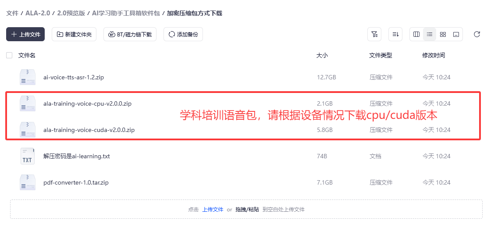

此外，对加密文件进行解压时可以使用\"7z\"，使用windows自带解压可能会解压失败。因此请下载以下安装包并进行安装。后续解压时也请使用本软件进行解压：

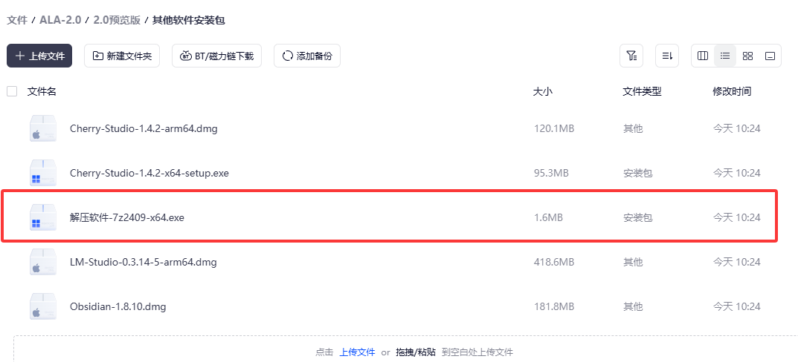

接着将下载的学习助手启动器"AI-Learning-Assistant-Launcher-win32-x64-2.0.0.zip"安装包解压：

1.  解压AI-Learning-Assistant-Launcher-win32-x64-2.0.0这个安装包

2.  点进文件夹里打开AI-Learning-Assistant-Launcher.exe即可到达学习助手主页面

## Step2. 启动器初始化配置

接下来安装基础软件驱动，分为"启用WSL"与"安装Podman"两步骤：

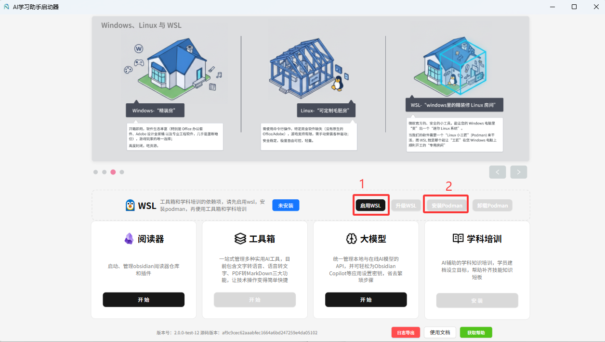

### Step2.1 WSL安装

1.  点击启用WSL后，过一会就会跳出一个【Windows Subsystem For
    Linux】的安装窗口 等他自动安装完就好（过程可能会时不时黑屏
    这个是正常现象）

2.  安装好WSL后学习助手右上角会跳出安装WSL成功，**需要进行一次重启**。

重启后WSL就全部配置好了，如果还是没弄好，则大概率可能是虚拟化配置的问题，可通过以下方法尝试解决：

1.  【控制面板】-【启动或关闭windows服务】把【适用于Linux的Windows子系统】和【虚拟机平台】打勾（win11只要打开【适用于Linux的Windows子系统】就好）然后重启电脑

2.  bios设置。如果是英特尔主板就在bios里打开VMD(有的如华硕好像是VMX)；如果AMD主板就在bios找【SVM】（比如技嘉主板开启svm的办法：技嘉AMD主板BIOS开启虚拟化（SVM）方法-攀升知识库）

3.  检查，虚拟化设置成功与否可以在【任务管理器】-【性能】-【cpu】左下的【虚拟化】一栏查看，成功则显示【已启用】

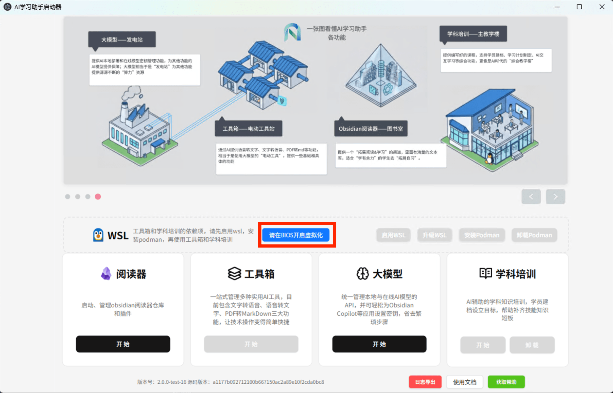

### Step2.2 Podman安装

接下来安装podman。点击"安装podman"，注意需要预留40-50G的存储空间，选择安装的位置安装，尽量不要选择系统盘，以免占用系统空间。

确定后，就会运行Podman软件相关的初始化操作，等待片刻后，显示如下结果，则说明安装成功：

注意：如安装过程出现异常，请点击AI学习助手界面下方的"获取帮助"按钮

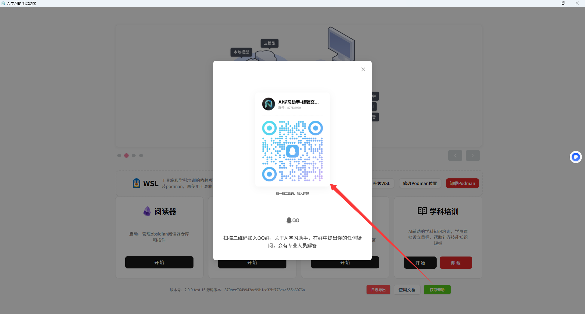

## Step3. D**eepseek Api服务接入**

配置在线大模型api分为两部分：

1.  在模型网站注册充值，创建API；

2.  在AI学习助手-大模型-大模型API配置中，填写模型相关信息

以deepseek开放平台[[https://platform.deepseek.com/usage]{.underline}](https://platform.deepseek.com/usage)为例，演示如何配置在线大模型api：

1. 
进入deepseek开放平台[[https://platform.deepseek.com/usage]{.underline}](https://platform.deepseek.com/usage)，使用手机号-验证码登录，确保账户中有余额（充值10元，可以用很久！）

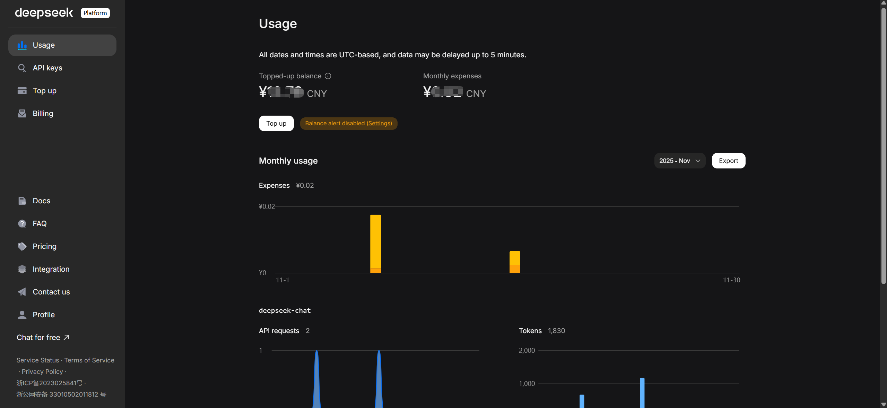

2. 
点击查看API文档，查看API地址（形如[[https://api.deepseek.com/v1]{.underline}](https://api.deepseek.com/v1)✔正确示范），模型名为"**deepseek-chat**"(也可以使用另外一个推理模型\"deepseek-reasoner\")。注意，每个模型提供商的API地址是固定的，模型名对于模型网站是唯一的，所以请复制对应地址和名称。

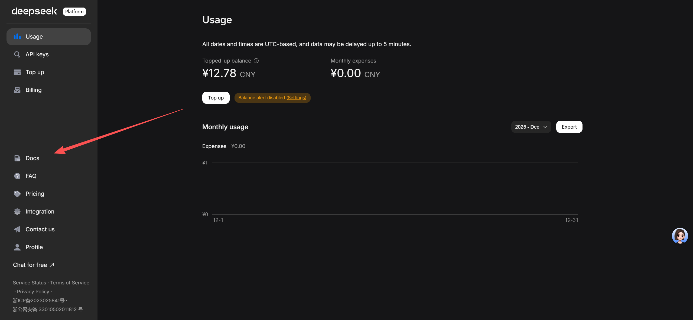

3.  创建API密钥，并复制，此密钥与账户的模型计费相关，请妥善保管。

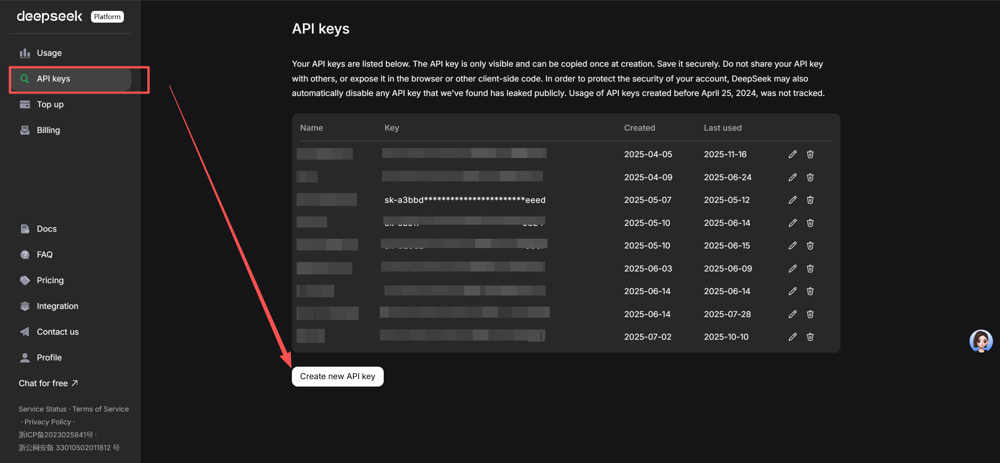

4.  打开AI学习助手-\>大模型-\>大模型API配置，点击"添加模型"

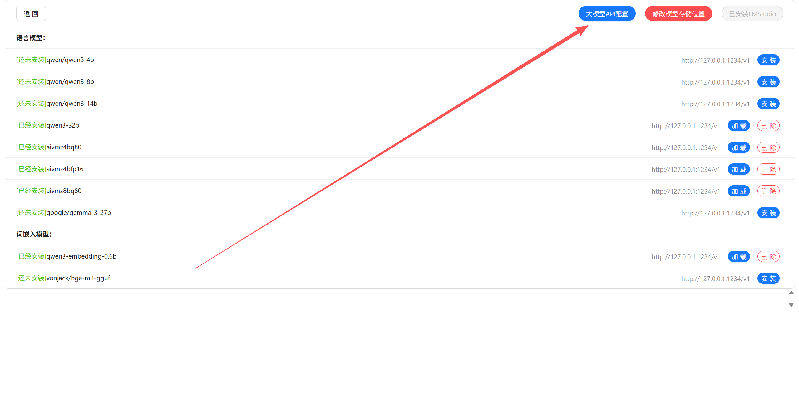

将从模型提供网站复制的信息粘贴到对应位置，**提供商**选择"DeepSeek"（注意带\*号的模型名称为从网站复制的名称，显示名称为自定义名称）

5.  测试模型连接状态，并保存

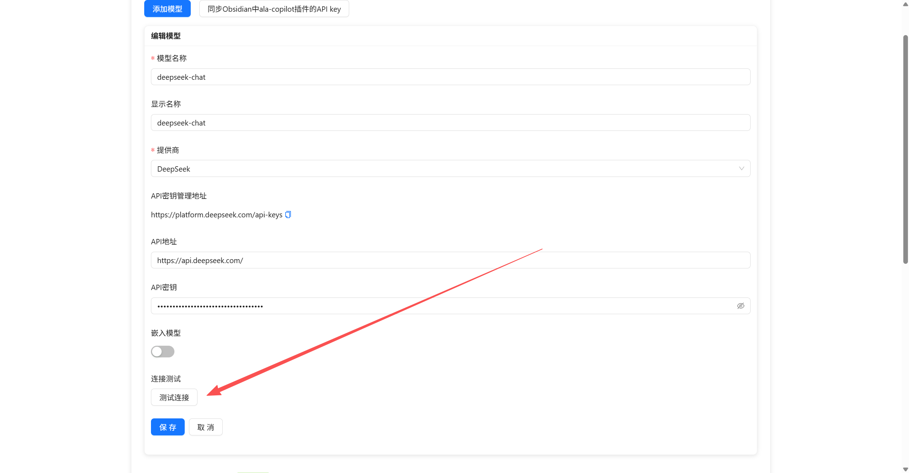

通过如上配置，你现在已经可以在"学科培训"模块正常使用大模型了！

## Step4. **学科培训安装与启动**

1.  点击"学科培训"的安装

2.  选择下载的tar包，进行安装

## Step5. **学科培训说明与使用**

1.  点击"学科培训"的"开始"，创建用户（自定义用户名）进入学科培训页面

2.  课程广场浏览要学习的课程，右侧是AI对话栏，进行AI对话

3.  进入"汽修课程"页面，展示课程章节与学习进度

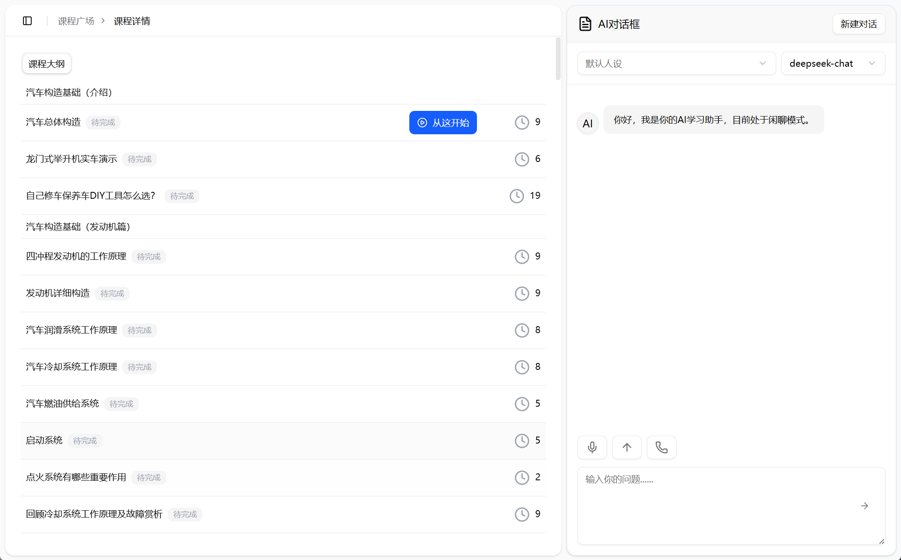

4.  进入知识点学习，通过观看视频与知识点文案学习该知识点

5.  "AI视频助手"功能：展示当前视频的每个时间段的具体内容

6. 
"这里不懂"功能：点击后AI对话框生成提问语句，发送后，AI会结合当前视频时间点（访问字幕文件）的内容为你详细讲解。

7. 
视频学习结束后，点击"随堂测验"进入测验，测验期间不能使用AI对话，不能返回"视频学习"

8.  测验交卷后，显示测验得分，点击"查看解析"，AI自动生成批改与解析

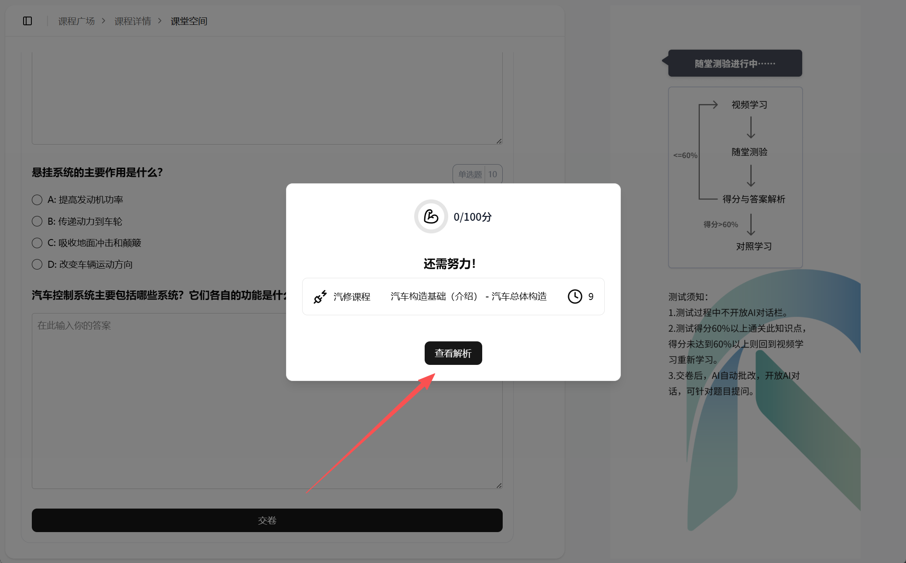

9.  "问问AI"功能，点击后，在对话框生成提问语句，发送后AI提供解答

10. 
当得分大于满分的60%时，视为通关此知识点，进入对照学习并解锁下一知识点。当得分小于或等于满分的60%时，只能回到视频学习，重新学习。

11. 
学习情况总结：通关知识点，进入"对照学习"或者"学习下一节课程"时，AI对话框会自动生成"学习情况总结"，为答题情况做总结并给出评价、建议。

## Step6. 语**音服务安装、启动与使用**

要使用学科培训的语音对话功能，则需要在工具箱中安装学科培训语音服务。

首先进入工具箱，点击学科培训语音的安装按钮，会弹出选择文件的窗口：

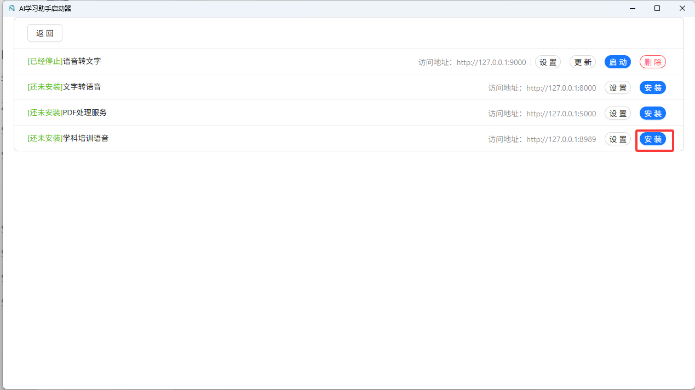

我们选择cpu或者cuda版本的学科语音包，等待一段时间安装：

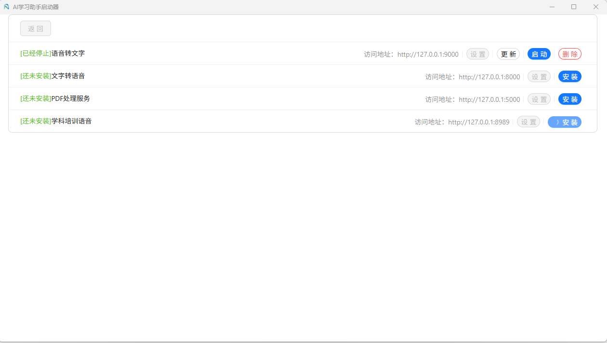

安装成功后，我们点击启动，等待一段时间让其初始化完毕。之后回到启动器首页，点击学科培训的开始按钮启动学科培训服务：

接下来，在学科培训的某个课程知识点学习中，我们可以点击右下角的"打电话"选项与AI进行实时语音，等待与语音服务连接成功后，即可进行语音对话：

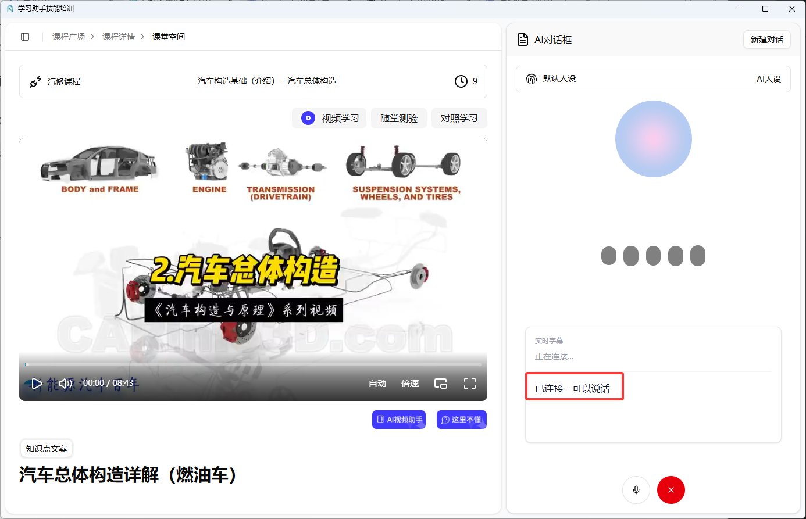

此时，我们可以询问有关课程的相关知识，AI学习助手会以语音的方式进行回答：

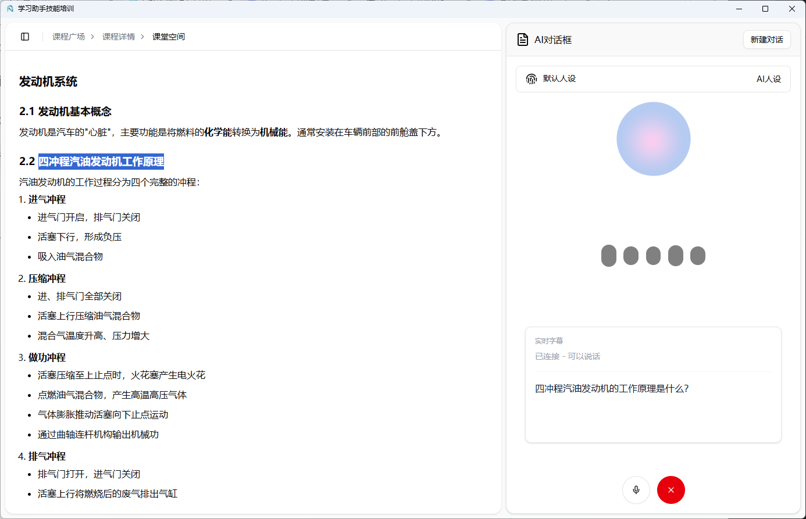

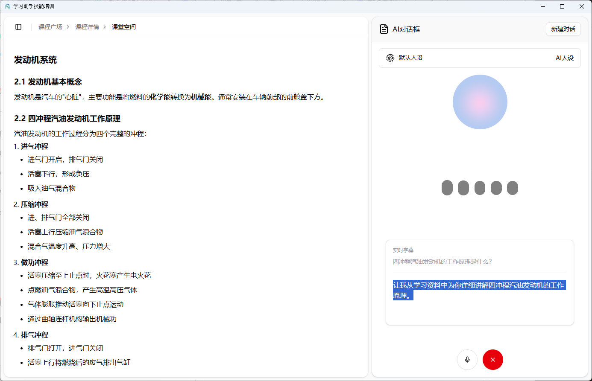

在语音过程中，你可以主动说话来打断AI语音，AI会按照新的语音指示进行回答：

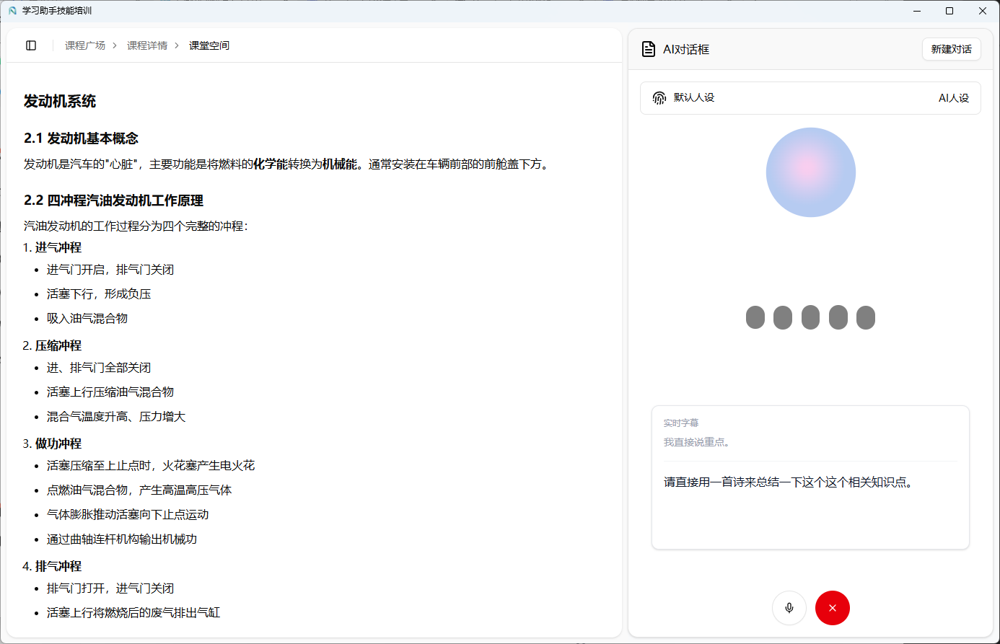

此外，当点击左边的语音按钮将其转为"禁用说话"的标识时，此时人声不会让AI听见，不会触发AI语音回复：

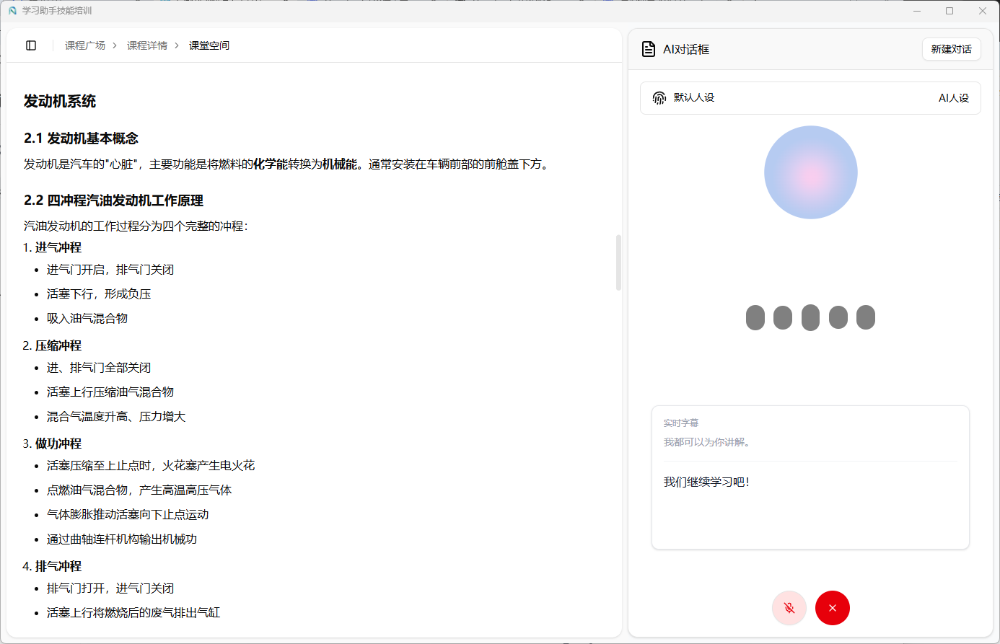
