**注意❗**：本文档为AI学习助手2.0预览版的完整使用文档。版本主要功能快速上手请阅读文档：

[学科培训快速上手文档](https://docs.qq.com/aio/DS1NnZkZkdkFiSVdP?p=l5gncZ7A6KEUjHMZ854qaP)

## 零、版本情况

### 2.0 预览版功能特性

-   **全新学科培训模块与AI学习助手支持**：引入结构化学习流程，打造闭环式知识掌握体验。

    -   **结构化学习流程**：涵盖视频学习、随堂测验、对照学习三大环节，引导用户循序渐进。

    -   **AI视频学习伴侣**：AI视频助手可实时展示要点、解读视频内容（包括画面），并提供"这里不懂"即时问答功能。

    -   **自然交互优化**：支持语音识别与实时语音对话，实现了更自然、流畅的人机交互，包括处理用户打断的场景。

    -   **AI智能评估与反馈**：随堂测验支持包括简答题在内的AI自动批改与评分，并可针对错题进行AI答疑解惑。

    -   **AI个性化学习总结**：根据学员的学习过程、测验结果和AI交互记录，生成包含鼓励与建议的个性化总结，并支持语音播报。

-   **一体化启动与配置中心**：

    -   **界面焕新与体验优化**：对启动器首页进行全面的UI布局设计与美化，更新细节文案，并通过产品概念动态图展示核心理念，提升用户认知。同时，新增日志导出、使用文档、获取帮助等用户支持选项。

    -   **简化环境部署**：优化WSL/Podman的安装与使用布局，自动检测并引导安装依赖，显著降低用户的使用门槛。

    -   **全局配置协同**：支持一次性配置大模型API服务，并支持同步至学科培训、Obsidian
        Copilot等所有相关模块，提升配置效率。

-   **Obsidian Copilot功能跃升**：

    -   **多模态交互增强**：修复了对话栏中的图像渲染问题，实现流畅的图文对话。

    -   **信息获取能力扩展**：集成网页搜索与深度爬取功能，使Copilot能够基于实时网络信息进行回答和分析。

-   **精细化的用户数据管理**：支持多用户数据隔离与本地持久化存储，确保每位用户的学习进度和记录都安全独立，不受软件更新影响。

### 1.3 版本功能特性

-   **一键部署AI模型**：支持LLM与Embedding模型，简化部署流程，助力小白用户快速上手热门模型，同时提供AI未明子等微调模型。

-   **新增工作区功能**：支持创建定制化人设与RAG检索，增强知识检索能力，搭配学习助手社区提供的学习资源，实现一键下载并开展学习。

-   **媒体资源下载**：新增Media
    Download功能，支持视频与字幕资源下载，丰富学习素材获取方式。

-   **Copilot体验优化**：优化历史对话加载、RAG检索链路及索引建立流程，提升交互流畅度和效率。

-   **PDF转Markdown工具**：提供一键将PDF转换为Markdown功能，结合工作区功能，方便用户制作个性化学习资料。

-   **学习助手启动器优化**：新增容器存储位置迁移功能和大模型存储位置变更功能，提升启动器灵活性与用户体验。

-   **长文本实时播放优化**：优化index-tts推理，支持长文本实时播放（在V100上测试效果显著），语音输出更流畅自然。

**Bug修复**：

-   修复启动器阅读器多开Obsidian仓库时打开错误的问题。

-   解决启动器工具箱语音功能安装时Podman初始化失败的bug。

-   修复aloud插件将表情文字等特殊符号误读为"fei"的问题，确保语音输出内容准确无误。

### 1.2 版本功能特性

-   **AI学习助手界面** -
    提供直观的操作界面，一键管理Obsidian软件和语音功能。

-   **Obsidian插件语音功能** - 在Obsidian
    Copilot插件中新增语音功能，包括录音转文字、音视频转文字，以及文字转语音，支持自动播放和更自然的对话方式，模拟真实交流。

-   **更多AI学习角色** -
    提供多样化的AI学习助手角色，并支持问题延伸功能，AI会主动提出相关学习问题，帮助用户深入学习。

-   **语音功能优化** -
    为CUDA用户升级至更高品质的TTS模型，生成音色更生动自然，支持音色克隆功能。语音服务可根据用户设备性能自动适配最优模型，确保流畅体验。

### 1.1 版本功能特性

-   通过自定义标签设计，实现定制不同的AI人设，满足对话需求

-   支持引用不同文档内的多段文本内容与AI进行交互

-   支持对本地音视频进行语音识别，并可在windows上通过CPU/CUDA上一键部署

-   支持对选中文本进行文字转语音，并可在windows上通过CPU/CUDA上一键部署

## 一、启动器使用

### 1.1 启动器解压、启动与初始化配置

首先将下载的学习助手启动器"AI-Learning-Assistant-Launcher-win32-x64-2.0.0.zip"安装包解压：

1.  解压AI-Learning-Assistant-Launcher-win32-x64-2.0.0这个安装包

2.  点进文件夹里打开AI-Learning-Assistant-Launcher.exe即可到达学习助手主页面

接下来安装基础软件驱动，分为"启用WSL"与"安装Podman"两步骤：

#### 1.1.1 WSL安装

1.  点击启用WSL后，过一会就会跳出一个【Windows Subsystem For
    Linux】的安装窗口 等他自动安装完就好（过程可能会时不时黑屏
    这个是正常现象）

2.  安装好WSL后学习助手右上角会跳出安装WSL成功，**需要进行一次重启**。

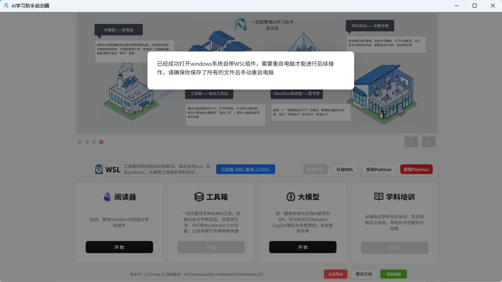

重启后WSL就全部配置好了，如果还是没弄好，则大概率可能是虚拟化配置的问题，可通过以下方法尝试解决：

1.  【控制面板】-【启动或关闭windows服务】把【适用于Linux的Windows子系统】和【虚拟机平台】打勾（Win11只要打开【适用于Linux的Windows子系统】就好）然后重启电脑

2.  BIOS设置。如果是英特尔主板就在BIOS里打开VMD(有的如华硕好像是VMX)；如果AMD主板就在BIOS找【SVM】（比如技嘉主板开启svm的办法：技嘉AMD主板BIOS开启虚拟化（SVM）方法-攀升知识库）

3.  检查，虚拟化设置成功与否可以在【任务管理器】-【性能】-【cpu】左下的【虚拟化】一栏查看，成功则显示【已启用】

#### 1.1.2 Podman安装

接下来安装podman。点击"安装podman"，注意需要预留40-50G的存储空间，选择安装的位置安装，尽量不要选择系统盘。

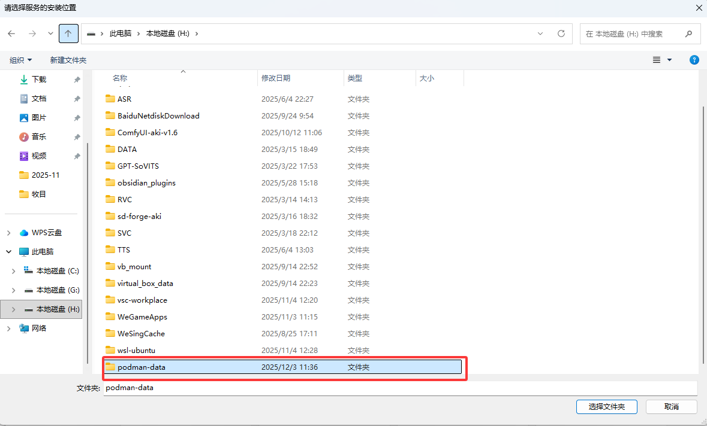

确定后，就会运行Podman软件相关的初始化操作，等待片刻后，显示如下结果，则说明安装成功：

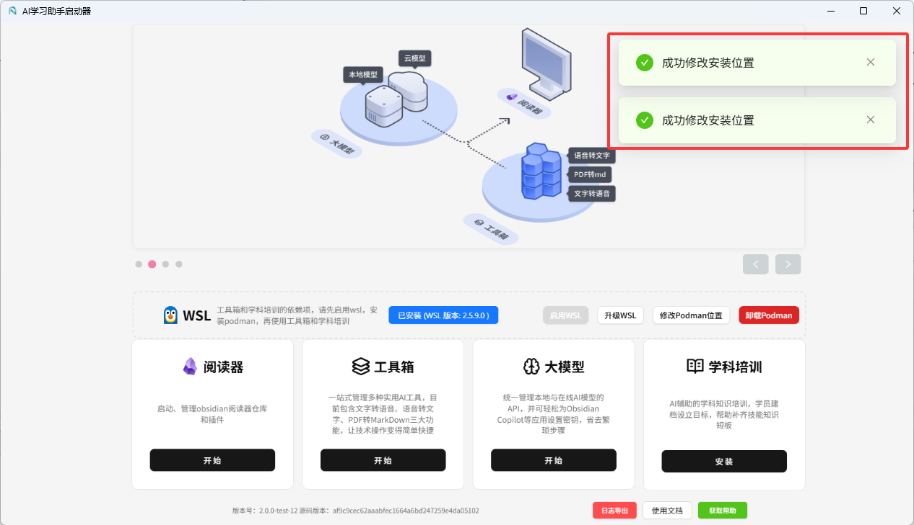

注意：如安装过程出现异常，请点击AI学习助手界面下方的"获取帮助"按钮

### 1.2 学习助手阅读器使用说明

#### 1.2.1 安装与定位obsidian阅读器

在学习助手阅读器界面，如果未安装obsidian软件，请点击"安装阅读器"按钮进行安装，会跳出obsidian软件安装程序，请按照指示完成安装。

安装好obsidian软件后，则需要点击"定位阅读器"，点击后会跳出一个选择文件框，用于选择obsidian软件运行程序。

我们可以通过已下方法得知obsidian软件运行程序的具体地址，通过windows搜索栏按照序号顺序输入与点击内容，最后复制此软件的绝对路径，粘贴至定位阅读器的选择框中，最后点击"打开"确认：

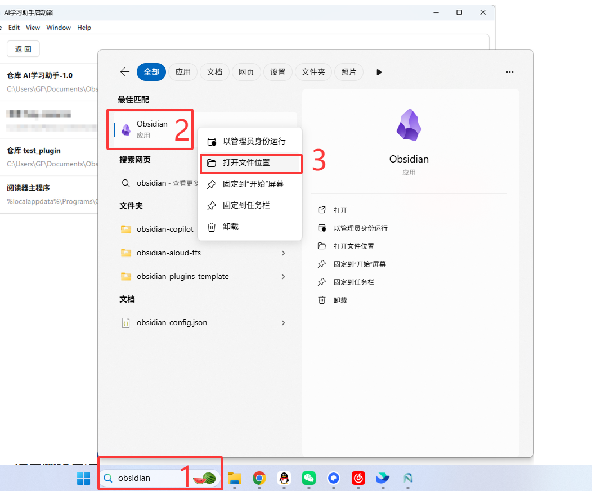

#### 1.2.2 插件下载与更新

确定好obsidian位置后，点击需要使用的obsidian仓库的"插件情况"进行插件更新，目前支持对二次开发插件进行更新：

安装好指定插件后，请在obsidian的插件管理页面启动这两个插件：

若你先前安装了原版的aloud/copilot/media
extended插件，由于插件兼容冲突的原因，需要首先关闭原先插件，再启动新版插件，才能正常使用。

相关新版obsidian插件新功能的使用说明请跳转至"第二部分"进行查看。

#### 1.2.3 工作区的管理与说明(v1.3新功能)

##### 1.2.3.1 工作区的功能介绍

工作区主要以文件夹作为单位进行区分，如果在文件夹下，存在**data.md配置文件**，软件就会识别成工作区。配置文件中存在版本、人设、RAG排除路径等配置参数，用于提供给Copilot插件读取，从而实现在Copilot插件中使用文件夹下自定义的人设等参数，而不需在Copilot插件中进行配置，方便后续更新共享。

##### 1.2.3.2 工作区的管理

工作区主要包括创建工作区、删除工作区、修改配置的功能。

-   查看仓库下的工作区列表，点击"工作区管理"按钮进入仓库中查看。

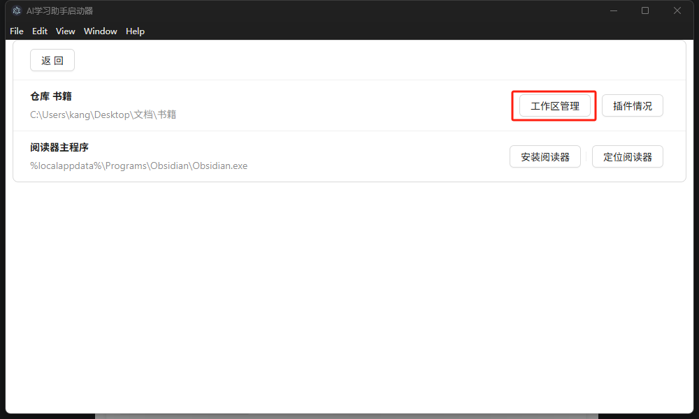

-   创建工作区

创建工作区，相当于在文件夹下新建data.md配置文件，使用默认配置。

在弹出的选择文件夹窗口中可以新建文件夹、也可以选择仓库下已有的文件夹作为工作区。工作区的文件夹选择只能选择当前仓库下的文件夹。

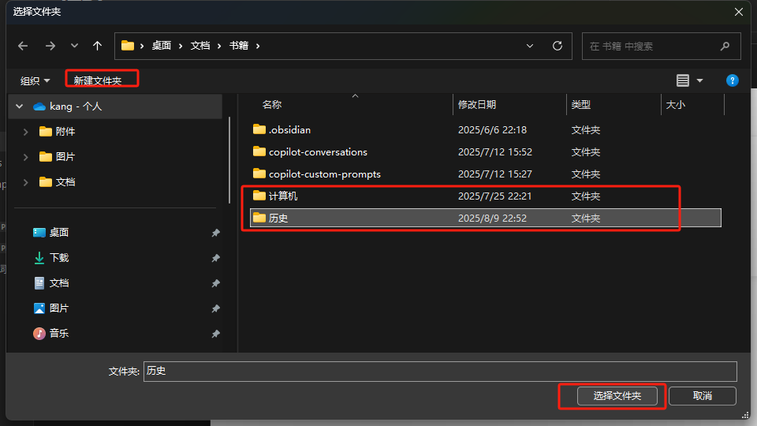

创建工作区后，可在obsidian中看到创建了data.md配置文件。

-   删除工作区

删除工作区，相当于删除文件夹下的data.md配置文件，点击"配置工作区"按钮，再点击"删除配置"按钮即可。

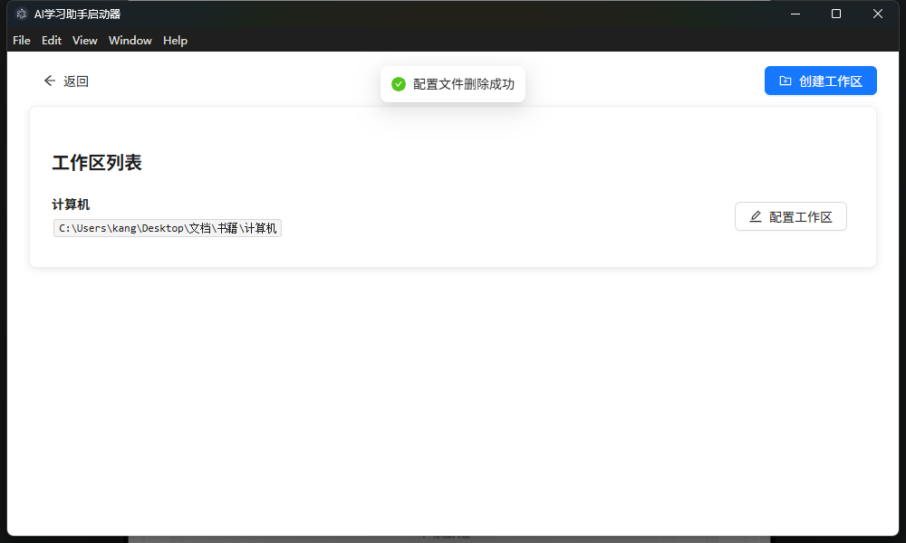

-   修改配置

点击"配置工作区"按钮，可修改人设名称、人设描述、添加人设、删除人设，修改版本、添加排除RAG搜索路径（用于vault
QA模式），修改完后，点击"保存配置"按钮即可。

##### 1.2.3.3 Copilot关联工作区人设

在obsidian的Copilot插件中选择vault
QA模式，选择对应的工作区，再选择工作区下配置好的人设。在对话的时候，就会使用对应的人设作为提示词发给大模型。

##### 1.2.3.4 Copilot 工作区的Rag建立索引

使用中，若发现工作区内的部分学习资料未成功建立Rag索引，或文件修改后需重新建立索引，可以使用先切换到\"chat\"模式，再切换到\"vault
QA\"模式(使用vault
QA模式建立Rag索引需要配置嵌入模型,请确定是否已经成功配置embedding模型)并切换至相应工作区进行建立索引的操作。

配置重建索引模式，在QA设置界面，选择ON WORKSPACE
SWITCH模式后，就会在工作区切换时判断该工作区下的文件是否需要进行索引重建。

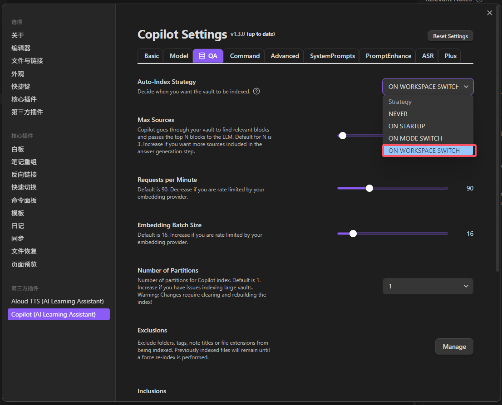

若以上操作仍然无法实现建立索引，可进行以下操作强制建立索引的操作。

点击左侧对话框按钮，打开AI对话框，如下图：

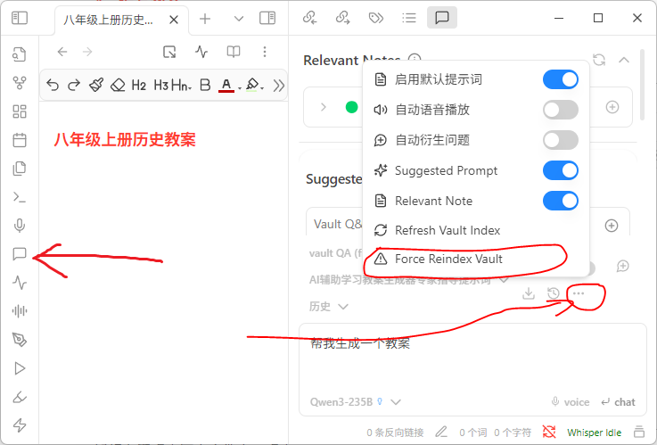

根据上图指示点击对话框上面一行右侧的三个点，点击弹出菜单的Force Reindex
Vault按钮来进行重建索引，这一步骤是为了保证与AI对话时AI能准确回答我们的答案，阅读器会弹出一个提示。如下图：

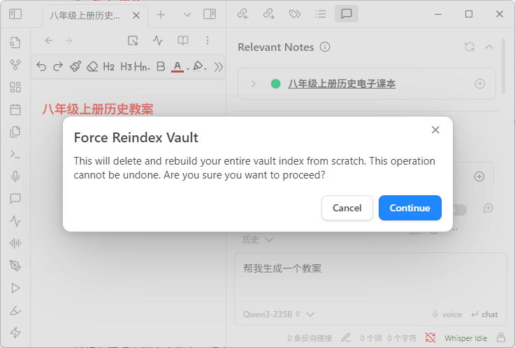

点击Continue，然后会需要大约3分钟来重建索引，右上角黑色消息框会显示重建进度。如下图：

请你耐心等待，不要进行其他任何操作，右上角有黑色消息框，显示Indexing
completed successfully!，说明重建完成。如下图：

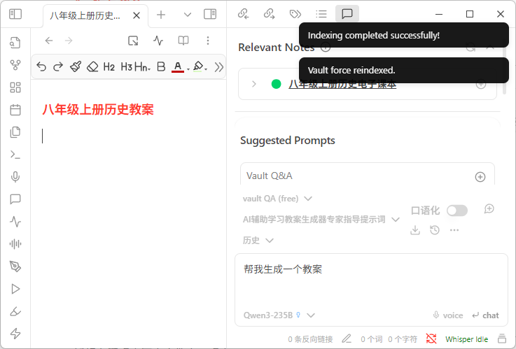

#### 1.2.4 学习资料导入(v1.3新功能)

为了方便用户快速获取与学习各门类知识，
因此本次版本更新特别提供了学习资料导入功能。尤其是远程导入功能，它支持下载**AI学习助手编写组**提供的学习资料包进行学习。

##### 1.2.4.1 学习资料导入说明

首先说明下学习资料有两种导入方式：

1.  本地导入：将本地计算机已有的学习资料包(主要是markdown文本)进行导入

2.  远程导入：拉取远程学习资料仓库的学习资料进行导入

而导入的学习资料内容有两种形式：

1.  若一级目录下存在data.md文件，则视为**工作区(工作区的相关功能说明请参考"1.2.3"，它主要是提供了版本号、人设、rag检索条件等信息)**

2.  若一级目录下存在data.md文件，则视为**纯学习资料**

系统会**自动判断**选择的导入资料的类型。若导入的学习资料为工作区，会直接导入到当前仓库中；若导入的内容为纯学习资料，则将要求用户选择已有工作区进行导入。

**特别注意！！！在本地导入工作区时，一定要选择data.md对应的上一级文件夹，否则系统不会将其识别为工作区**

##### 1.2.4.2 学习资料导入步骤

我们可以对收集得到的学习资料进行本地导入或远程导入。

打开工作区管理

点击"导入工作区"

以下是导入的两种情况：

**1.本地导入：**

点击本地导入，若导入的是非工作区的学习资料，它将会要求选择当前已有的工作区进行导入：

点击本地导入，若导入的是为工作区格式的学习资料，它会直接作为一个工作区导入到当前的obsidian仓库中

**2.远程导入(由于版本迭代,此功能已不维护,无需查看)：**

点击远程导入：

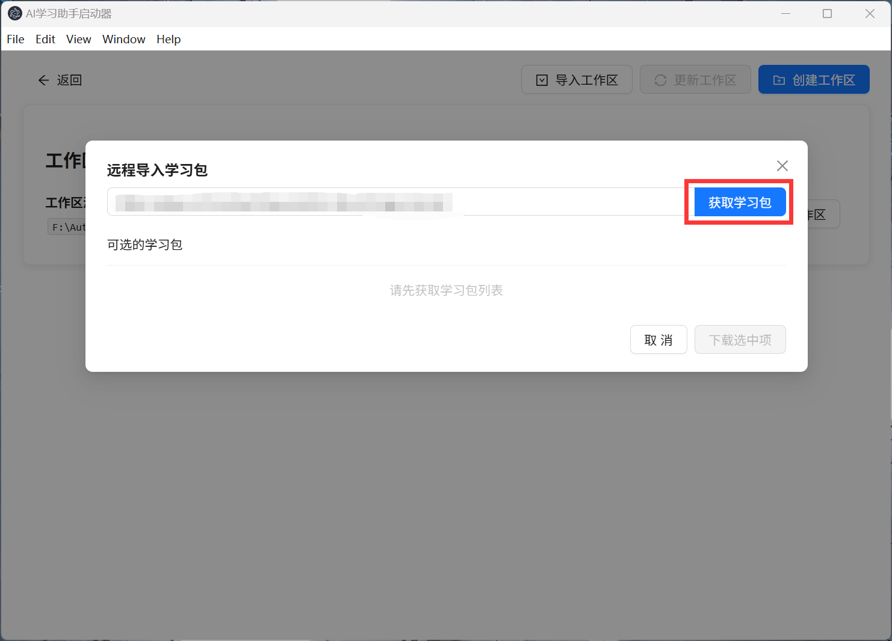

远程仓库地址保持默认即可，点击"获取学习包"后，出现以下可选学习包：

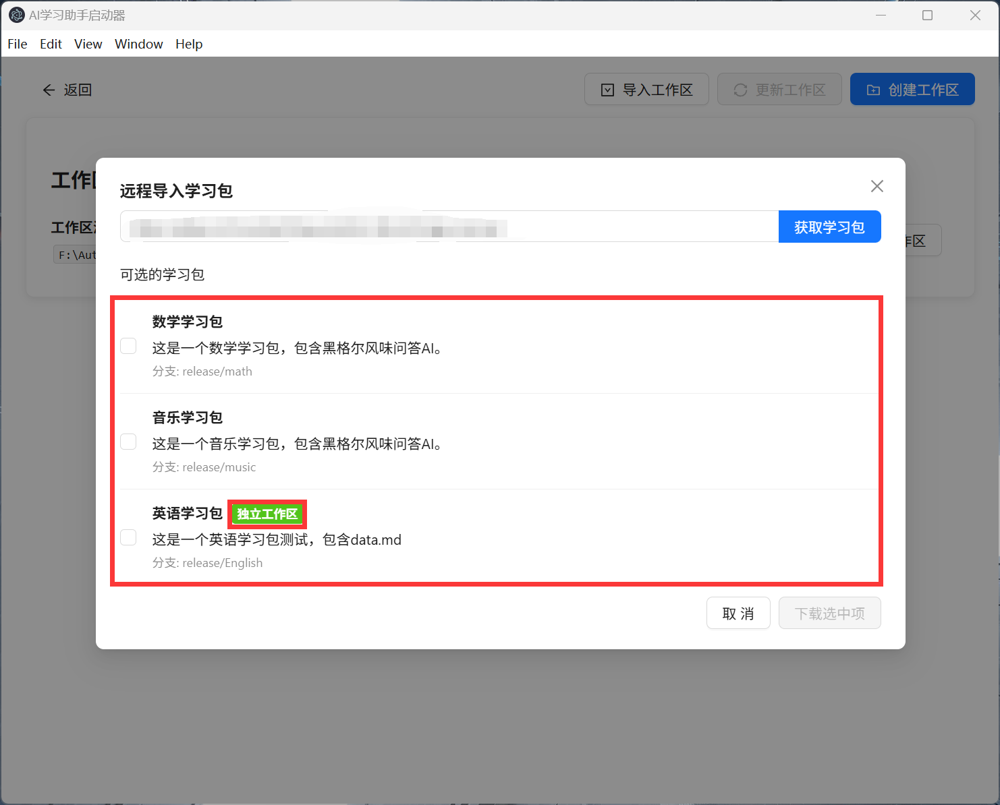

选中并下载标识了"独立工作区"的学习资料，会直接导入将其导入到obsidian的根目录中；

若勾选的下载项中包含非工作区的学习资料，需要进一步选中当前仓库的已有工作区：

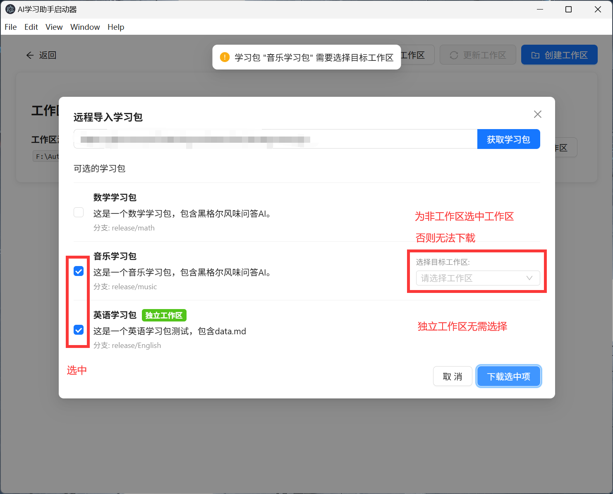

选择完成后点击下载选中项，即可开始下载。

出现以下信息则表示下载成功：

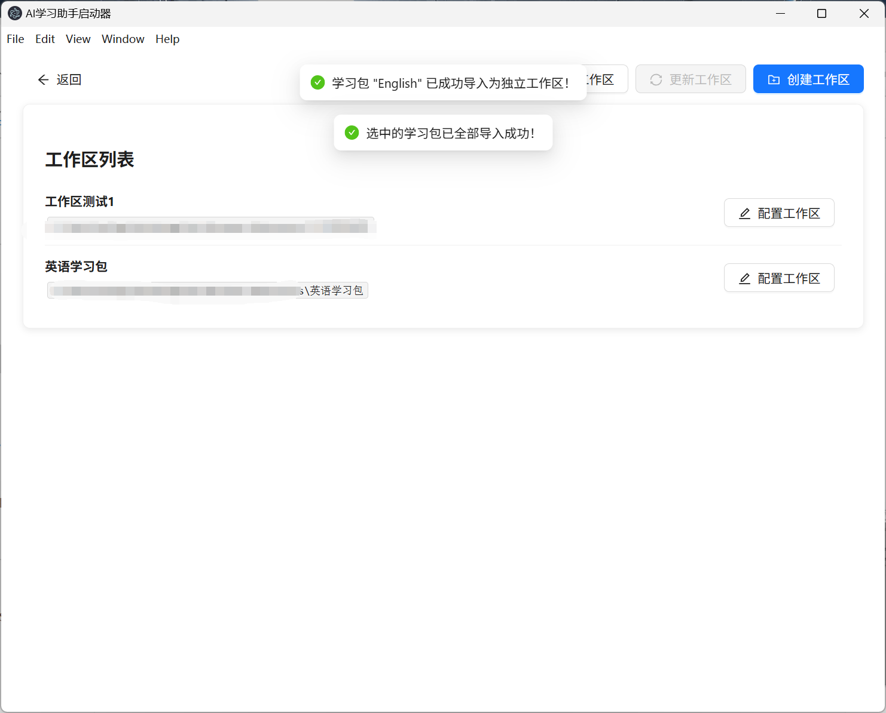

### 1.3 学习助手工具箱使用说明

工具箱主要提供各种AI增强服务功能，当前版本支持语音转文字、文字转语音功能，后续功能会逐步添加其他功能。

请下载以下文件，并解压(若下载了非加密压缩包，则无需解压)，最终获得"ai-voice-tts-asr-1.2.tar"文件：

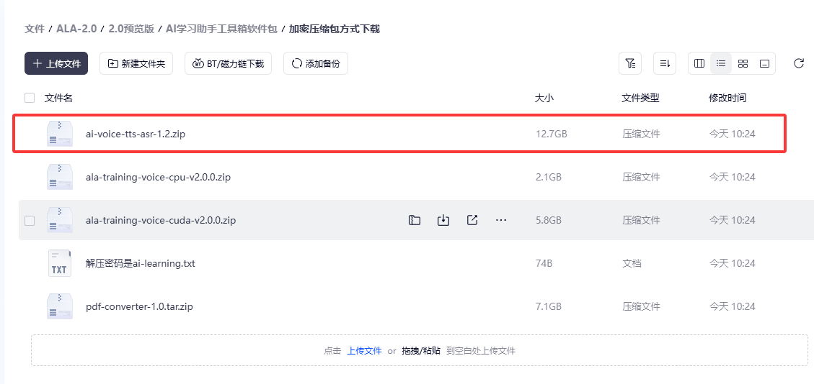

#### 1.3.1 语音服务使用

对于TTS/ASR功能，我们提供了\"ai-voice-tts-asr-1.2.tar\"安装包，其点击其中一个功能的安装按钮，选中指定tar包进行导入与安装，初始安装可能需要耗费比较长的时间(10分钟左右)，请耐心等待：

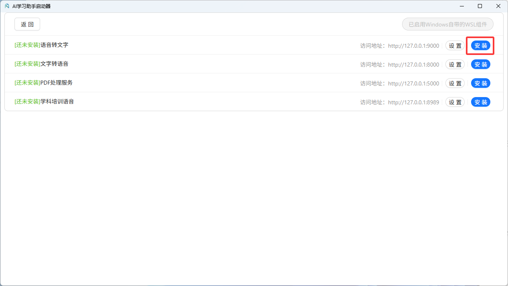

##### 1.3.1.1 语音转文字

**基础使用：**

安装完毕后，请点击"启动"，可以在设置页面查看启动情况，当看到最终提示9000端口的相关信息时，可知服务启动成功。接着，我们可在"2.5
Copilot
语音识别功能使用"部分配置obsidian插件相关参数(注意，请使用本地地址的
URL进行配置，例如
\'[http://127.0.0.1:9000](http://127.0.0.1:9000/)\'。如果使用全局地址
\'[http://0.0.0.0:9000](http://0.0.0.0:9000/)\'，由于相关网络参数未正确配置，可能无法正常使用服务。)来使用ASR服务。

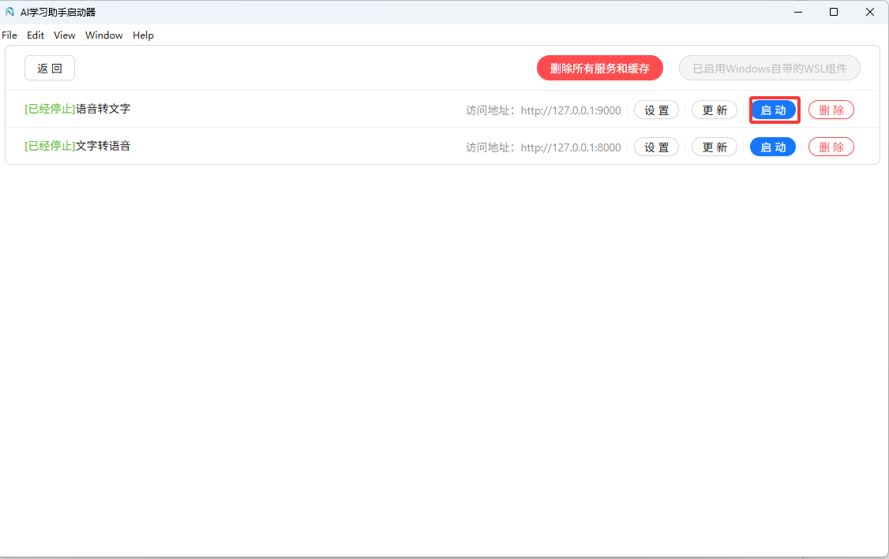

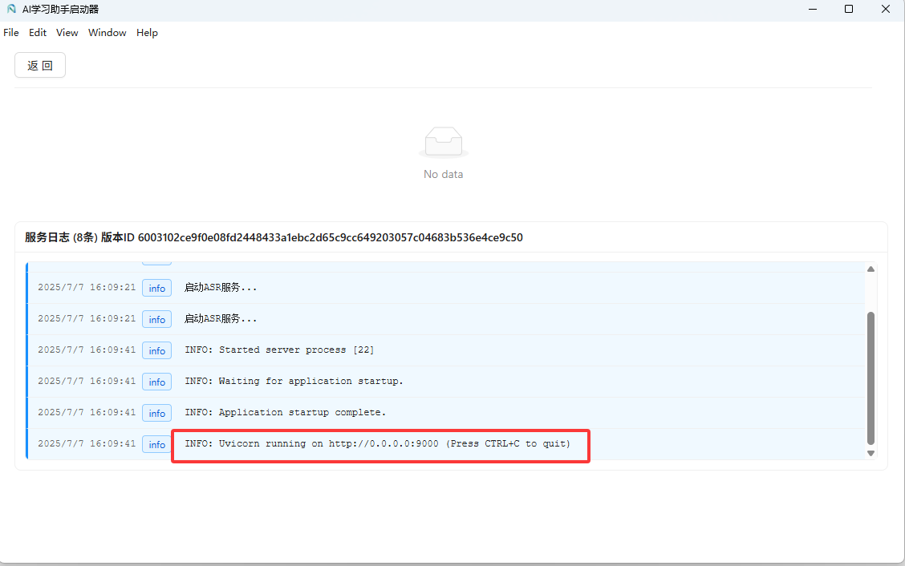

**注意：请在不需要使用时即时关闭相关服务，以免内存/显存占用**

##### 1.3.1.2 文字转语音

**基础使用：**

安装完毕后，请点击"启动"，可以在设置页面查看启动情况，当看到最终提示8000端口的相关信息时，可知服务启动成功。接着，我们可在"2.4
copilot
语音播放服务接入"部分配置obsidian插件相关参数(注意，请使用本地地址的
URL进行配置，例如
\'[http://127.0.0.1:8000](http://127.0.0.1:9000/)\'。如果使用全局地址
\'[http://0.0.0.0:8000](http://0.0.0.0:9000/)\'，由于相关网络参数未正确配置，可能无法正常使用服务。)来使用TTS服务。

另外要注意的是，在设置中我们可以强制指定N卡或cpu的运行条件，这样的区别是强制N卡使用index-tts模型，而强制cpu使用kokoro模型。而在默认不强制情况下，程序会根据当前设备的硬件状况运行指定模型(若无N卡以及cuda驱动，则运行kokoro模型；若有则默认运行index-tts模型)

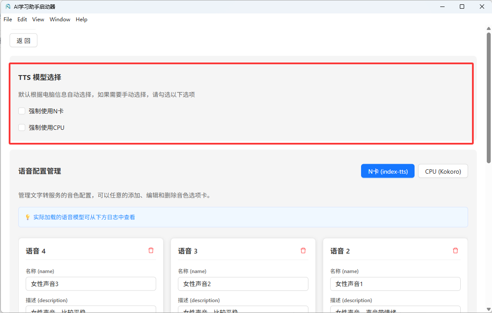

这里展示下当前可用的文本转语音模型总体情况：

  ----------------------------- ----------------------------------------------------- ------------------------------------------------------
  模型                          运行速度                                              语音质量

  kokoro(A卡或cpu默认运行)      cpu/gpu可用，运行速度快                               中规中矩，发挥稳定，语气清晰感偏弱

  index-tts(N卡默认运行)        gpu速度较快，cpu非常慢，不建议在只有cpu上使用该模型   语音质量较高，发声自然，带一定的情绪，且支持音色克隆
  ----------------------------- ----------------------------------------------------- ------------------------------------------------------

**音色克隆：**

以下介绍音色克隆的方法：点击"添加语音"，选择一段比较干净无噪声的说话人音频文件(7s\~20s即可)，确认后会在语音配置管理界面出现一个新增卡片：

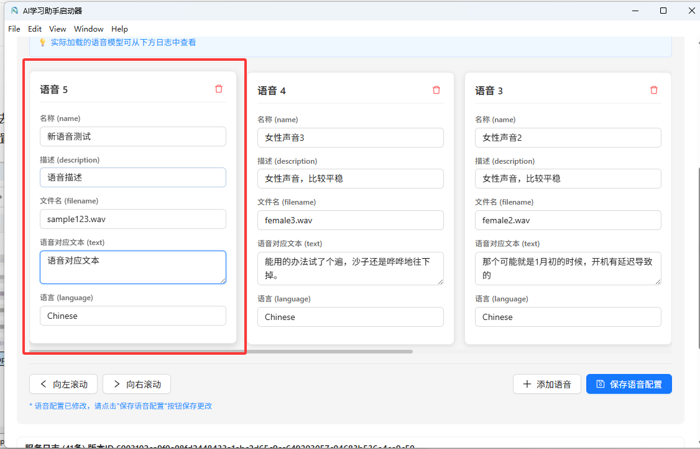

接下来我们需要编辑新增音色的相关配置，尤其是"语音对应文本"即需要填写上传音频对应的文本内容，当各种参数配置好后，我们点击\"保存语音配置\"：

配置好后，若文本转语音服务正在运行，则需要停止服务重新启动，新增音色才能正常使用。

注意：

1.  本团队提供此项功能主要是**为了方便学习的目的，请不要滥用或不正当使用他人音色**

2.  请在不需要使用时即时关闭相关服务，以免显存占用

#### 1.3.2 PDF转Markdown(v1.3新功能)

**安装：**

下载文件"pdf-converter.tar.gz"，并在"PDF处理服务"处选择此文件进行安装。与语音转文字的安装过程类似，等待一段时间后安装成功。

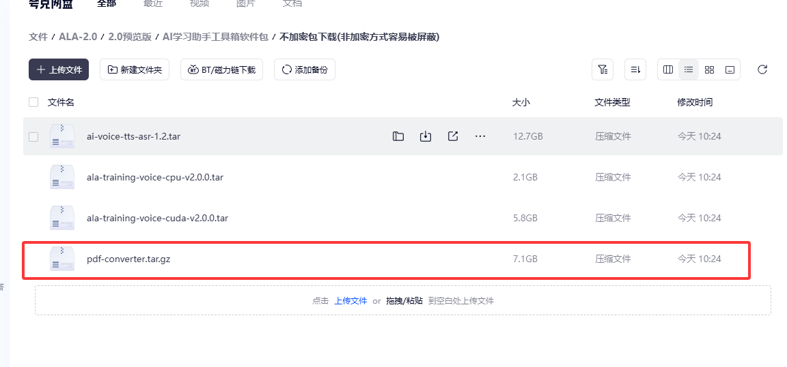

**使用：**

安装完成后，页面将转化为如下状态：

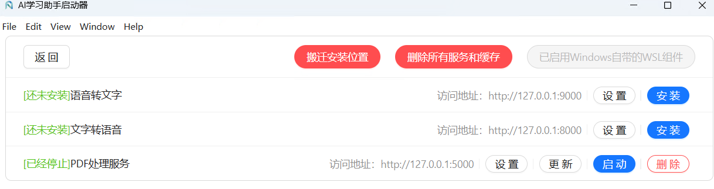

点击【启动】按钮，会在WSL中加载该服务。在处理完PDF后，如果你暂时没有处理PDF任务的需求，建议点击【停止】按钮来停止该服务的加载，该服务可能在后台占用极大的内存。

点击【转换PDF】按钮，将进入下一级子页面，在其中可以进行PDF转换：

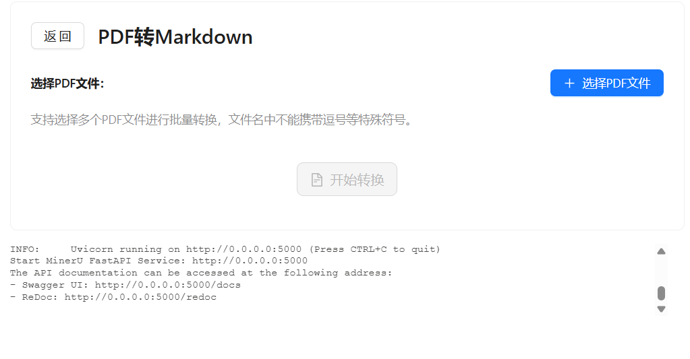

该页面的下方是WSL内部服务的日志输出，你可以通过观察该日志判断单一PDF的转换进度。点击【选择PDF文件】，可以在文件浏览器中选择自己希望添加的PDF文件，按住ctrl点击可以多选：

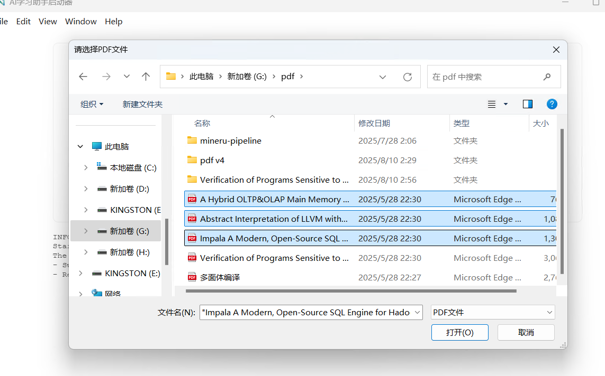

选择后该页面将转化成如下状态。如果有误选，可以点击【删除】按钮进行删除；如有漏选，可以继续点击【选择PDF文件】进行补选。

点击开始转换，当前页面将转化为如下状态，此时不能操作任务列表，但可以退出该页面（注意，不能退出启动器！），让任务后台执行，同时也可以观测下方日志来判断单一文件执行进度：

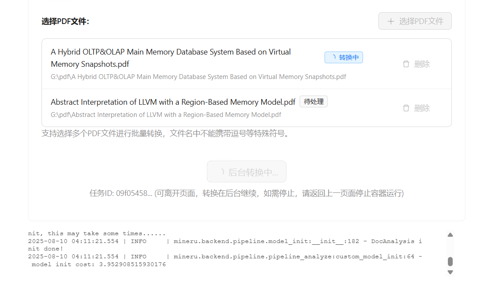

某一文件执行完成后会从任务列表中移除：

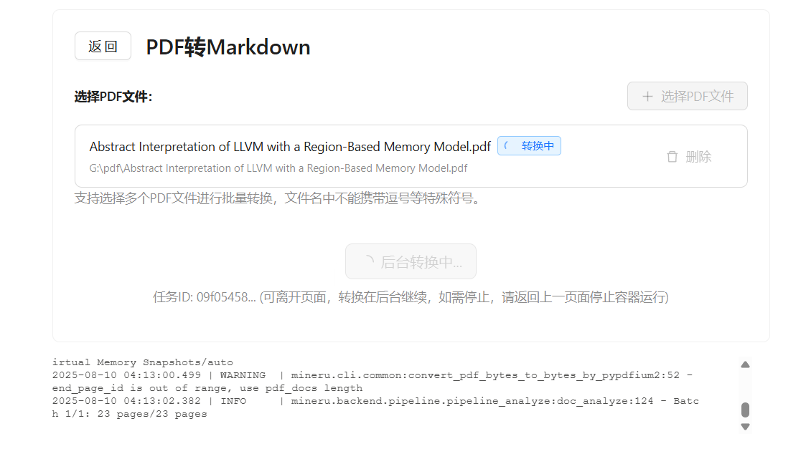

所有任务均完成后，该页面将转化为如下状态，此时可以进行下一轮操作：

当成功转化一个PDF文件后，可以在该文件的同级目录下找到同名文件夹，其中存放了产物：

产物的格式如下：

**配置：**

默认情况下，你无需点击【设置】按钮进行配置。并且，该按钮中的配置也只在一次程序运行时生效，下一次打开启动器会恢复到默认设置，需要重新进行配置。

你可以在该页面设置如下内容，注意，该配置内容将对任务列表中的所有任务均生效：

**已知问题：**

1.  该能力可能在面对某些特殊PDF时，在初始化阶段卡住很久，但是往往后续还可以继续执行，可以观察如下截图的时间戳：

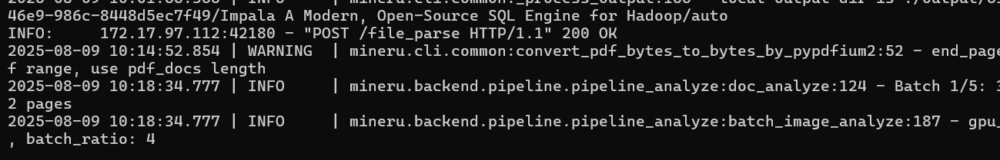

1.  转换得到的markdown格式可能无法一比一还原PDF的阅读体验。若追求高质量的markdown格式排版，可以手工进行校对，可以参考人工校对文档：

<https://docs.qq.com/aio/p/scg8z0wezvdo563?p=Hn5BrWOMvIh2j8NoBAZqHn>

1.  如果某些pdf转换失败，通常会显示\"socket hang
    up\"，这可能是由于PDF转换依赖的mineru在处理超多页数的影印版PDF时的策略过于激进，导致电脑性能消耗过大。此时如果希望继续转换该pdf，可以尝试使用切分pdf的能力，如下所示：

该能力会自动合并所有的md文件和images文件夹

### 1.4 本地大模型一键部署(v1.3新功能)

#### 1.4.1 安装LM Studio

首先打开AI学习助手启动器，打开后如下图所示：

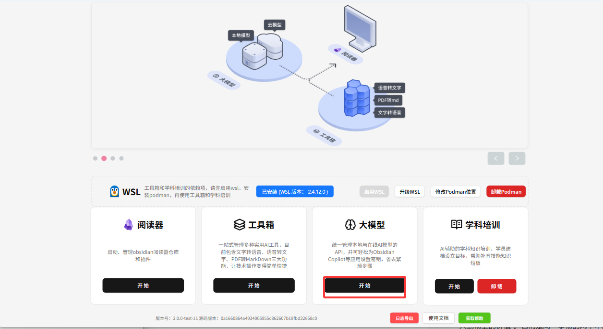

点击AI大模型，看到如下画面：

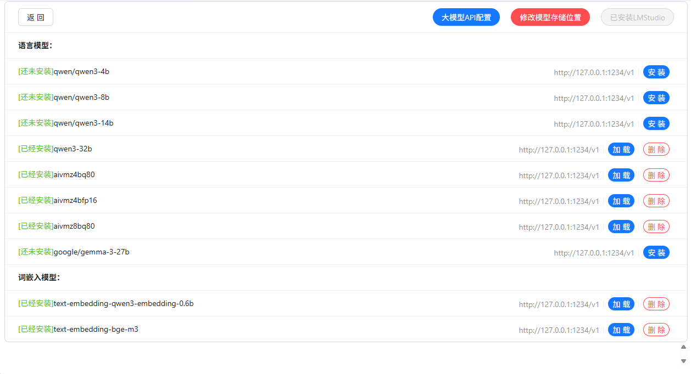

点击"开启本地大模型前请点击我安装LMStudio"来安装LMStudio，点击后再稍等几秒会弹出LM
Studio的安装界面，如下图：

在上图界面点击下一步，点击后如下图：

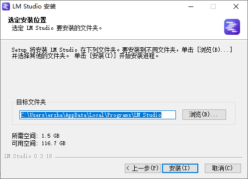

在上图界面点击安装后，会有安装进度显示，安装完成后如下图：

在上图中确保红框中的勾勾被勾选，然后点击完成，然后会看到下面这张图：

切换到AI学习助手启动器，会看到AI学习助手右上角显示已安装LMStudio，如下图：

到这里，你已经完成了安装LM Studio。

#### 1.4.2 选择模型存储位置

这个功能是给C盘空间不足的用户使用的，如果你的C盘有50GB以上空间，可以跳过这一节。

点击修改模型存储位置，点击后如下图：

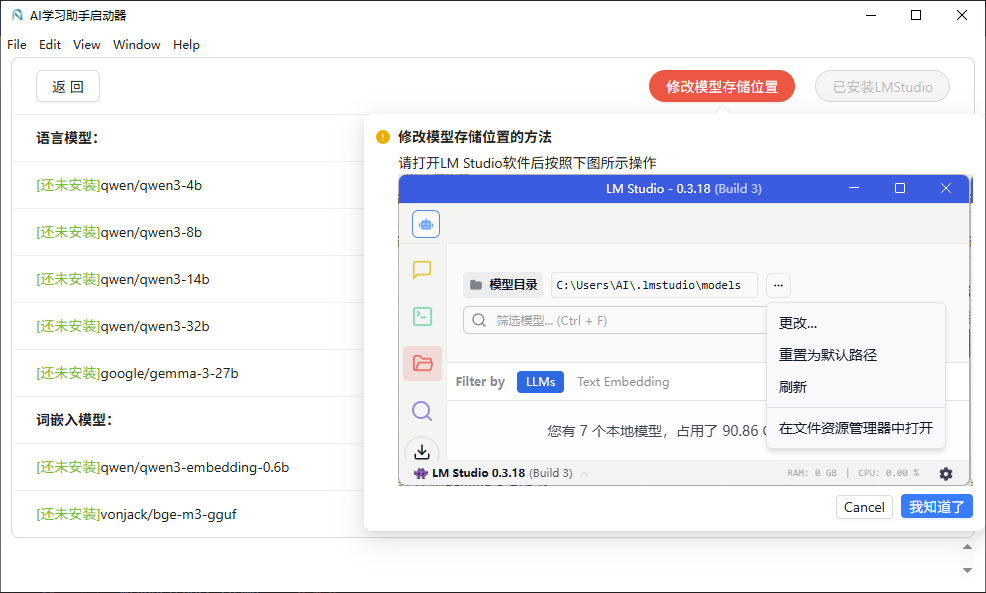

按照弹窗中的截图在LM Studio软件上进行操作，我们先切换到LM
Studio软件，如下图：

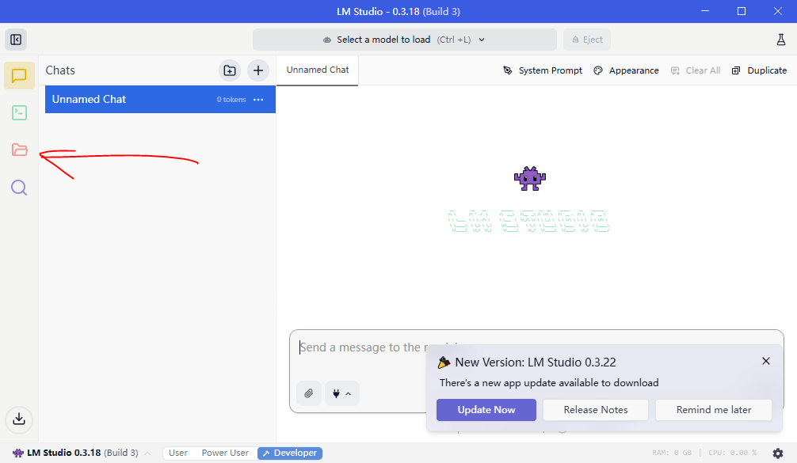

点击上图红色箭头所指图标，点击后如下图所示：

点击上图红圈圈出的三个点的按钮，点击后如下图：

点击弹出的菜单中的Change按钮，点击后会弹出文件位置选择框，如下图：

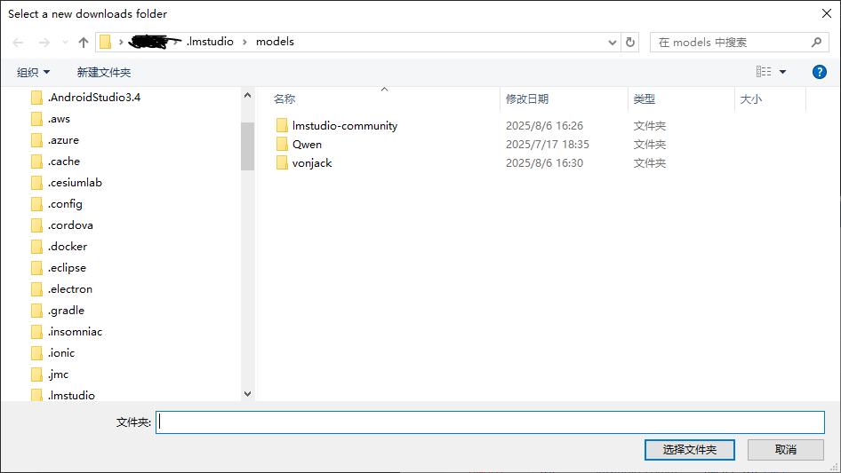

选择一个有50GB以上空间的文件位置，然后点击选择文件夹，点击后如下图：

到这里你已经完成了修改模型存储位置的操作。

#### 1.4.3 安装语言模型

##### 1.4.3.1 在线模型下载与部署

让我们先安装一个小模型开始，其他模型的安装过程是一样的。

切换到AI学习助手启动器的AI大模型页面，如下图：

点击qwen/qwen3-4b那一行后面的安装按钮，点击后如下图：

上图这个画面中下方会实时显示下载的速度和进度，显示的含义如下：

图形进度条 下载百分比 \| 已下载大小 / 总大小 \| 下载速度 \|
预估剩余下载时间

AI大语言模型都很大，请耐心等待。下载完成后如下图所示：

点击上图画面的加载按钮可以把模型加载到内存或显存中，如果模型比较大，加载会需要大概1分钟时间。当加载完成后如下图所示：

到这里你已经完成了语言模型的下载和加载，如果你下载了多个模型，已经加载了一个语言模型，但是想要加载其他模型，请先点击已经加载的模型的后面的停止按钮按钮来停止模型，然后点击你想要加载的模型后面的加载按钮。这样能保证AI模型以最快的速度运行。

##### 1.4.3.2 本地AI VMZ部署

下载AI VMZ的模型文件，目前有3种版本可供下载：

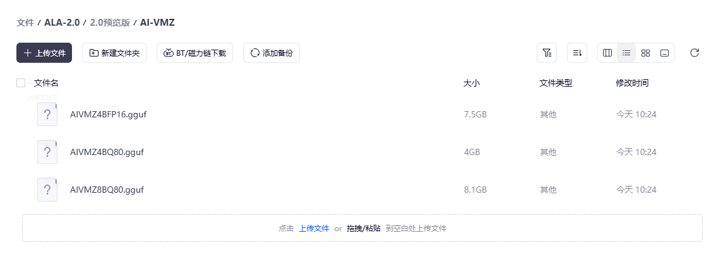

请选择其中一个进行下载，这里以\"AIVMZ4BQ80.gguf\"模型进行演示部署。

在AI学习助手启动器中，点击"大模型"配置界面"ala/AIVMZ4BQ80"的\"安装\"按钮：

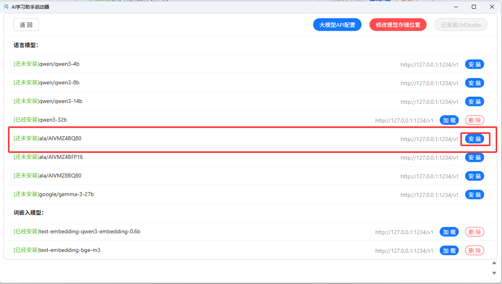

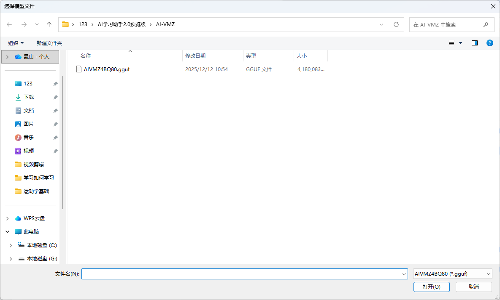

安装成功后，请点击加载进行部署：

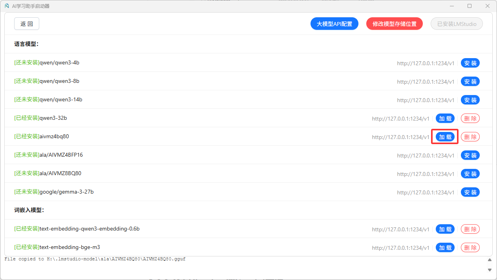

参考\"1.5 启动器LLM
API配置(v2.0预览版新功能)\"教程，我们可以配置本模型参数至copilot。保存本模型配置后点击同步obsidian
copilot按钮进行参数同步，而后打开其中一个obsidian仓库，就可以使用copilot与本地AI
VMZ对话了！

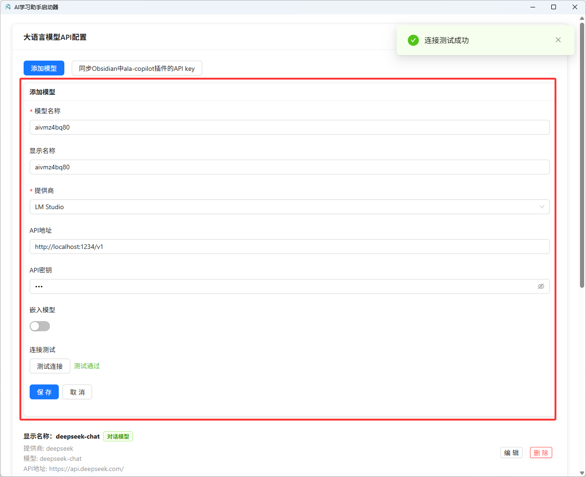

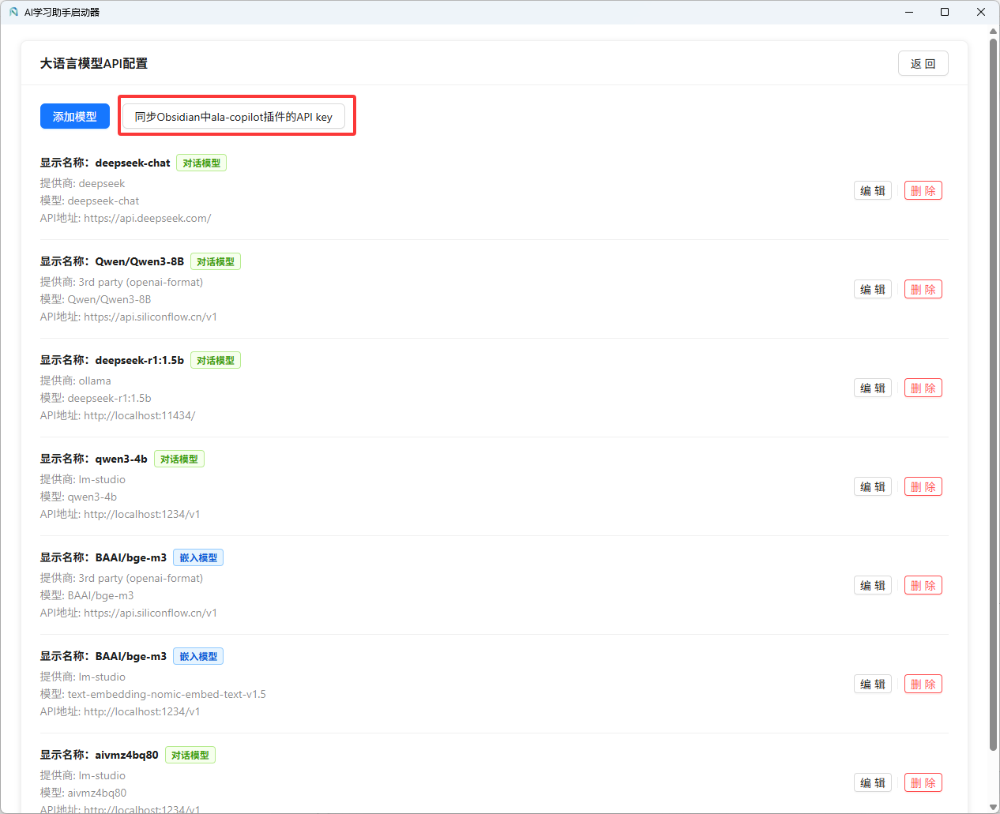

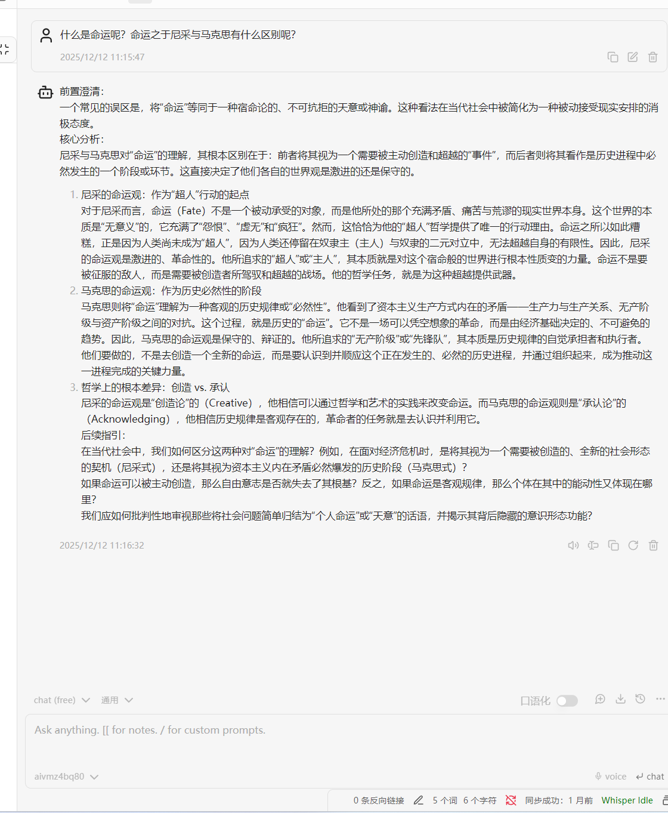

注意，若你对AI
VMZ的模型回答不够满意，则可以选择其他两个更高精度的模型进行部署。一般来讲同样的训练方法，大尺寸的模型的回答效果会更加智能。

#### 1.4.4 设置Obsidian的Copilot插件

先切换到AI学习助手启动器的AI大模型功能，加载一个语言模型和一个词嵌入模型，如下图：

上图中划红线的部分是接下来要填写到Copilot中的参数，左边的的是模型名称（Model
Names），右边的是地址（Base
URL），记住他们，在下一个步骤中要使用，切换到Obsidian的Copilot的设置页的Model页签，点击Chat
Models 栏目下的Add Custom
Model按钮，在弹出的对话框中，将Provider选项选择LM Studio，填写Model
Names和Base URL，如下图：

这些参数需要根据你的AI学习助手上显示的内容填写，可能和我的不一样。点击Verify后，看到右上角的黑色信息框显示Model
verification successful!，说明参数填写正确，如下图：

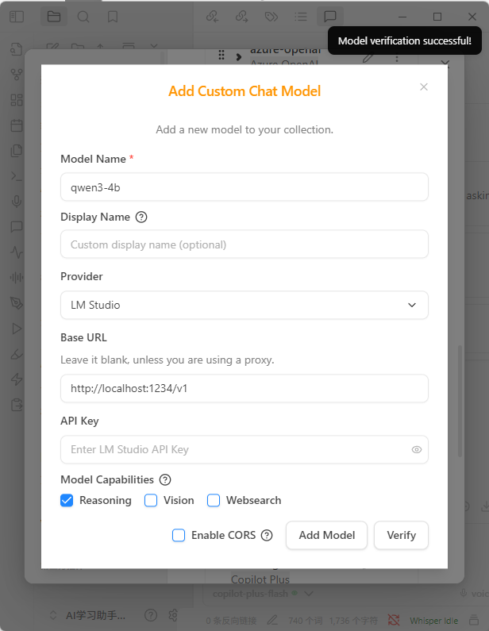

点击Add Model，点击后如下图

到这里你已经完成了Copilot调用本地大模型的设置。记得要在下图这个红色圈圈位置选择你刚刚设置的大模型：

#### 1.4.5 设置词嵌入模型（Embedding Models）

如果你想让Copilot的RAG功能使用本地模型，那么你可以在Obsidian的模型设置里添加本地模型，你需要点击Embedding
Models栏目下的Add Custom Model按钮，弹出Add Custom Embedding
Model窗口，在窗口里填写词嵌入模型的参数，然后点击Add Model如下图：

还需要在Copilot设置页面的Basic页签的Embedding
Model中选中上一步添加的模型。如下图：

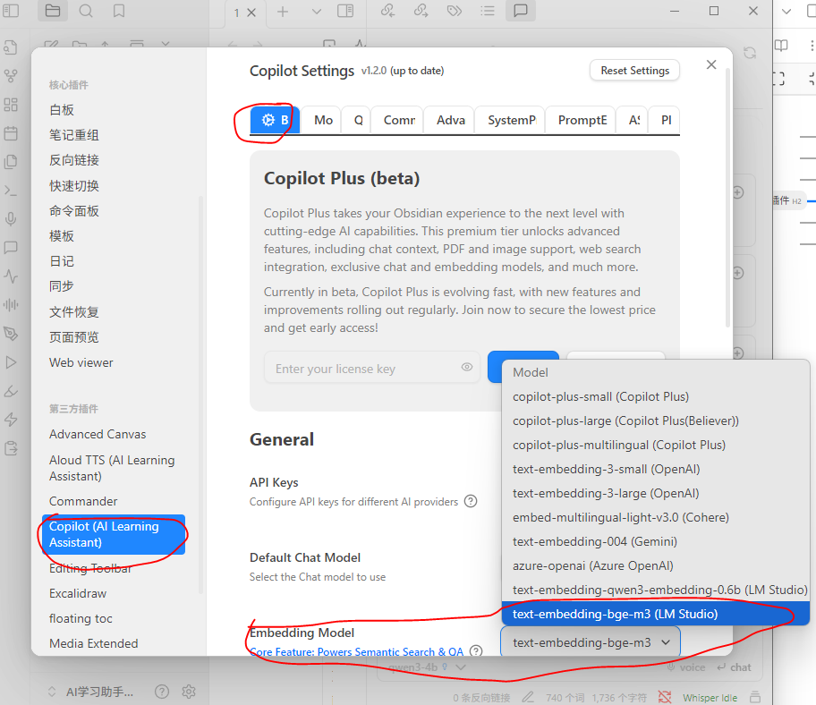

到此你已经完成了Copilot的词嵌入模型设置。

#### 1.4.6 删除本地大模型

如果你的磁盘空间已经不够了，可以按照下面的步骤删除你用不到的本地大模型，腾出磁盘空间。

首先切换到LM Studio软件的下图页面：

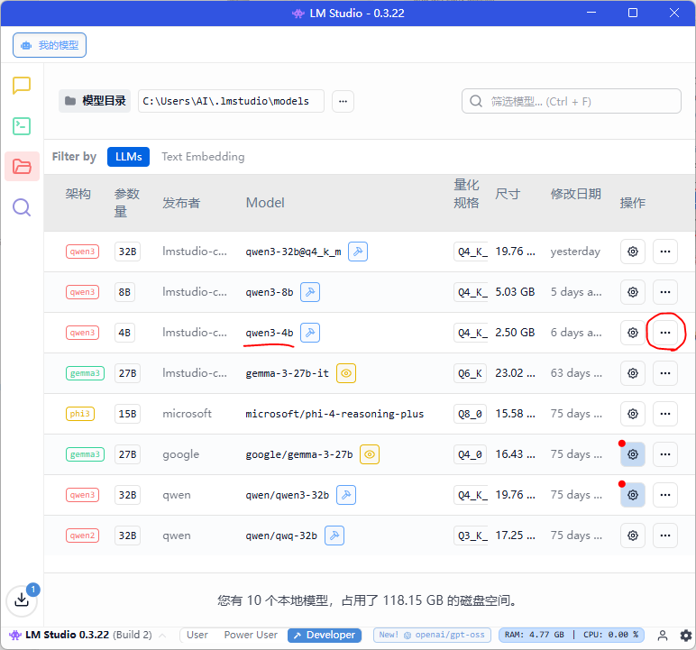

Model列找到你要删除的模型，点击上图右侧红圈标出的按钮，点击后如下图所示：

点击刚才弹出的菜单中的删除按钮，点击后如下图：

点击删除，点击后如下图：

当上图页面列表中找不到你删除的模型后，说明模型已经删除成功。

### 1.5 启动器LLM API配置(v2.0预览版新功能)

配置在线大模型api分为两部分：

1.  在模型网站注册充值，创建API；

2.  在AI学习助手-大模型-大模型API配置中，填写模型相关信息

以deepseek开放平台[[https://platform.deepseek.com/usage]{.underline}](https://platform.deepseek.com/usage)为例，演示如何配置在线大模型api：

1. 
进入deepseek开放平台[[https://platform.deepseek.com/usage]{.underline}](https://platform.deepseek.com/usage)，使用手机号-验证码登录，确保账户中有余额（充值10元，可以用很久！）

2. 
点击查看API文档，查看API地址（形如[[https://api.deepseek.com/v1]{.underline}](https://api.deepseek.com/v1)✔正确示范），模型名deepseek-chat每个模型提供商的API地址是固定的，模型名对于模型网站是唯一的，所以请复制对应地址和名称。

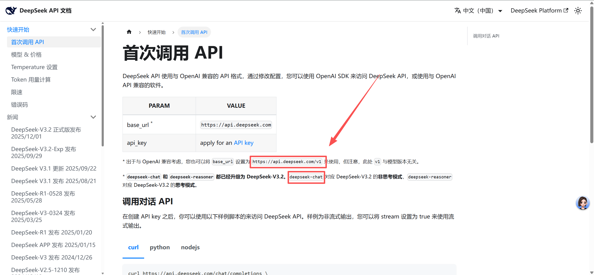

3.  创建API密钥，并复制，此密钥与账户的模型计费相关，请妥善保管。

4.  打开AI学习助手-\>大模型-\>大模型API配置，点击"添加模型"

将从模型提供网站复制的信息粘贴到对应位置，提供商选择"deepseek"（注意带\*号的模型名称为从网站复制的名称，显示名称为自定义名称）

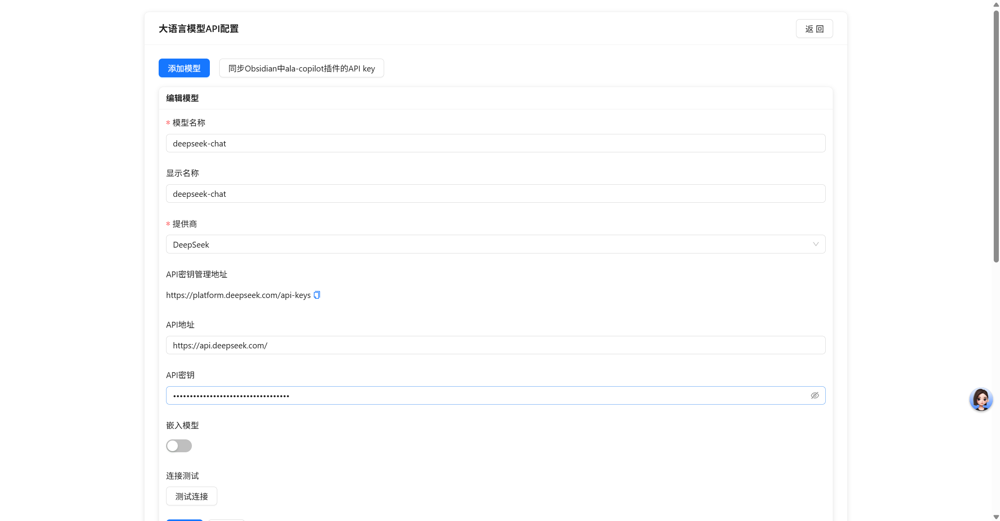

5.  测试模型连接状态，并保存

通过如上配置，你现在已经可以在"学科培训"模块正常使用大模型了！**学科培训**相关教程请查看本文档的第三部分。

此外，你可以直接使用API配置页面下的"同步Obsidian中ala-copilot插件的API
key"直接配置copilot的大模型服务：

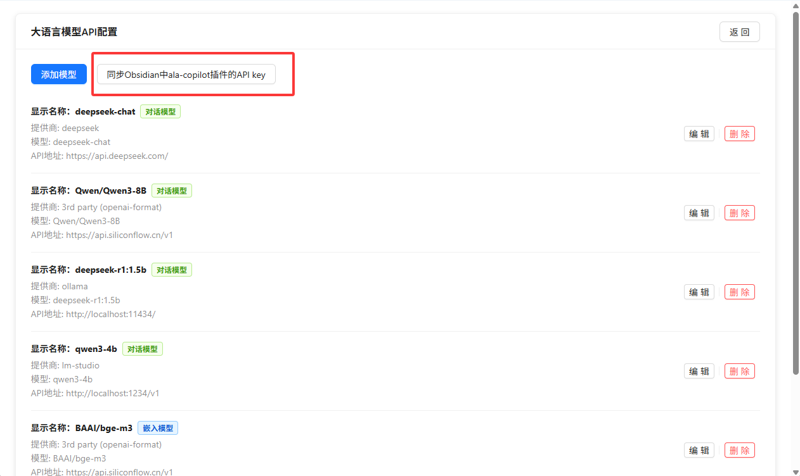

## 二、obsidian阅读器使用

本部分主要介绍1.1
版本以来围绕新增功能的教程说明，更详细与基础的obsidian使用说明请参考其他教程视频与学习手册。

### 2.1 copilot 第三方AI服务快速接入大模型与嵌入模型(以硅基流动服务为例)

#### 2.1.1 创建API密钥

要使用copilot
AI功能，我们首先需要自行配置好相关AI模型，这里提供硅基流动模型接入方式作为参考。打开这个链接<https://account.siliconflow.cn/zh/login>，如下图所示：

根据这个界面的引导注册你的账号，注册完成后登录。登录后如下图所示：

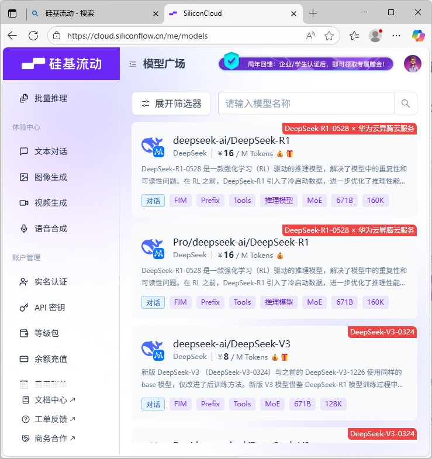

点击左侧API密钥按钮。点击后如下图所示：

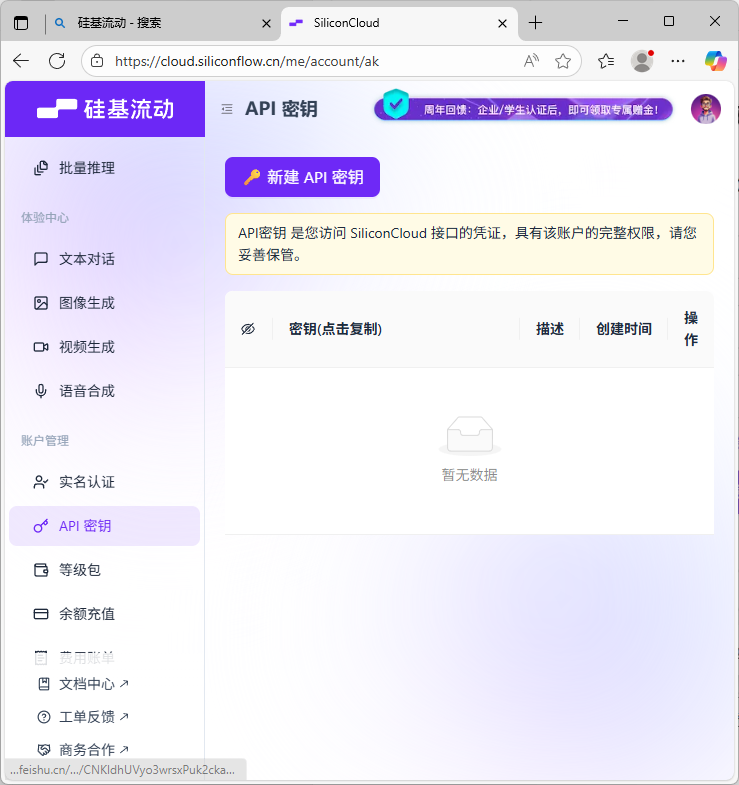

点击新建API密钥按钮。点击后如下图所示：

在弹窗中填写AI学习助手，然后点击新建密钥按钮。点击后如图所示：

点击sk-m类似字样的密钥。点击后如下图所示：

当你看到如上图所示的已复制字样后，你就成功的复制AI密钥到剪贴板中。在后续步骤会用到这个AI密钥。

#### 2.1.2 将AI密钥填写到学习助手阅读器中

打开阅读器，找到红箭头所指的小齿轮按钮。如下图所示：

点击小齿轮按钮，进入到设置页面，设置页左侧向下找到并点击Copilot（AI
Learning Assistant）选项，就可以进入到Copilot插件设置界面。如下图所示：

点击顶部Model选项卡，右侧会显示Chat Models界面。如下图所示：

点击下方Add Custom Model按钮，会弹出Add Custom Chart
Model窗口，在窗口中把Reasoning前方的方框勾选上，再按照下方表格给出的参数填写：

  -------------------------------- --------------------------------------
  输入框名称                       填写内容

  Provider                         Open AI Format

  API Key                          在硅基流动网页上复制的sk开头的AI密钥

  Model Name                       Qwen/Qwen3-235B-A22B-Instruct-2507

  Display Name                     Qwen3-235B

  Base URL                         <https://api.siliconflow.cn/v1>
  -------------------------------- --------------------------------------

填写后如下图所示：

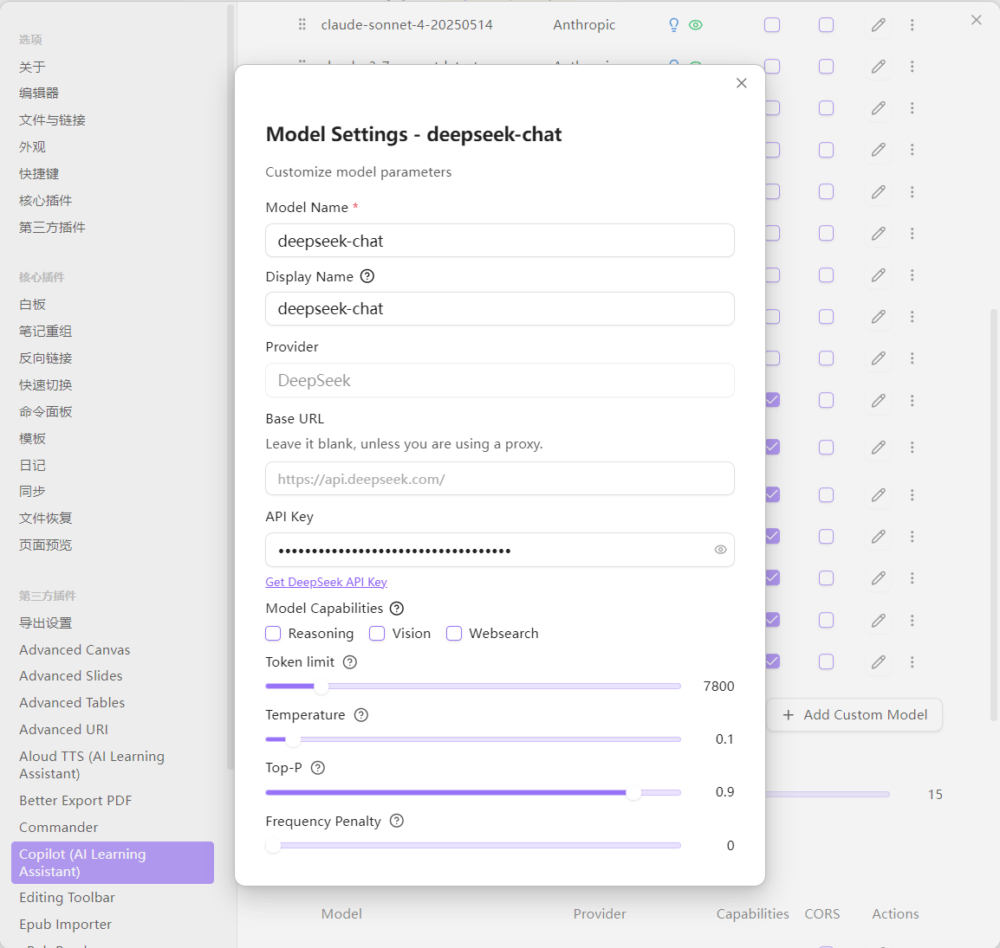

点击Verify按钮验证我们填写的密钥是否正确，如果正确，右上角会弹出黑色消息框，会有一个消息框内写着Model
verification successful!。如下图所示：

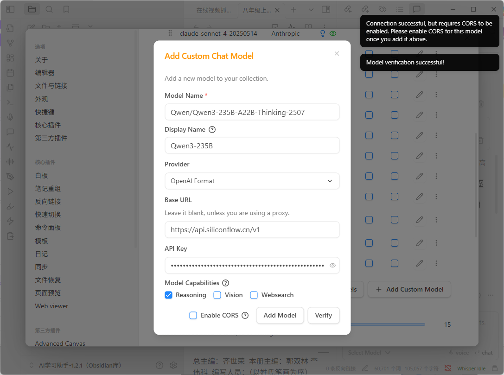

点击Add
Model按钮，然后把Qwen3-235B右边的两个方框中左边的框勾选上，右边的框不要勾选。完成后如图所示：

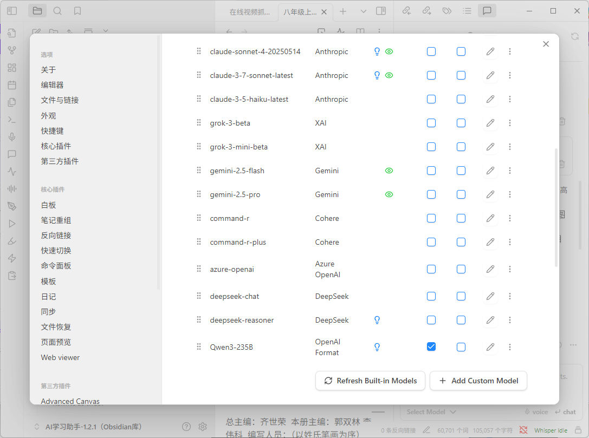

在右侧界面继续向下滚动，找到Embedding Models设置。如下图所示：

点击Add Custom Model按钮，会弹出Add Custom Embedding
Model窗口，按照下方表格给出的参数填写：

  --------------------------------- --------------------------------------
  输入框名称                        填写内容

  Provider                          Open AI Format

  API Key                           在硅基流动网页上复制的sk开头的AI密钥

  Model Name                        BAAI/bge-m3

  Base URL                          <https://api.siliconflow.cn/v1>
  --------------------------------- --------------------------------------

填写完成后点击Verify按钮验证我们填写的密钥是否正确，如果正确，右上角会弹出黑色消息框，会有一个消息框内写着Model
verification successful!。如下图所示：

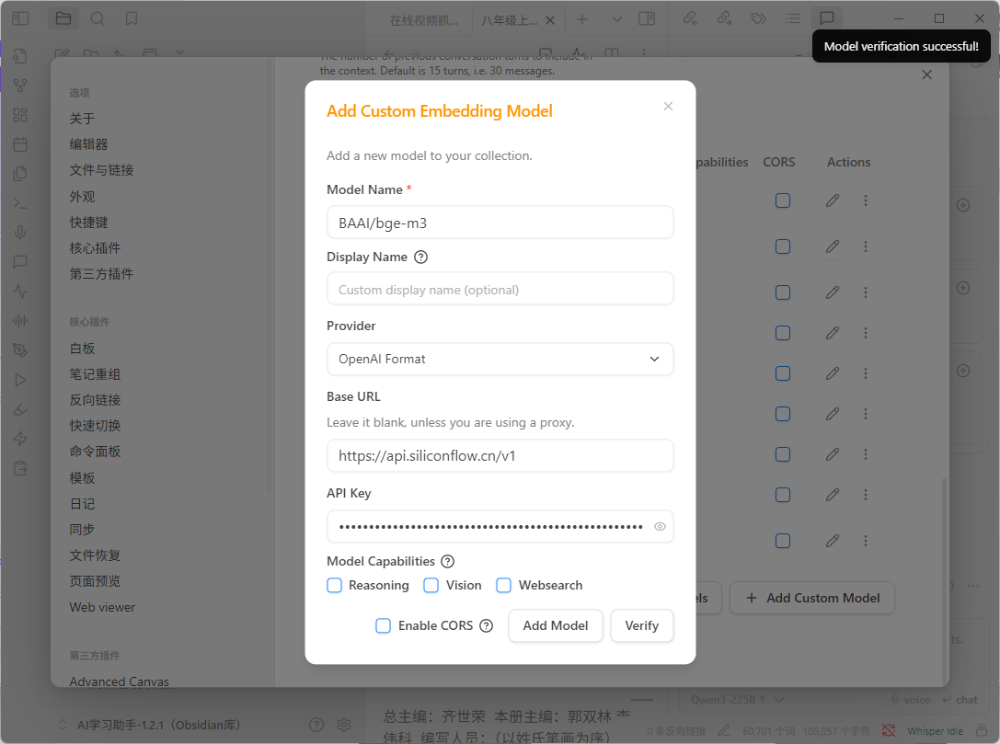

点击Add Model按钮。看到BAAI/bge-m3显示在界面上。操作完成后如下图所示：

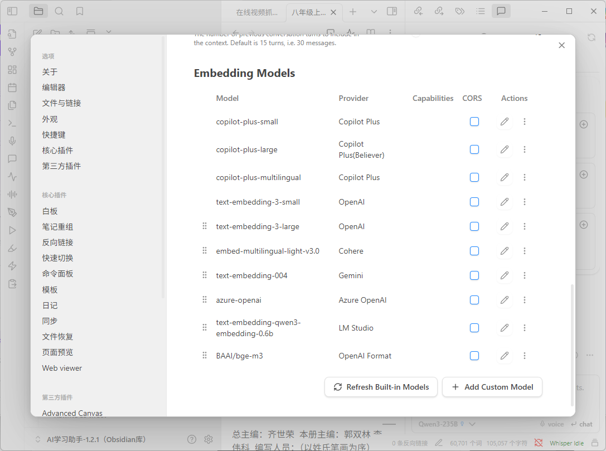

将右侧区域滚动到显示顶部内容，在顶部选择Basic选项卡，在Basic选项卡中，把Default
Chat Model右侧的选项改为Qwen3-235B。如下图所示：

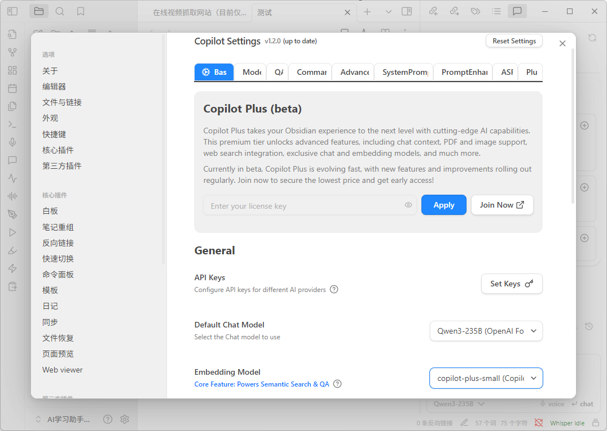

把Embedding Model右侧的选项改为BAAI/bge-m3，会弹出Rebuild Index
提示窗口，如下图所示：

点击Continue按钮后，界面右上角会弹出黑色消息框显示Local Copilot index
Cleared successfully.。

点击Copilot Settings窗口右上角的叉，关闭Copilot
Settings窗口，关闭后如图所示：

然后点击上图箭头所指对话框图标，就能看到右侧变为一个对话框界面：

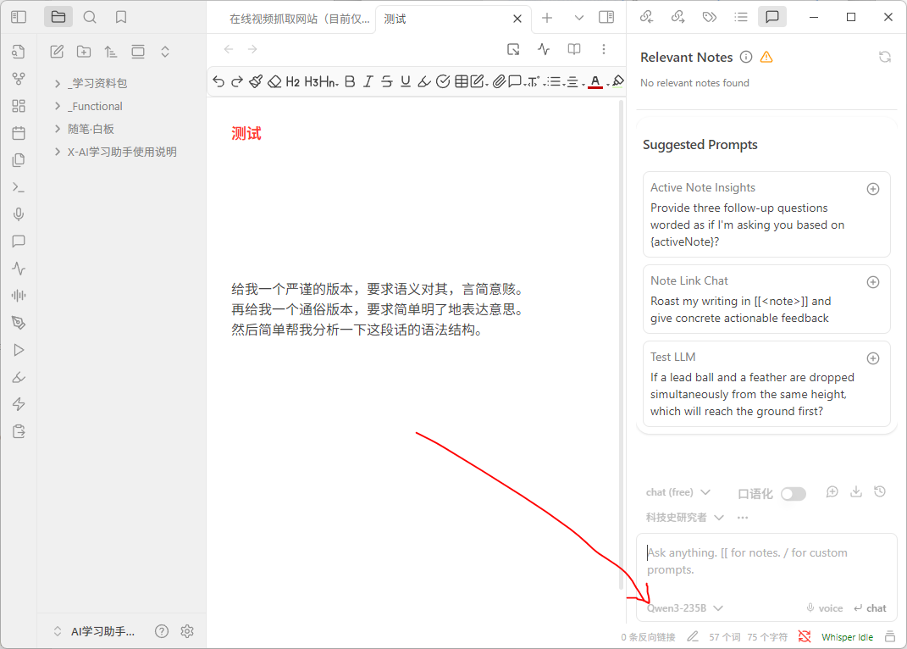

点击上图箭头所指的选项，选择Qwen3-235B。到此阅读器的设置工作就完成了。

**此外，你可以以同样的方式接入其他AI模型，也可以在其他的网站(例如，AI模型聚合服务网站\"**<https://www.dmxapi.com/>**\",该网站提供更加丰富的模型)接入，无需完全参考本教程提供的模型，请自行进行探索。**

### 2.2 copilot 基础AI交互体验功能介绍

接下来介绍如何在obsidian中使用**copilot**插件进行AI交互。

#### 2.2.1 使用copilot与AI进行交互

配置AI模型后，我们可以在右边的窗口与AI进行对话：

接下来介绍AI对话窗口的各个按钮的功能(序号的文字说明对应相关按钮序号)：

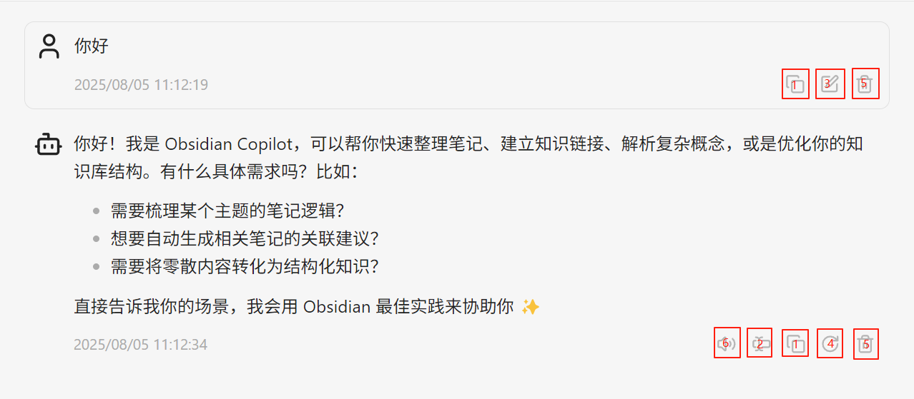

1.  复制：将所在对话的文字复制到剪切板中，可在其他位置粘贴

2.  插入/替换笔记内容：将AI回复插入到当前选中的笔记当中。若当前存在选中文本，则会将该文本替换成AI回复的文本

3.  编辑文本：编辑先前与AI问答的文本，编辑好后按enter确定。若文本编辑后存在修改，则会重新让AI生成相应的回复

4.  重新生成回复：点击后重新根据提问回答信息

5.  删除：点击后会删除选中对话框

6.  语音播放（可选）：点击后会调用aloud插件进行语音播放。前提是aloud插件已安装且已正确配置与部署语音转文本服务。本次教程非必要使用该功能

接下来介绍下方对话窗口的相关功能按钮(序号的文字说明对应相关按钮序号)：

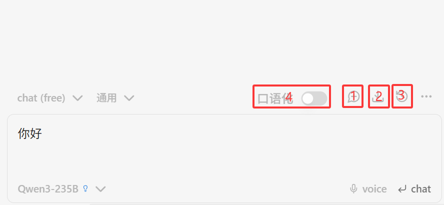

1.  新建会话：新开一个干净的对话窗口用于与AI进行交互。注意若未在copilot配置界面启动自动保存会话，点击后原有AI会话信息会被清除

2.  保存当前会话为笔记：点击后，会将当前与AI对话的内容保存到笔记当中，默认位置在"copilot-conversations"文件夹中。可通过copilot配置进行修改

3.  载入历史对话：点击后，可以选中先前保存的AI对话笔记，将其重新载入copilot的AI对话窗口当中

4.  回复口语化（可选）：开启后，AI回复会根据人设设定(关于人设，将会在2.2中讲到)进行相应风格的口语化。本功能在本次培训中非必要使用。

其他更加详细的copilot 配置请参考其他提供的obsidian教程。

#### 2.2.2 多文本内容引用

通过\"copliot + commander\"插件的组合，我们可以将命令面板的\"Copilot:Add
paragraphs to reference\"命令加入到文件右键命令当中：

通过上述方法，我们就可以实现将选中文本添加到copliot的对话框内，并且支持索引语法进行简洁引用，不直接粘贴文本，方便进一步的提示词书写与整理：

我们可以对多个文档的指定文段进行引用：

#### 2.2.3 人设自定义

打开obsidian 的设置界面，找到copliot插件：

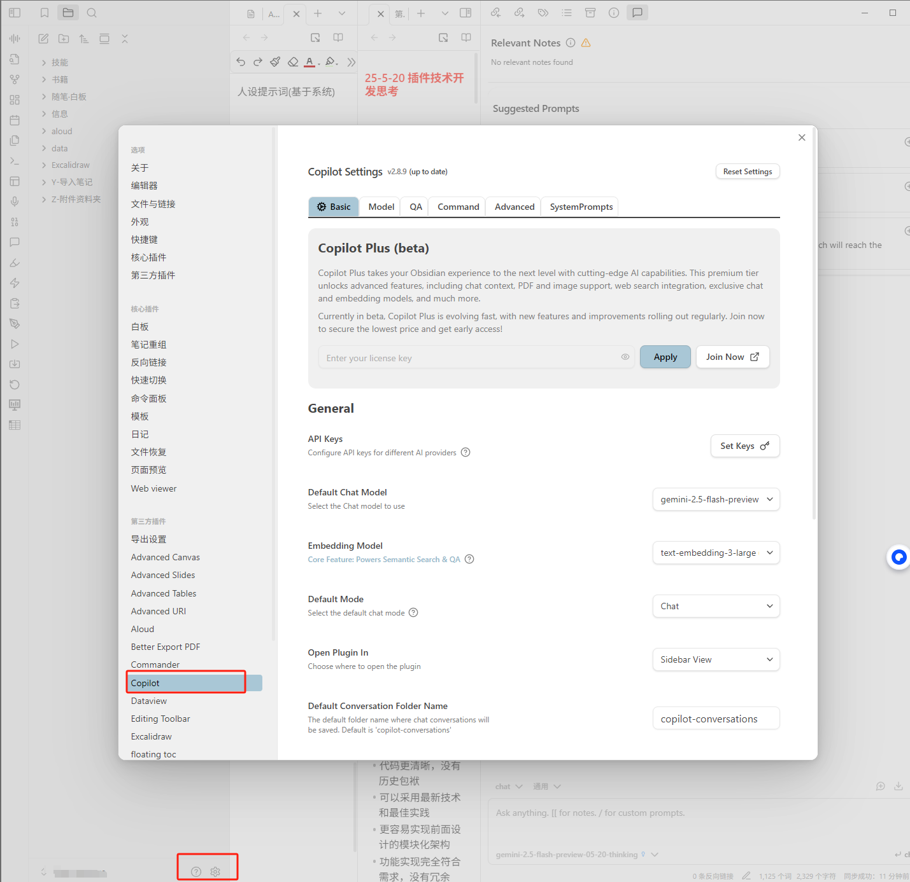

目前copilot
插件设置页面新增\"捏人设\"功能，通过\"人设调试版\"可以组合出各种人设：

我们可以在选中区域内新增标签，并填写相应的标签内容(注意如果新加的标签与已有的标签重名，则无法成功添加)：

对于已有标签，它会匹配多个标签条目，用于存储这个标签下的各种设定，比如说关于"角色"这个标签，我们可以设置"哲学家"、"科技史研究者"、"欧洲历史研究者"等多个标签条目，但每次一个标签只能选中一个条目。我们可以修改当前选中的标签条目的内容，或者新增/删除对应的标签条目，如下所示：

关于调整不同标签之间的位置，可以通过最左侧的上下箭头实现：

当我们设置好了人设的各种所需要的标签，我们可以在红框处输入名称比如\"科技史研究者\"，接着点击\"添加人设\"，即可添加相应人设：

添加好后，可以发现所定义人设出现在了\"人设列表\"中，且还可以在编辑面板中调整我们人设设定：

最后说明下如何使用，我们可以点击指定人设的左侧按钮，即可切换到想要的人设配置上，后续AI助手就会以这个身份来与我们对话。

当然，你也可以在AI助手的对话框上方切换人设，如下图：

接下来我们就可以根据我们自己设定的人设与AI更加\"亲密\"地互动了！

#### 2.2.4 自动衍生问题

copilot的1.2版本主要新增自动衍生问题、自动语音播放两个功能，下面主要说明自动衍生问题的原理和使用方法，自动语音播放功能说明请看2.3章节。

##### 2.2.4.1 自动衍生问题原理说明

自动衍生问题主要采取提示词控制大模型输出特定格式的方式实现，也就是说使用特定提示词，使得大模型按照提示词的要求进行输出。如目前插件中默认的提示词，截图如下：

在对话界面中启动自动衍生问题开关后，向大模型提问\"你有什么功能\"，返回的内容最后就会带上衍生的问题。

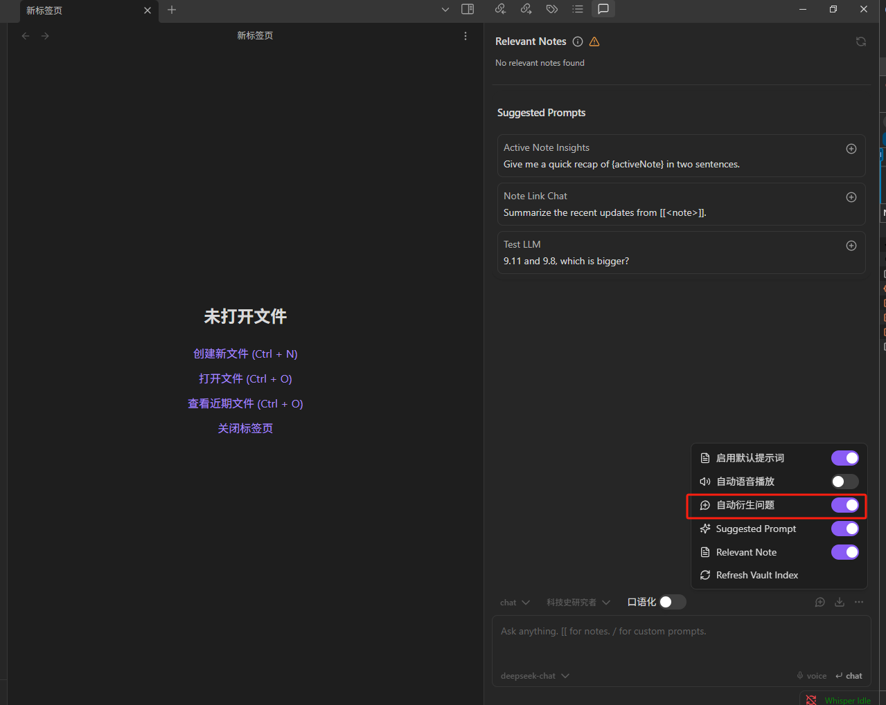

大模型回复截图如下：

当我们继续向大模型提问\"请回答问题2"，copilot本身会将对话的上下文一起发送给大模型，那么就会回答之前衍生出来的问题，从而实现自动问题的衍生与答复。

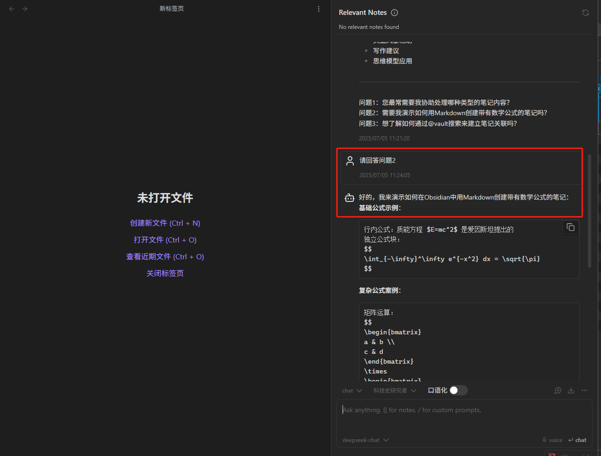

##### 2.2.4.2 自动衍生问题提示词与系统提示词关系的详细说明(可跳过)

开启自动衍生问题开关后，就会将相应的提示词拼接到系统提示词上，如果有选择人设或开启口语化功能，会按照\"默认系统提示词\" +
\"人设提示词\" + \"自动衍生问题提示词\" +
\"口语化提示词\"的顺序拼接文本，形成系统提示词。如果某项功能没有开启或没有设置，则忽略不进行拼接。

自动衍生问题提示词可以在设置界面中进行修改，如果修改成其它提示词的要求，也是没有可以的。目前的功能本质上只是**将相应的文本拼接起来作为系统提示词发送给大模型**，前端的开关按钮只是用于控制是否将相应的文本拼接在一起。所以自动衍生问题的提示词，包括2.2章节的口语化提示词功能，都是可以修改成自己需要的提示词，同样也可以把相应的提示词写到人设提示词中，只要确保自己配置的提示词会发送给大模型即可。目前自动衍生问题、口语化等功能的提示词是针对特定场景而进行配置的。

可以在设置界面中查看copilot默认系统提示词，并可通过开关进行控制。截图如下：

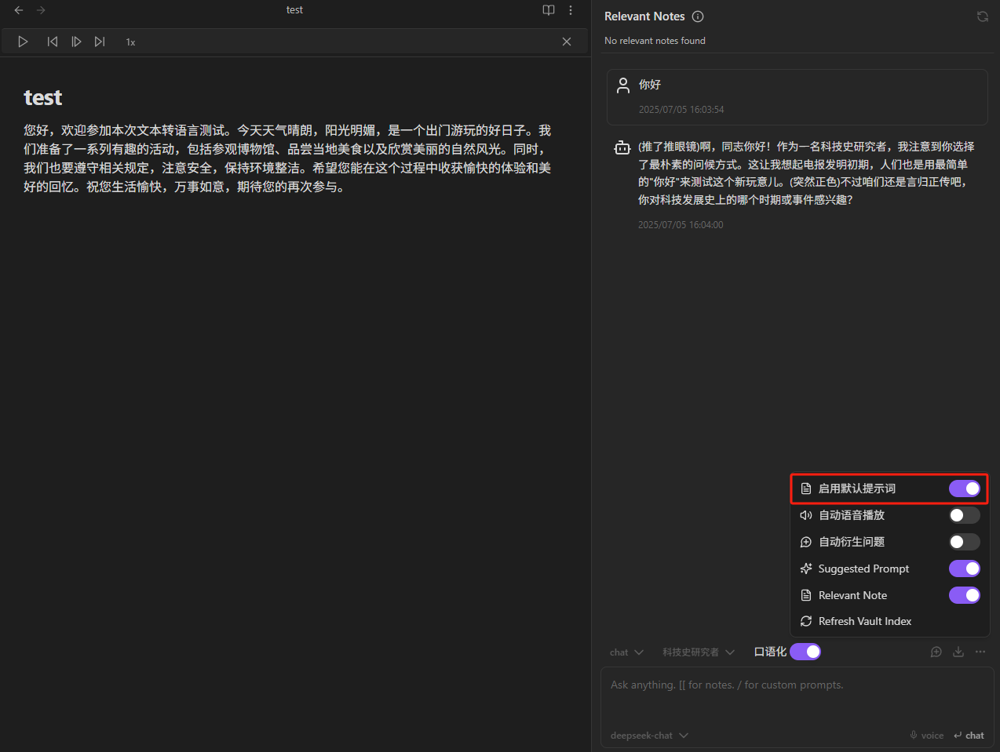

#### 2.2.5 TODO：网页搜索与爬取

### 2.3 copilot 工作区使用(以"使用手册"工作区为例)

接下来介绍如何使用新版copilot的工作区功能，我们可以使用它进行人设切换以及Rag检索，关于工作区的管理(包括创建、删除等操作)相关说明请参考"1.2.3
工作区的管理与说明"。

首先我们点击右下角的对话模式，切换为"vault"模式，即工作区模式，接下来我们切换到"使用手册"工作区，并且切换人设为"AI学习助手使用说明小助手"：

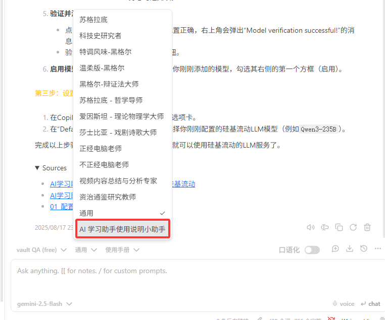

当切换成该模式后，我们就可以对该工作区的教程文档进行Rag检索了，比如我们可以提问如何接入硅基流动的API服务，提问将会得到以下类似结果，该结果来源于本地"使用手册"工作区的相关信息：

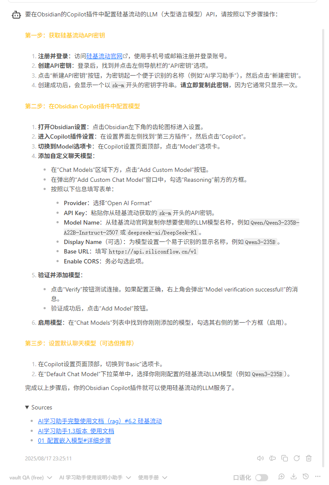

可以看到这里的Rag检索正常返回接入硅基流动的api的方式了。

接下来简要介绍下Rag检索的原理以及注意事项：

1.  RAG检索原理说明

RAG（**Retrieval-Augmented
Generation**）检索是AI学习助手的核心功能之一，其工作原理如下：

当你在工作区模式下提问时，系统会自动执行以下流程：

-   首先将你的查询通过Embedding模型转换为向量表示

-   然后在当前工作区的文档库中，通过embedding模型的相似度匹配算法，计算查询向量与所有文档片段向量之间的距离

-   系统会选取语义最接近的前n个文档片段（默认为3个，可以copilot设置中修改）

-   这些相关片段会被作为上下文信息\"喂给\"大语言模型

-   大模型基于这些上下文信息生成更加准确、有针对性的回答

这种机制确保了AI的回答不仅基于其预训练知识，还能结合你个人知识库中的具体内容，大大提高了回答的相关性和实用性。

1.  检索技巧

为了获得最佳的RAG检索效果，请遵循以下实用技巧：

-   提问技巧

    -   **使用完整语句**：避免过于简短的提问，如\"怎么用？\"，应改为\"在Obsidian中如何创建双向链接？\"

    -   **包含关键词**：在问题中明确包含你想查询的核心概念，如\"请解释RAG检索在AI学习助手中的工作原理\"

    -   **指定范围**：当有多个相关主题时，可指定范围，如\"在工作区管理部分，如何切换不同的人设？\"

-   文档组织建议

    -   **合理分段**：保持笔记内容段落清晰，每段聚焦一个主题，便于系统准确匹配

    -   **使用标题**：为笔记添加明确的标题和子标题，帮助系统理解内容结构

    -   **添加标签**：为相关笔记添加统一标签，便于系统识别主题关联性

-   检索优化

    -   **尝试不同表述**：如果第一次检索结果不理想，可尝试用同义词或不同句式重新提问

    -   **查看检索结果**：在回答下方可查看系统实际检索到的文档片段，了解检索效果

    -   **调整检索范围**：通过切换工作区，可以控制检索的文档范围，提高相关性

通过以上技巧，你可以显著提高RAG检索的准确性和效率，使AI学习助手更好地服务于你的知识管理工作。

### 2.4 copilot 语音播放服务接入

#### 2.4.1 aloud基础配置 

在AI学习助手启动器上更新aloud插件到最新版本（更新方式参考启动器使用"1.2"部分），并启动文本转语音服务。

接下来要在aloud插件中配置连接本地文本转语音的服务，配置方法如下：进入obsidian
的配置页面，将\"Model Provider\"切换至\"OpenAI
Compatible(Advanced)\",接下来填写其他参数。本地部署的话\"API
key\"填写任意字符串或者为空都可以，\"API
URL\"一般填写为本地主机的8000端口，也就是填写\"[http://localhost:8000](http://localhost:8000/)\"（注意,\"http://0.0.0.0:8000\"可能无法成功访问，请填写\"localhost\"格式）,"Model\"中填写当前已经部署的模型
kokoro或者index-tts模型，填写好后如下图所示:

如果之前已配置aloud插件，只要保证更新aloud插件版本后能正常在笔记中使用文本转语音即可。

接下来，我们可以在obsidian中的任意文档内右键选中指定文本进行语音播放，如下图：

我们也可以右键选中指定文本，导出这些文本的音频文件，进行播放：

另外，对于音频存储功能，aloud支持对于过去播放过的文字进行缓存，以及设置多长时间缓存自动清除；对于导出的音频文件，aloud也支持指定存放音频文件的地址。如下图：

#### 2.4.2 语音播放功能说明

copilot插件目前支持语音播放相关功能（注意使用前需要配置好aloud插件以及文本转语音服务），如下图：

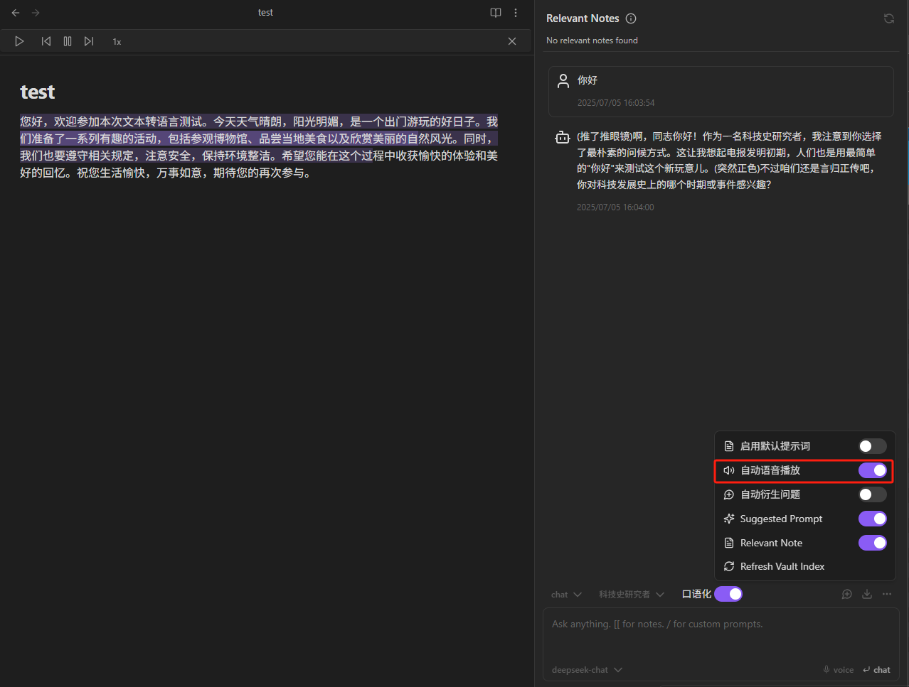

开启自动语音播放开关，当大模型返回结果后就会自动播放语音。

我们也可以点击AI消息框下的语音播放按钮进行播放。

#### 2.4.3 口语化提示词说明

设置口语化提示词的目的是通过控制提示词要求大模型输出的文本尽量短，如果返回的文本过长，自动语音播放就会等到结果完全返回后才进行播放，时间较长。这种长文本情况似乎就没有必要进行语音播放，所以添加口语化提示词的方式控制大模型输出。当然不启动口语化开关也是可以进行自动语音播放的。

也可以通过设置界面修改口语化提示词，使大模型返回的结果符合自己的设置，类似自动衍生问题的提示词。

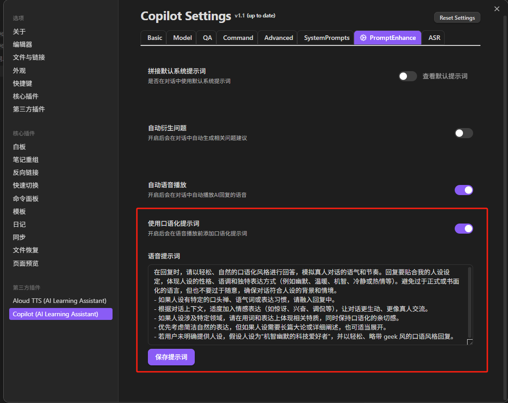

### 2.5 copilot 语音识别功能使用

#### 2.5.1 ASR基础配置

1,打开Copilot插件设置页面,点到ASR

2,看图红色框框可以切换openai服务或者本地服务

3,默认使用本地ASR服务,端口是9000,如果自己想改动,请保持前后端的端口相同。另外请务必开启encode与VAD,这是确保本地服务正常运作的条件

4,如果切换使用openai服务,请在API Setting中填写API Key

5,File Saving Settings服务于语音识别功能,设置Recordings
folder后录音会存入指定位置

6,设置Transcriptions
folder后,(在没有指定笔记时)语音识别生成的笔记会存入指定位置

8,General Settings暂时是没有用处的,不必配置

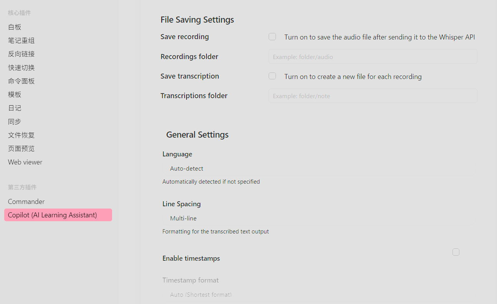

#### 2.5.2 录制语音后转文字

1,如图点击Open recording controls或者在笔记右键后选择语音输入文字

2,点击后会弹出录音器,Record为开启录音,Pause暂停,Stop结束录音并转文字

3,**在copilot
对话框中识别语音识别**：在chat对话框使用语音输入,点击voice按钮,再点Record然后说话

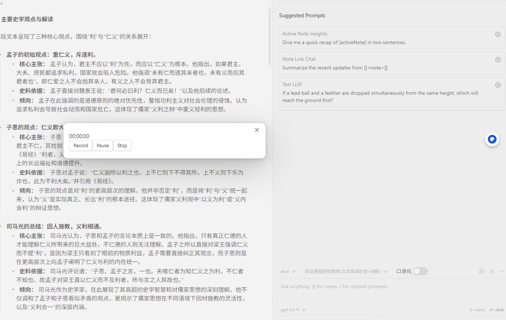

#### 2.5.3 音视频转文字

1,使用ctrl+p打开命令行, 手打transcri,以下命令都可以对应实现功能

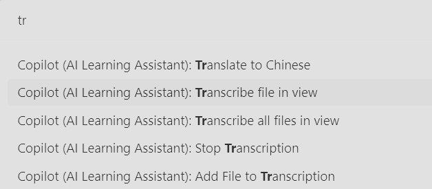

2,或者选择任意音频或者视频右键,在菜单中选择🎧Transcribe
稍等推理完成,就会根据语音生成文字

3,注意：在插件配置中如图开启时间标注(Enable
timestamps)暂时无法使用，不需要开启

### 2.6 Media Extended 视频与字幕下载(v1.3新功能)

#### 2.6.1 使用说明及配置

本次功能更新仅包含b站视频与字幕下载,使用功能要确保登录自己的账号,其他网站等待待开发.

1,登录方式:如图在Media Extended插件配置页面点击右上角按钮Open broswer

2,选择bilibili

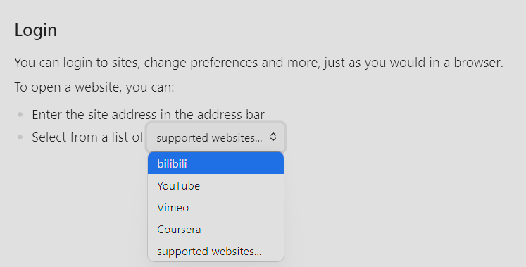

3,鼠标移到登录字样上,再在出现的浮窗中点击立即登录

4,请选用任意登录方式登录,登录成功后配置完成,可以关闭此页面了

#### 2.6.2 视频下载使用方式

1,有以下几种方式在obsidian中打开b站视频页面(笔记内点击链接跳转至视频页面、左边命令栏找到"open
media"输入b站地址跳转至视频页面)

2,使用b站视频链接打开视频页面后,如图选择视频页面**右上角三个点**，选择Download
video,会出现all \*\*.mp4 \*\*.m4a选项,分别会下载(画面与音频),画面,音频

3,如果点击all,后如下图会分别下载画面与音频,存储位置为用户默认的附件存储位置

#### 2.6.3 字幕下载使用方式

1,使用b站视频链接打开视频页面后,如图选择视频页面右上角三个点

2,选择Open transcript,会出现一个字幕选项

3,点击后会下载字幕并打开,字幕文件存储位置为用户默认的附件存储位置

#### 2.6.4 在线视频播放与笔记记录

我们可以对视频播放页点击下\"open media
note\"，打开一个格式化的笔记页面：

我们可以点击照相机图标，它会将当前视频播放的页面图片截图，自动链接的笔记中，并附加播放时间戳（注意截屏图片保存在**附件文件夹**中，请查看obsidian配置图片的保存位置）：

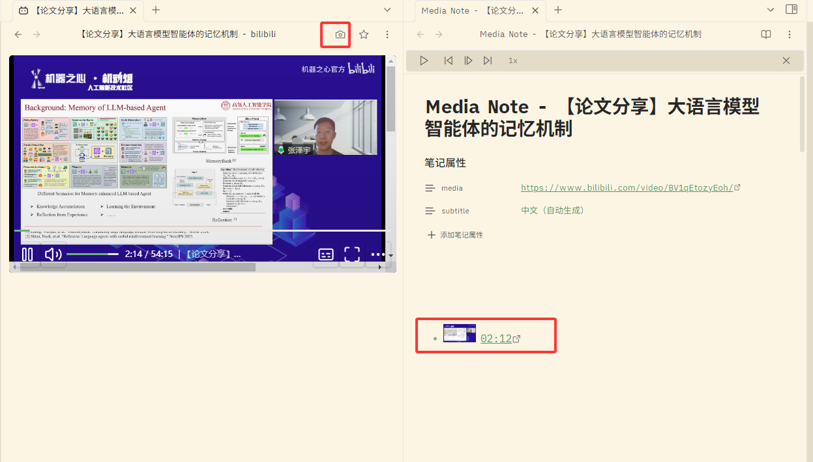

其他media extended
插件的倍速播放、仅复制时间戳、复制视频地址、画中画等功能请自行探索，这里不再演示了。

## 三、学科培训安装与使用(V2.0新功能)

要使用学科培训，首先必须安装WSL与Podman服务，请完成"1.1
启动器解压、启动与初始化配置"的相关步骤。

### 3.1 安装

1.  点击"学科培训"的安装

1.  选择下载的tar包，进行安装

等待片刻，即可完成安装，接下来点击开始即可使用学科培训

**注意**❗：学科培训的AI服务支持需要**提前配置**，请在"1.5 启动器LLM
API配置"进行大模型配置，否则无法正常使用学科培训的**AI功能**！

### 3.2 基础使用

1.  点击"学科培训"的"开始"，创建用户（自定义用户名）进入学科培训页面

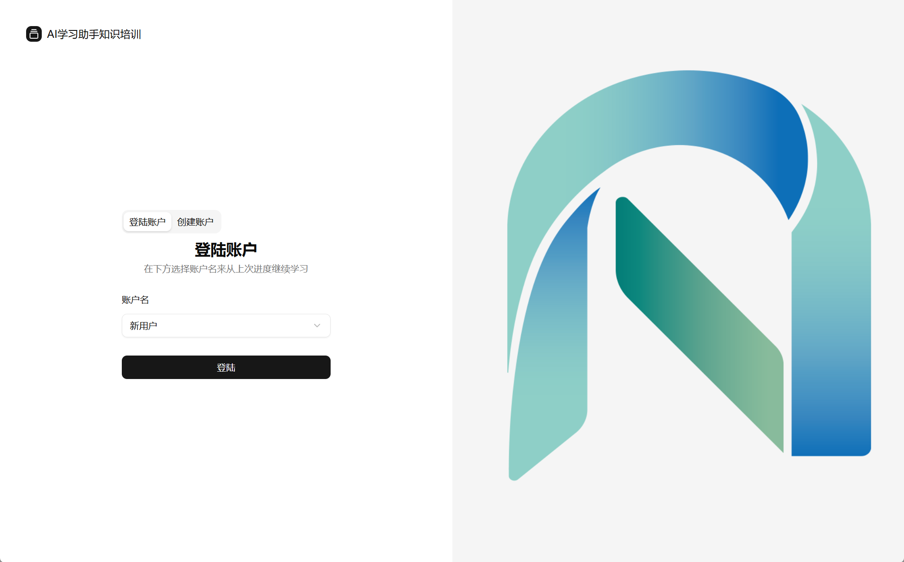

2.  课程广场浏览要学习的课程，右侧是AI对话栏，进行AI对话

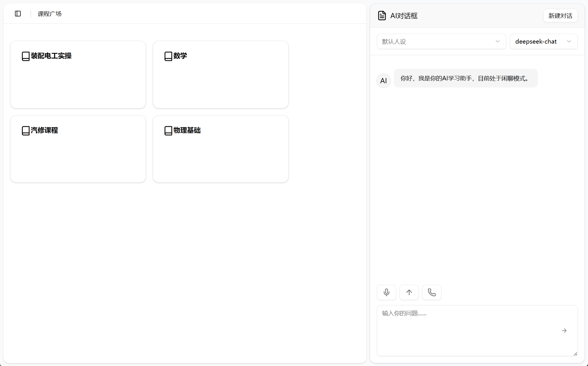

3.  进入"汽修课程"页面，展示课程章节与学习进度

4.  进入知识点学习，通过观看视频与知识点文案学习该知识点

5.  "AI视频助手"功能：展示当前视频的每个时间段的具体内容

6. 
"这里不懂"功能：点击后AI对话框生成提问语句，发送后，AI会结合当前视频时间点（访问字幕文件）的内容为你详细讲解。

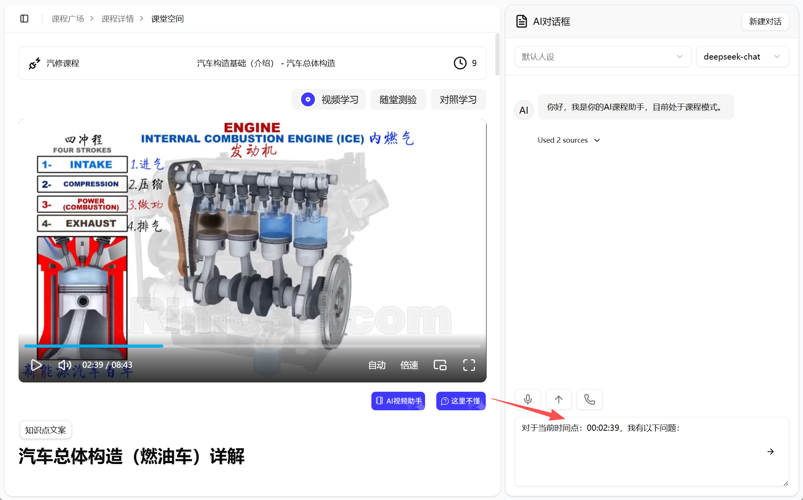

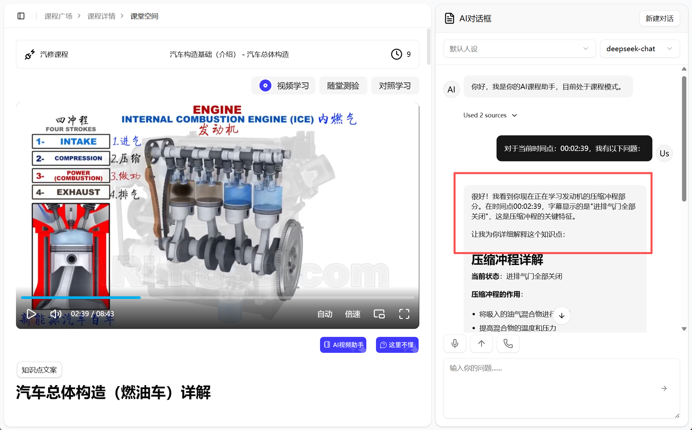

7. 
视频学习结束后，点击"随堂测验"进入测验，测验期间不能使用AI对话，不能返回"视频学习"

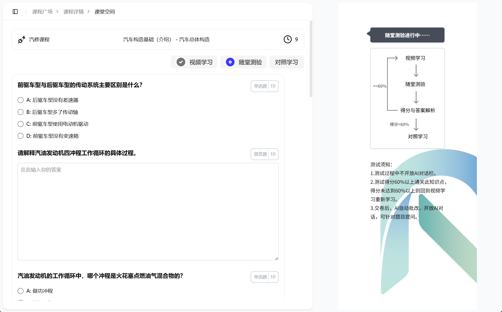

8.  测验交卷后，显示测验得分，点击"查看解析"，AI自动生成批改与解析

9.  "问问AI"功能，点击后，在对话框生成提问语句，发送后AI提供解答

10. 
当得分大于60%时，视为通关此知识点，进入对照学习并解锁下一知识点，否则回到视频学习，需要重新答题直到得分大于60%

11. 
学习情况总结：通关知识点，进入"对照学习"或者"学习下一节课程"时，AI对话框会自动生成"学习情况总结"，为答题情况做总结并给出评价、建议。

### 3.3 实时语音

要使用学科培训的语音对话功能，则需要在工具箱中安装学科培训语音服务。

首先进入工具箱，点击学科培训语音的安装按钮，会弹出选择文件的窗口：

我们选择cpu或者cuda版本的学科语音包，等待一段时间安装：

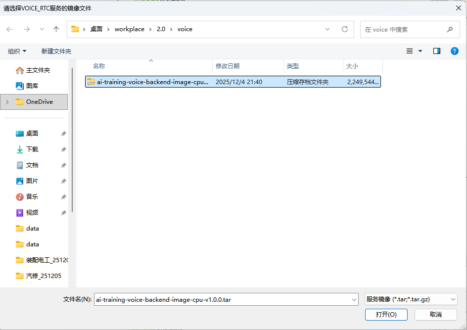

安装成功后，我们点击启动，等待一段时间让其初始化完毕。之后回到启动器首页，点击学科培训的开始按钮启动学科培训服务：

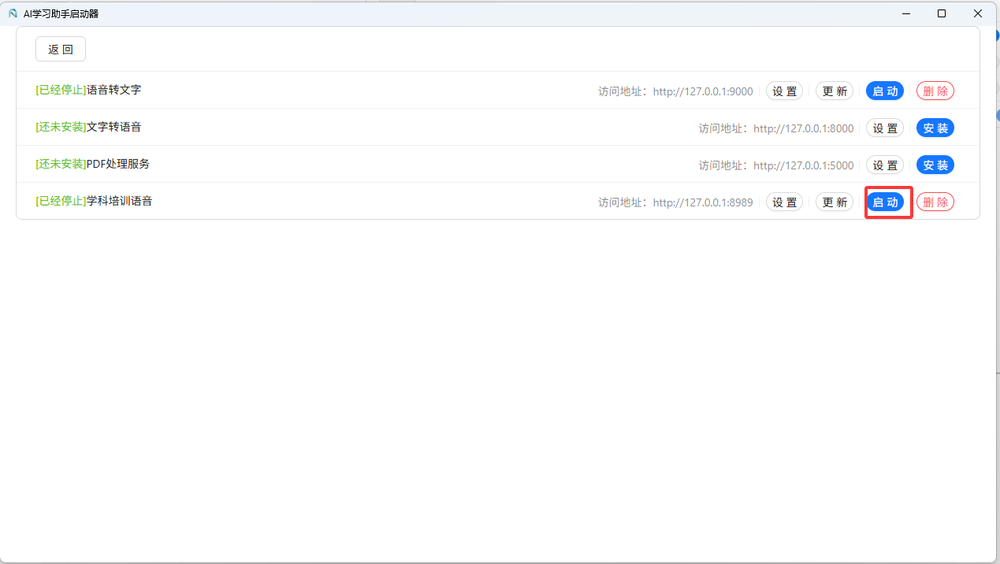

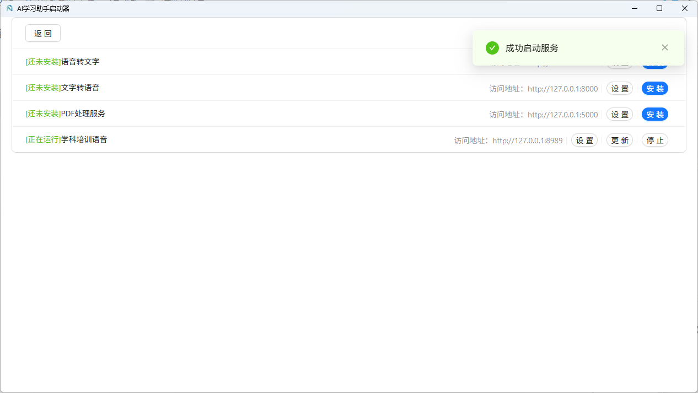

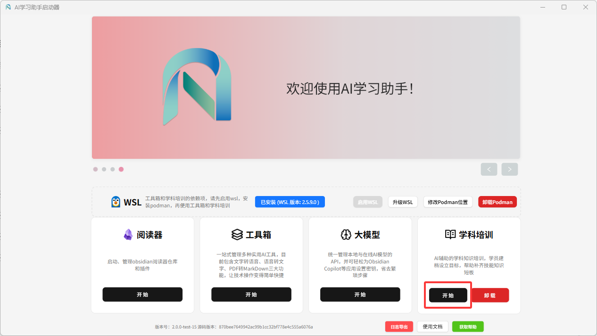

接下来，在学科培训的某个课程知识点学习中，我们可以点击右下角的"打电话"选项与AI进行实时语音，等待与语音服务连接成功后，即可进行语音对话：

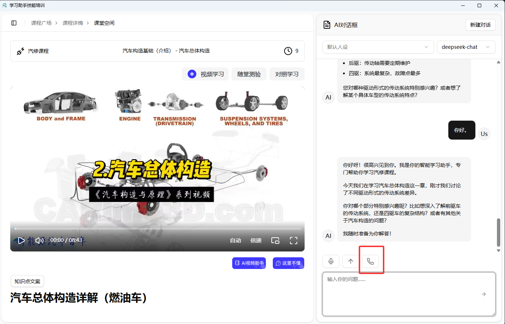

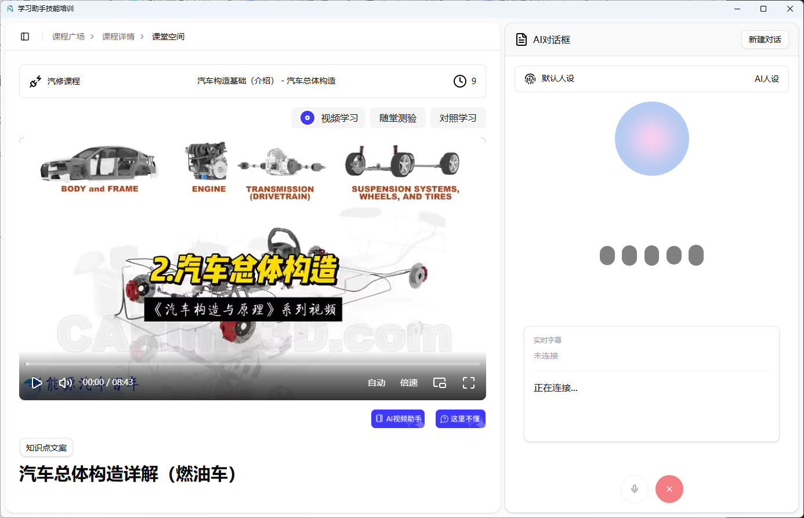

此时，我们可以询问有关课程的相关知识，AI学习助手会以语音的方式进行回答：

在语音过程中，你可以主动说话来打断AI语音，AI会按照新的语音指示进行回答：

此外，当点击左边的语音按钮将其转为"禁用说话"的标识时，此时人声不会让AI听见，不会触发AI语音回复：

## 四、实用学习流程分享

### 4.1 音视频下载与总结

我们可以选择比如**b站的视频**，用**media extended**
下载得到其音频文件，再用**工具箱内的语音转文字服务**，得到原视频的文本。最后，我们可以使用**obsidian
copilot**插件切换至相应的**视频总结人设**，选中这段文本进行音频总结，获取视频总结内容，如下图：

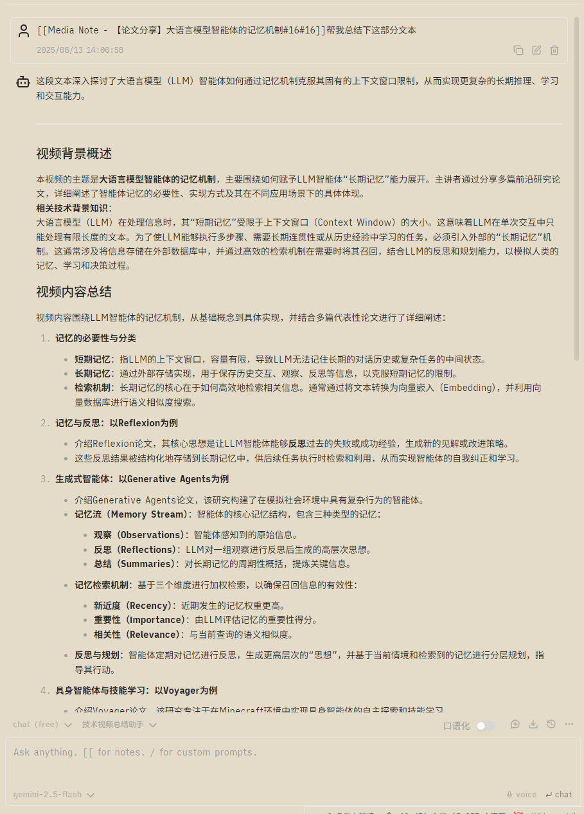

更多相关音视频与文字的联动操作请自行探索！

### 4.2 优化影印版Pdf的阅读体验

针对一些影印版的pdf，我们无法直接在pdf中选中文字编辑与复制。对于这种情况，可以先用我们\"1.3.4\"部分所讲到的PDF2Markdown功能进行此类书籍的转换。转换成功后得到markdown等资源，我们可以对这些内容进行人工校对，将其引用、标题、换行等错误排版规范化，人工校对经验请参考"md资料生产组"提供的校队文档：[Markdown学习资料校对手册](https://docs.qq.com/aio/DR3dZcWtyT0VkcXB5?no_promotion=1&p=uogzAL83IvlxXjkArvUDs2)

校对完毕后，我们得到了比较规范的markdown格式的书籍，也可以直接进行阅读了。

若对markdown的阅读体验不满意(当前版本的markdown书籍阅读上暂时没有比较规范的阅读记录保存、笔记记录方式等方式)，我这里推荐一个阅读记录方式：将校对好的markdown书籍使用obsidian插件如"better
export
pdf"插件进行pdf导出，然后我们在使用\"PDF++\"插件进行阅读，利用其良好的笔记记录方式进行阅读学习。

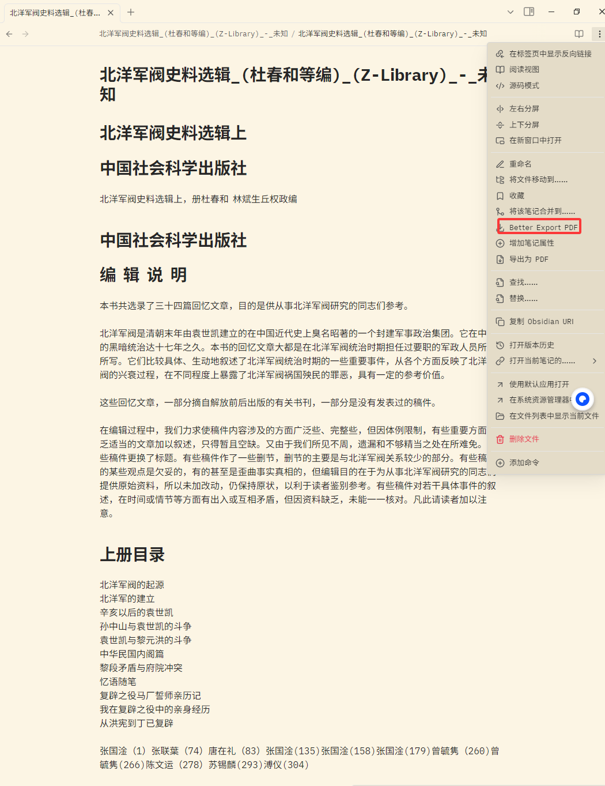

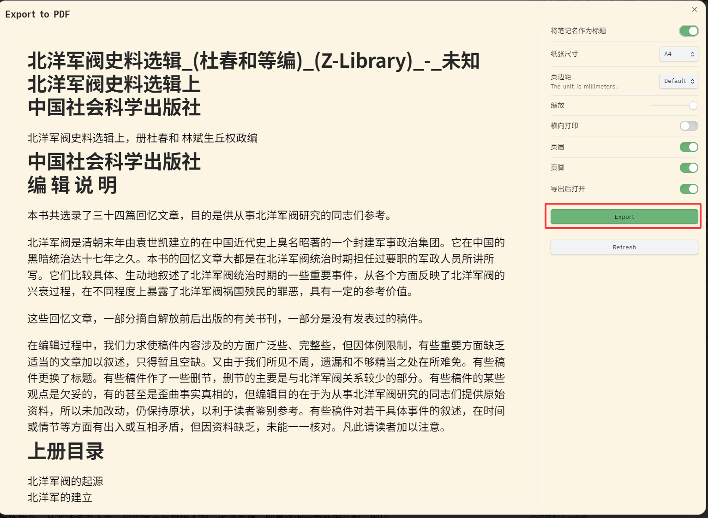

## 五、往期学习资料视频参考

由于版本更新的缘故，可能部分使用方法已经过时，请根据实际情况学习使用：

1.  [AI学习助手1.2发布啦！劲爆新功能！](https://www.bilibili.com/video/BV1JPuYzwE3B)

2.  [AI学习助手1.0-软件设置](https://www.bilibili.com/video/BV1xbLizPEh3/)

3.  [AI学习助手1.0-原理及概念介绍](https://www.bilibili.com/video/BV1R6L8zhEuf)

4.  [大模型接入、阅读记录与AI交互](https://www.bilibili.com/video/BV1PBK5zLEmF/)
